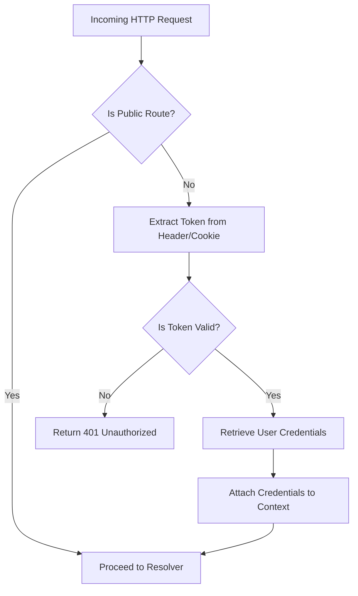

# Table of Contents
- [Overview](#overview)
- [Purpose](#purpose)
- [How It Works](#how-it-works)
- [Example: Auth Middleware Code](#example-auth-middleware-code)
- [Integration](#integration)
- [Architecture Context](#architecture-context)
- [Source Code](#source-code)

---

## Overview

The **Authentication Middleware** is a critical component within the WhoDB backend server that enforces security by authenticating and authorizing incoming HTTP requests to GraphQL API endpoints.

It intercepts every incoming request and verifies bearer tokens or credentials embedded in headers or cookies. Public routes and introspection queries are allowed without authentication, ensuring openness where necessary, while securing all other endpoints behind authentication checks.

## Purpose

- **Secure access** to GraphQL APIs by validating authentication tokens.
- **Support public endpoints** (e.g., introspection, login) without requiring authentication.
- **Inject user credentials** into the request context for downstream usage.
- **Reject unauthorized requests** early in the pipeline to prevent unauthorized access.

## How It Works

1. **Intercept Incoming Requests:**
   The middleware wraps around the HTTP router handlers.

2. **Check if Route is Public:**
   Some routes like login or introspection are permitted without auth.

3. **Extract Token or Credentials:**
   Reads tokens from HTTP headers or cookies.

4. **Validate Token:**
   Checks if the token is valid and hasn’t expired or been revoked.

5. **Get Credentials:**
   On successful validation, the user's database credentials are retrieved and attached to the request context.

6. **Allow or Reject:**
   If authenticated, the request proceeds to the GraphQL resolver; if not, it returns an unauthorized response.

## Example: Auth Middleware Code

```go
package auth

import (
  "context"
  "net/http"

  "github.com/clidey/whodb/core/src/engine"
  "github.com/clidey/whodb/core/src/graph/model"
  "github.com/clidey/whodb/core/src/log"
)

// AuthMiddleware secures HTTP requests by checking authorization tokens.
func AuthMiddleware(next http.Handler) http.Handler {
  return http.HandlerFunc(func(w http.ResponseWriter, r *http.Request) {
    // Allow unauthenticated access for public routes
    if isPublicRoute(r) {
      next.ServeHTTP(w, r)
      return
    }

    // Extract token from header or cookie
    token := extractToken(r)
    if !isTokenValid(token) {
      w.WriteHeader(http.StatusUnauthorized)
      w.Write([]byte(`{"error": "Unauthorized"}`))
      return
    }

    // Fetch user credentials
    credentials := GetCredentials(r.Context())

    // Attach credentials to request context
    ctx := context.WithValue(r.Context(), AuthKey_Credentials, credentials)
    next.ServeHTTP(w, r.WithContext(ctx))
  })
}

// Helper functions (e.g. isPublicRoute, isTokenValid, extractToken, GetCredentials) are implemented elsewhere.
```

## Integration

### Dependencies

- **GraphQL layer:** Middleware ensures only authorized requests reach the GraphQL resolvers.
- **Authentication package:** Uses internal `GetCredentials` and token validation logic.
- **Logging:** Records unauthorized attempts and important auth-related info.
- **HTTP router:** The middleware is applied as a request handler wrapper in the network router setup.

### Interaction Flow




## Architecture Context

The Authentication Middleware is positioned in the request processing pipeline of the WhoDB backend server:

- **Pre-GraphQL Handler:** It executes before the request hits the GraphQL server, ensuring security before processing mutations or queries.
- **Secure & Seamless:** By injecting credentials into contexts, the rest of the system can fetch user-specific database connection details transparently.
- **Supports Mixed Access:** Besides strictly securing requests, public endpoints (e.g., login mutations, GraphQL introspections) bypass middleware checks.

It works closely with:

- **`core/src/auth`** packages for validation logic.
- **`core/src/router`** where the middleware is plugged in.
- **GraphQL resolvers** accessing credentials from the context to perform authorized database operations.

## Source Code

View the full implementation in the core source:

- [Authentication Middleware Source - core/src/auth/auth.go](https://github.com/clidey/whodb/blob/main/core/src/auth/auth.go)

## Summary

The Authentication Middleware is essential for securing the WhoDB backend by vetting requests based on tokens, allowing public access where necessary, and ensuring authenticated context is propagated for downstream operations. Its design ensures a clean separation of concerns and smooth integration with the rest of the API infrastructure.
