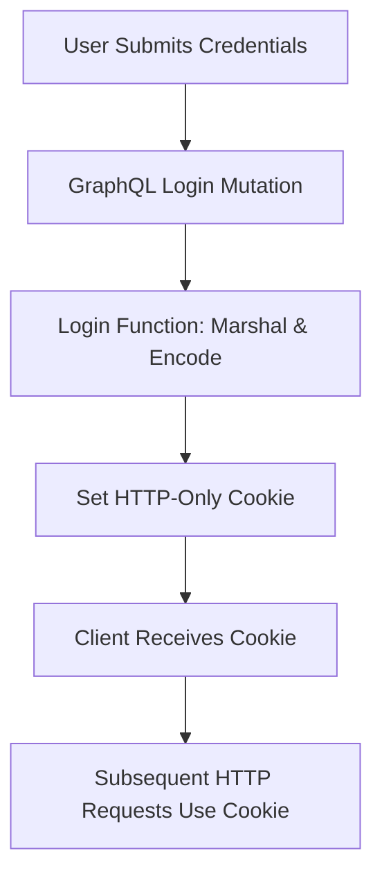

# Login Logic

This section explains the login mechanism of the WhoDB backend system. The login logic authenticates users by verifying their credentials, establishing a session via cookies, and integrating with the GraphQL API.

---

## Table of Contents

- [Overview](#overview)
- [How Login Works](#how-login-works)
- [Core Login Function](#core-login-function)
- [Integration with GraphQL](#integration-with-graphql)
- [Error Handling and Security](#error-handling-and-security)

---

## Overview

The login feature in WhoDB allows users to authenticate by passing their database credentials. This mechanism is fundamental to managing access, ensuring that only authorized users can query or modify database information via the API. 

It uses cookies to store encoded login information, enabling session persistence in HTTP requests.


## How Login Works

1. The user submits their credentials via a GraphQL mutation.
2. The backend receives and processes these credentials.
3. Login credentials are marshaled into JSON, then encoded with base64.
4. An HTTP cookie is created with this encoded string and sent in the response.
5. Subsequent requests use this cookie to identify the user session.


## Core Login Function

Here is an example of the core login function used by the API to perform login operations:

```go
package auth

import (
	"encoding/base64"
	"encoding/json"
	"net/http"
	"time"

	"github.com/clidey/whodb/core/graph/model"
)

// Login authenticates the user by encoding credentials in a cookie
func Login(ctx context.Context, input *model.LoginCredentials) (*model.StatusResponse, error) {
	// Marshal credentials to JSON
	loginInfoJSON, err := json.Marshal(input)
	if err != nil {
		return &model.StatusResponse{Status: false}, err
	}

	// Base64 encode the JSON
	cookieValue := base64.StdEncoding.EncodeToString(loginInfoJSON)

	// Create login cookie. Set properties like expiry and path.
	cookie := &http.Cookie{
		Name:     "whodb-login",
		Value:    cookieValue,
		Path:     "/",
		HttpOnly: true,
		Expires:  time.Now().Add(24 * time.Hour), // session length
	}

	// Send cookie in response
	http.SetCookie(w, cookie)

	// Return success status
	return &model.StatusResponse{Status: true}, nil
}
```

**Comments:**
- This function is invoked during GraphQL login mutation resolution.
- The encoded credential cookie allows stateless session management.


## Integration with GraphQL

- The login functionality is exposed as a GraphQL `Login` mutation.
- The GraphQL resolver receives credentials from client requests.
- It delegates to the core `Login` function to set cookies and manage sessions.
- Upon success, the resolver returns a status boolean indicating successful authentication.

This integration allows smooth usage of login from clients using GraphQL APIs, such as the frontend React app.


## Error Handling and Security

- Credentials marshaling failures are returned with error status.
- The cookie is marked HTTP-Only to prevent JS access, enhancing security.
- Cookie expiration is set to limit session lifetime.
- The backend should ensure secure connection (e.g., HTTPS) for cookie transport in production.


---

## System Interaction Diagram




## Related Files

- Backend login function: [core/src/auth/login.go](/core/src/auth/login.go)
- GraphQL login resolver: [core/graph/schema.resolvers.go](/core/graph/schema.resolvers.go)
- Authentication middleware handling cookie validation: [core/src/auth/auth.go](/core/src/auth/auth.go)


## Summary

The login logic in WhoDB backend securely manages user authentication by encoding credentials in cookies and leveraging GraphQL API endpoints. This approach enables seamless integration with frontend clients that use GraphQL mutations and ensures session persistence via cookies with HTTP-only flag for security.

The backend's login function is a critical part of the authentication pipeline and allows the system to authorize and establish sessions for users accessing database information through the API.