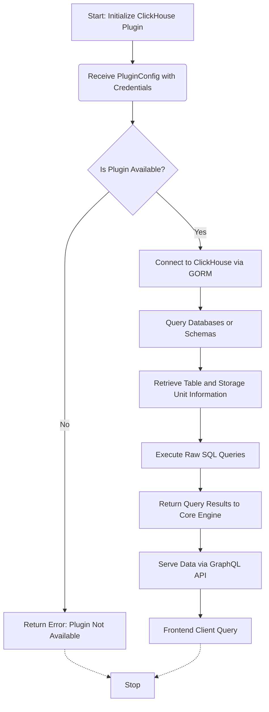

# ClickHouse Plugin

The **ClickHouse Plugin** integrates ClickHouse databases with the WhoDB application, enabling schema discovery, data fetching, and query execution through a uniform plugin interface. It leverages the GORM ORM for connection management and raw SQL interactions, providing a seamless experience for users working with ClickHouse.

---

## Table of Contents

- [Overview](#overview)
- [Key Features](#key-features)
- [Installation and Setup](#installation-and-setup)
- [Usage Example](#usage-example)
- [Architecture and Integration](#architecture-and-integration)
- [Mermaid Diagram - Interaction Flow](#mermaid-diagram---interaction-flow)
- [Source Reference](#source-reference)

---

## Overview

The ClickHouse Plugin serves as a bridge between the WhoDB application and ClickHouse databases, enabling standardized interactions such as fetching databases, schemas, tables (storage units), executing raw SQL queries, and retrieving table metadata.

It is built as a Go plugin embedding the GORM plugin abstraction, which simplifies interactions with SQL databases by using GORM's ORM capabilities along with ClickHouse-specific features.

---

## Key Features

- **Database connectivity:** Establishes a connection to ClickHouse using provided credentials and connection parameters.
- **Schema Inspection:** Retrieves information about databases, schemas, and tables.
- **Query Execution:** Supports raw SQL execution with parameterized queries.
- **Storage Units:** Maps ClickHouse tables to storage units and manages their attributes.
- **Pagination and Filtering:** Supports fetching rows of data with pagination.
- **Plugin Interface Compatibility:** Implements required methods from WhoDB's `PluginFunctions` interface.

---

## Installation and Setup

The ClickHouse plugin requires the following dependencies:

- GORM ORM (https://gorm.io) for ORM-based database interactions.
- ClickHouse Go client and GORM driver (https://github.com/ClickHouse/clickhouse-go/v2).
- WhoDB core engine components for PluginConfig and StorageUnit abstractions.

To initialize the plugin in your Go code:

```go
import (
  "github.com/clidey/whodb/core/src/engine"
  "github.com/clidey/whodb/core/src/plugins/clickhouse"
)

func InitializeClickHouse() *engine.Plugin {
  // Create a new ClickHouse plugin instance
  plugin := clickhouse.NewClickHousePlugin()

  // Register plugin with the engine if applicable
  engine.MainEngine.RegistryPlugin(plugin)

  return plugin
}
```

Make sure to provide valid ClickHouse connection credentials in `engine.PluginConfig` when using this plugin.

---

## Usage Example

A basic example of using the ClickHouse plugin to get databases and perform a raw query:

```go
import (
  "fmt"
  "github.com/clidey/whodb/core/src/engine"
  "github.com/clidey/whodb/core/src/plugins/clickhouse"
  "context"
)

func exampleUsage(ctx context.Context, credentials *engine.Credentials) error {
  plugin := clickhouse.NewClickHousePlugin()
  config := engine.NewPluginConfig(credentials)

  // Check if plugin is available
  if !plugin.IsAvailable(config) {
    return fmt.Errorf("clickhouse: plugin not available")
  }

  // Get databases
  dbs, err := plugin.GetDatabases(config)
  if err != nil {
    return err
  }
  fmt.Printf("Databases: %v\n", dbs)

  // Execute a raw query
  rawResult, err := plugin.RawExecute(config, "SELECT 1 as example")
  if err != nil {
    return err
  }

  fmt.Printf("Raw query result columns: %v\n", rawResult.Columns)
  fmt.Printf("Raw query result rows: %v\n", rawResult.Rows)

  return nil
}
```

---

## Architecture and Integration

The ClickHouse plugin fits into the WhoDB architecture as one of the core database engine plugins that the main `engine.Engine` manages. It implements the `PluginFunctions` interface, allowing it to be used interchangeably alongside other database plugins such as Postgres, MySQL, and MongoDB.

Key integration points:

- **Plugin Registry:** Registered in `engine.Engine`'s plugin registry to be chosen based on database type.
- **PluginConfig:** Receives connection credentials and configuration, used for connecting and executing queries.
- **GORM Layer:** Uses GORM's ORM with ClickHouse-specific driver for abstraction and ease of connection management.
- **Core Engine:** Carries out schema discovery and raw execution requests delegated from higher layers.
- **GraphQL API:** Data retrieved and manipulated by the plugin is exposed via GraphQL resolvers in the core graph package.

Dependencies:

- `gorm.io/gorm` for ORM operations.
- `gorm.io/driver/clickhouse` or ClickHouse Go driver for database communication.
- `github.com/clidey/whodb/core/src/engine` for plugin abstractions.
- `github.com/clidey/whodb/core/src/plugins` for shared plugin utility functions.

---

## Mermaid Diagram - Interaction Flow



---

## Source Reference

For detailed implementation, refer to the following source files:

- [ClickHouse Plugin implementation](core/src/plugins/clickhouse/clickhouse.go)
- [ClickHouse DB connection setup](core/src/plugins/clickhouse/db.go)
- [Core Engine Plugin Definitions](core/src/engine/plugin.go)
- [GORM Plugin Base](core/src/plugins/gorm/plugin.go)

These sources provide the full context of integration, connectivity, and plugin interface implementation for ClickHouse within WhoDB.

---

By using the ClickHouse plugin, WhoDB efficiently supports ClickHouse databases with rich functionality for schema introspection, query execution, and integration with AI and GraphQL features, enabling interactive and comprehensive management of ClickHouse data in a unified system.