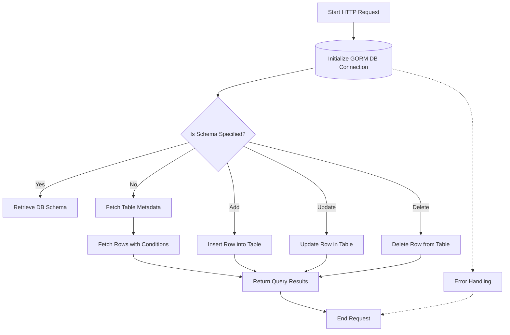

# GORM Base Plugin

The **GORM Base Plugin** provides a foundational implementation for integrating SQL-based databases using the GORM ORM library in Go. It serves as a reusable base that specific SQL database plugins, such as Postgres, MySQL, SQLite3, ClickHouse, extend and customize to support database operations in a standardized way.

---

## Table of Contents

- [Overview](#overview)
- [Key Concepts](#key-concepts)
- [Functionality](#functionality)
- [Code Example](#code-example)
- [Mermaid Diagram](#mermaid-diagram)
- [Integration Details](#integration-details)
- [Source](#source)

---

## Overview

The GORM Base Plugin encapsulates common behaviors for SQL database interaction using the GORM ORM. It provides:

- Schema discovery (getting schemas, tables, columns)
- Row data fetching with pagination and filtering
- Table creation and modification supports
- Row insertion, updating, and deletion
- Conversion utilities for data types
- Query construction with support for condition application

This base plugin abstracts away redundant boilerplate to allow database-specific plugins to focus on unique SQL dialect behaviors and connection details.

## Key Concepts

- **Plugin Abstraction:** Implements the [PluginFunctions](https://github.com/clidey/whodb/core/src/engine/plugin.go) interface methods on a `GormPlugin` struct 
- **DB Connection:** Provides utility to safely manage GORM database connections
- **Schema Operations:** Supports obtaining table schemas, storage units, and column metadata
- **Row Management:** Enables fetching rows with filters and pagination, as well as adding/updating/deleting rows
- **Type Conversion:** Converts string data from SQL to appropriate Go types for safe handling
- **Where Condition:** Applies `Where` clauses to GORM queries, translating abstract conditions

## Functionality

### Core Methods Provided by GORM Base Plugin

- `GetStorageUnits`: Retrieves tables (storage units) for a given schema
- `GetAllSchemas`: Returns all schemas in the connected database
- `GetRows`: Queries rows from a table with optional where conditions and paging
- `AddStorageUnit`: Creates a new table 
- `AddRow`: Inserts a new row into a table
- `UpdateStorageUnit`: Updates row(s) with new values
- `DeleteRow`: Deletes rows matching criteria

### Utility and Helper Functions

- `ConvertRawToRows`: Converts SQL rows to the plugin internal `GetRowsResult` format
- `applyWhereConditions`: Translates GraphQL-style filters (`WhereCondition`) into GORM `Where` queries
- `ConvertStringValue`: Parses string representations into strongly-typed Go values
- `GetPrimaryKeyColumns`, `GetColumnTypes`: Extract primary key and column type information from the database
- `EscapeIdentifier`: Safely escapes identifiers like table and column names for SQL queries

## Code Example

```go
package gorm_plugin

import (
  "github.com/clidey/whodb/core/src/engine"
  "gorm.io/gorm"
)

// GormPlugin defines the base plugin for SQL databases using GORM
// It embeds the generic Plugin handling interface and implements required methods

type GormPlugin struct {
  engine.Plugin // embeds the core plugin interface
}

// GetStorageUnits returns all tables in the specified schema
func (p *GormPlugin) GetStorageUnits(config *engine.PluginConfig, schema string) ([]engine.StorageUnit, error) {
  db, err := p.DB(config)
  if err != nil {
    return nil, err
  }
  // Assume p.GetTableSchema fetches schema maps with table columns
  schemaMap, err := p.GetTableSchema(db, schema)
  if err != nil {
    return nil, err
  }

  var storageUnits []engine.StorageUnit
  for tableName, columns := range schemaMap {
    attrs := make([]engine.Record, len(columns))
    for i, col := range columns {
      attrs[i] = engine.Record{Key: col.Key, Value: col.Value}
    }
    storageUnits = append(storageUnits, engine.StorageUnit{Name: tableName, Attributes: attrs})
  }

  return storageUnits, nil
}

// DB returns a GORM *gorm.DB connection for the plugin
func (p *GormPlugin) DB(config *engine.PluginConfig) (*gorm.DB, error) {
  // Plugin-specific implementation to create & validate GORM DB connection
  return nil, nil
}

// ... other methods omitted for brevity
```

## Mermaid Diagram



## Integration Details

The GORM Base Plugin is a core part of the **Whodb** backend architecture, providing a flexible foundation for SQL database support with ORM capabilities.

- **Extensible Base:** Specific databases (Postgres, MySQL, SQLite3, ClickHouse) extend this base plugin, overriding or augmenting connection and query details.
- **Core Engine Interaction:** The base plugin obeys the `engine.PluginFunctions` interface, allowing the `engine.Engine` to invoke operations generically across multiple database types.
- **GraphQL Layer:** The backend GraphQL resolvers invoke plugin methods to fulfill schema and data queries, enabling uniform API operations independent of the underlying SQL dialect.
- **Error Handling:** All database operations properly handle connection errors and SQL execution results, returning structured errors for API responses.
- **Connection Pooling:** Each plugin manages its own GORM database connection instance for efficiency and controlled lifecycle.

**Dependencies and Relations:**

- Uses `gorm.io/gorm` for ORM capabilities.
- Requires internal engine types like `engine.PluginConfig`, `engine.GetRowsResult`, and `engine.Record`.
- Serves as a base for plugins located in `core/src/plugins/postgres`, `core/src/plugins/mysql`, `core/src/plugins/sqlite3`, and `core/src/plugins/clickhouse`.
- Interacts with support utility functions in `core/src/plugins/common` and `core/src/plugins/gorm/utils.go`.

---

## Source

- [Gorm Base Plugin Source](https://github.com/clidey/whodb/blob/main/core/src/plugins/gorm/plugin.go)
- [Common Plugin Utilities](https://github.com/clidey/whodb/blob/main/core/src/plugins/common.go)
- [GORM Plugin Utilities](https://github.com/clidey/whodb/blob/main/core/src/plugins/gorm/utils.go)
- [Postgres Plugin (Example Extension)](https://github.com/clidey/whodb/blob/main/core/src/plugins/postgres/postgres.go)

Embed this plugin to quickly enable SQL database support with a consistent interface, and customize database specifics in the extended plugin implementations.
