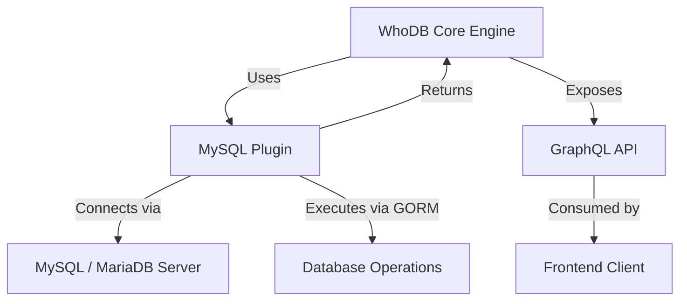

# MySQL Plugin

The **MySQL Plugin** integrates MySQL and MariaDB databases into the WhoDB platform through a unified plugin interface. It provides capabilities to explore database schema, retrieve table metadata, execute raw SQL queries, and work seamlessly with the application's core engine.

---

## Table of Contents

- [Overview](#overview)
- [Features](#features)
- [Installation & Usage](#installation--usage)
- [Core Methods](#core-methods)
- [Integration with WhoDB](#integration-with-whodb)
- [Example Usage](#example-usage)
- [Component Diagram](#component-diagram)
- [Source Code](#source-code)

---

## Overview

This plugin acts as the bridge between WhoDB's core engine and MySQL/MariaDB databases. It wraps the GORM ORM for database interactions, supporting raw SQL execution, schema introspection, and converting database metadata into internal representations.

The plugin supports these databases:

- MySQL
- MariaDB (via a derived plugin that shares core implementation with MySQL)

It allows querying for available databases, schemas (in this case synonymous with database names in MySQL), storage units (tables), and detailed column info.

---

## Features

- Retrieve the list of databases available on the MySQL server.
- List database schemas and tables.
- Get detailed table metadata including columns and attributes.
- Execute arbitrary raw SQL queries with results mapped into the engine format.
- Support pagination and filtering of results.
- Built on top of the GORM plugin base for consistency across SQL plugins.

---

## Installation & Usage

The MySQL plugin is initialized as part of the main engine initialization in WhoDB. You don't typically need to manage it separately, but here is the basic setup flow:

```go
import (
  "github.com/clidey/whodb/core/src/engine"
  mysql "github.com/clidey/whodb/core/src/plugins/mysql"
)

func main() {
  plugin := mysql.NewMySQLPlugin()
  engineInstance := engine.Engine{Plugins: []*engine.Plugin{plugin}}
  // Use engineInstance for DB operations
}
```

The plugin will use the provided configuration and credentials to connect and perform operations.

---

## Core Methods

### NewMySQLPlugin()
Creates a new plugin instance for MySQL.

```go
func NewMySQLPlugin() *engine.Plugin
```

### GetDatabases(config *engine.PluginConfig) ([]string, error)
Returns a list of available database names.

### GetAllSchemasQuery() string
Returns the SQL query to fetch all schemas.

### FormTableName(schema string, storageUnit string) string
Helper to construct fully qualified table names.

### GetSchemaTableQuery() string
Returns the SQL query to fetch tables within a schema.

### GetTableInfoQuery() string
Returns the SQL query to fetch detailed column info.

### GetTableNameAndAttributes(rows *sql.Rows, db *gorm.DB) (string, []engine.Record)
Parses database rows into a table name and a list of column attributes.

### RawExecute(config *engine.PluginConfig, query string) (*engine.GetRowsResult, error)
Executes a raw SQL query and returns rows in engine format.

---

## Integration with WhoDB

- **Dependency on Core Engine:** The plugin implements the `engine.PluginFunctions` interface defined in the core engine module, allowing WhoDB to abstract interactions with multiple databases uniformly.
- **Based on GORM:** It uses the GORM ORM library via the shared GormPlugin base for SQL database communication.
- **Works with Plugin Config:** Accepts plugin configuration with credentials and connection parameters to safely connect to the MySQL database.
- **Exposed via GraphQL API:** Methods translate to GraphQL resolvers allowing frontend clients to query database info and execute dynamic SQL.

---

## Example Usage

### Listing Databases

```go
package main

import (
  "fmt"
  mysql "github.com/clidey/whodb/core/src/plugins/mysql"
  "github.com/clidey/whodb/core/src/engine"
)

func main() {
  plugin := mysql.NewMySQLPlugin()
  config := engine.NewPluginConfig(&engine.Credentials{
    Hostname: "127.0.0.1",
    Port: "3306",
    Username: "root",
    Password: "password",
  })

  databases, err := plugin.GetDatabases(config)
  if err != nil {
    fmt.Printf("Error fetching databases: %v\n", err)
    return
  }

  fmt.Println("Available Databases:")
  for _, db := range databases {
    fmt.Println("-", db)
  }
}
```

### Executing Raw SQL

```go
result, err := plugin.RawExecute(config, "SELECT * FROM users LIMIT 10")
if err != nil {
  log.Fatalf("Query failed: %v", err)
}
for _, row := range result.Rows {
  fmt.Println(row)
}
```

---

## Component Diagram



---

## Source Code

- [MySQL Plugin Implementation](../../core/src/plugins/mysql/mysql.go)
- [MySQL Database Connection](../../core/src/plugins/mysql/db.go)
- [MySQL GraphQL Integration](../../core/src/plugins/mysql/graph.go)

---

The MySQL plugin is a fundamental part of WhoDB's support for SQL databases, enabling flexible and powerful database exploration and querying through a consistent plugin-based architecture.