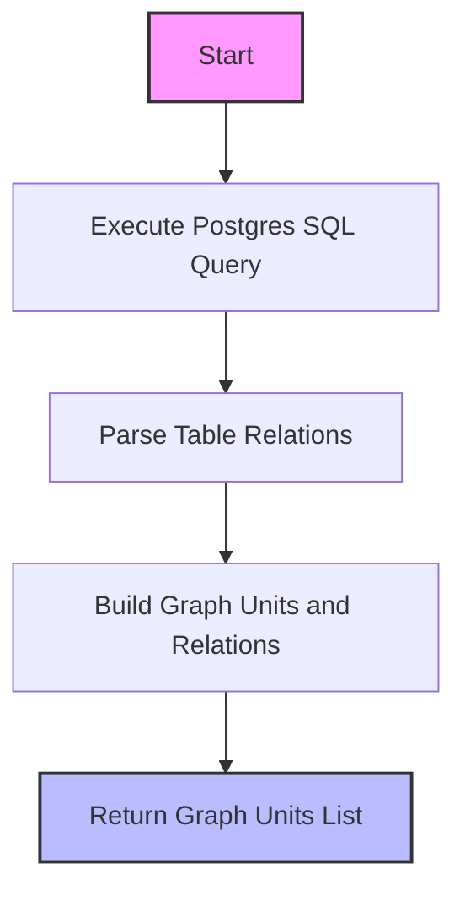

# Postgres Plugin

The **Postgres Plugin** is a core module within WhoDB that provides comprehensive integration with PostgreSQL databases. It enables schema introspection, data query execution, metadata retrieval, and raw SQL execution via the **GORM ORM** framework, tailored specifically for PostgreSQL's dialect and features.

This plugin acts as a bridge between WhoDB's abstract engine layer and the PostgreSQL database system, offering PostgreSQL-aware implementations of the plugin interface to enable efficient database browsing, querying, and manipulation.

---

## Table of Contents

- [Overview](#overview)
- [Key Features](#key-features)
- [Plugin Components](#plugin-components)
- [Example Usage](#example-usage)
- [Integration](#integration)
- [Postgres Schema Graph Query](#postgres-schema-graph-query)

---

## Overview

The Postgres Plugin extends the generic GORM-based plugin with PostgreSQL-specific knowledge. It provides:

- Supported PostgreSQL data types.
- Custom SQL queries to retrieve all schemas, tables, and table metadata.
- Conversion utilities for PostgreSQL data types.
- Raw SQL query execution support.

The plugin ensures that all database object identifiers are properly escaped and handles details like identity columns, null constraints, and primary keys as per PostgreSQL conventions.

## Key Features

- **Schema Exploration:** Retrieve a list of all schemas and tables.
- **Metadata Extraction:** Fetch detailed column information including types and keys.
- **Raw SQL Execution:** Execute arbitrary SQL queries with results parsed into a uniform structure.
- **Type Handling:** Conversion functions, handling PostgreSQL-specific types and nuances.
- **Integration with GORM:** Leverages GORM for connection management and query execution.

---

## Plugin Components

### 1. Supported Data Types

The plugin defines a set of supported column data types relevant to PostgreSQL to facilitate correct query generation and type conversion during result parsing.

### 2. Queries

- **GetAllSchemasQuery:** SQL query to retrieve all schemas excluding system schemas.
- **GetSchemaTableQuery:** Query to list tables within a schema.
- **GetTableInfoQuery:** Query detailed column info, including keys and identity.

These queries conform to PostgreSQL's system views (`information_schema`, `pg_catalog`) for reliable schema metadata.

### 3. Identifier Handling

Postgres uses double quotes to escape identifiers, and the plugin provides helper functions to properly escape these identifiers when forming SQL strings.

### 4. Query Execution

The plugin implements methods to execute raw SQL queries using GORM's `Raw()` methods with appropriate scanning and result transformation.

### 5. Plugin Construction

A dedicated constructor `NewPostgresPlugin()` initializes the plugin instance, embedding GORM plugin functionality and PostgreSQL specifics.

---

## Example Usage

```go
import (
  "fmt"
  "github.com/clidey/whodb/core/src/engine"
  postgres "github.com/clidey/whodb/core/src/plugins/postgres"
)

func example() {
  plugin := postgres.NewPostgresPlugin()

  // Suppose cfg is a PluginConfig with credentials setup
  cfg := &engine.PluginConfig{ /* database credentials and settings */ }

  // Fetch all schemas
  schemas, err := plugin.GetAllSchemas(cfg)
  if err != nil {
    fmt.Println("Error fetching schemas:", err)
    return
  }
  fmt.Printf("Schemas: %v\n", schemas)

  // Fetch tables from first schema
  if len(schemas) > 0 {
    tables, err := plugin.GetStorageUnits(cfg, schemas[0])
    if err != nil {
      fmt.Println("Error fetching tables:", err)
      return
    }
    fmt.Printf("Tables in %s: %v\n", schemas[0], tables)
  }
}
```

---

## Integration

The Postgres Plugin integrates directly with the WhoDB core engine:

- Registered as a plugin for the `Postgres` database type.
- Used by the engine's `Choose` method to select the proper plugin based on DB type.
- Interfaces with the connection and query infrastructure provided by the GORM-based abstraction.
- Communicates with the REST/GraphQL API to respond to client requests about database metadata and data retrieval.

### Dependencies

- **GORM:** For database connection and query abstraction.
- **Postgres Driver:** GORM's PostgreSQL dialect (“gorm.io/driver/postgres”).
- **WhoDB Core Types:** Uses engine, model, and plugin interfaces.

### Touchpoints

- Invoked during server startup when initializing engine plugins.
- Called by GraphQL resolvers when clients request PostgreSQL schema data.
- Employed in data querying, table changes, and direct SQL execution.

---

## Postgres Schema Graph Query

A specialized SQL query is used to extract table relationships for visualization or analysis. It inspects foreign key constraints, primary keys, unique keys, and many-to-many join tables.



This query and process provide insights into how tables are related within the database, enabling features like diagram rendering and relationship navigation.

---

## See Also

- [Postgres Plugin Source](https://github.com/clidey/whodb/blob/main/core/src/plugins/postgres/postgres.go) 
- [GORM Plugin Base](https://github.com/clidey/whodb/blob/main/core/src/plugins/gorm/plugin.go)
- [WhoDB Core Engine](https://github.com/clidey/whodb/blob/main/core/src/engine/engine.go)
- [GraphQL Resolvers](https://github.com/clidey/whodb/blob/main/core/graph/schema.resolvers.go)

---

The Postgres Plugin is a pivotal component for robust PostgreSQL support within WhoDB, enabling seamless inspection and query execution using the power of GORM ORM and PostgreSQL's system catalogs.
