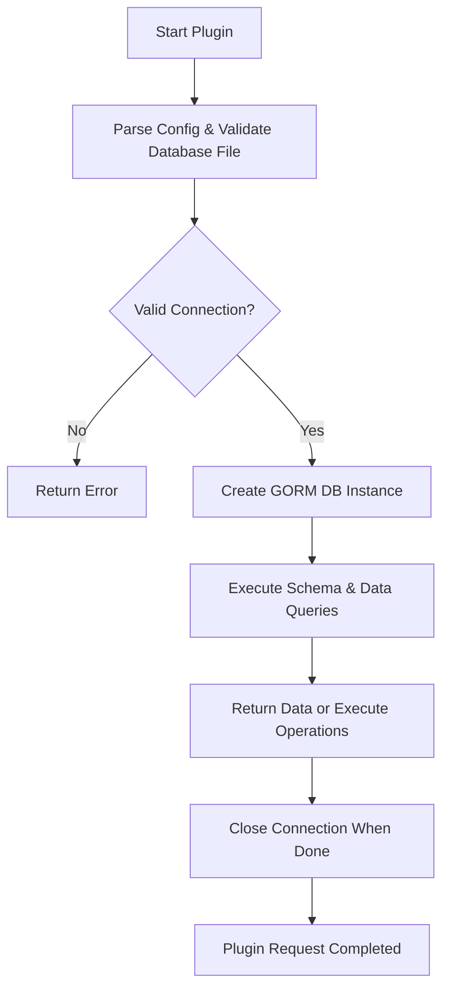

# SQLite3 Plugin

The SQLite3 Plugin provides integration support for SQLite3 databases within the WhoDB platform. This plugin enables database schema introspection, retrieval of metadata, execution of SQL queries, and interaction with SQLite3 databases through a standardized plugin interface.

## Table of Contents
- [Overview](#overview)
- [Key Features](#key-features)
- [Usage and Initialization](#usage-and-initialization)
- [Core Methods](#core-methods)
- [Integration Details](#integration-details)
- [Example: Using SQLite3 Plugin](#example-using-sqlite3-plugin)
- [Plugin Lifecycle Diagram](#plugin-lifecycle-diagram)
- [Source Code](#source-code)

---

## Overview

SQLite3 is a widely-used, lightweight, file-based SQL database engine. The SQLite3 Plugin in WhoDB acts as a bridge between the application and SQLite databases, enabling schema discovery and data querying in a way consistent with the other supported database plugins.

This plugin is built on top of the GORM ORM and implements the generic engine.PluginFunctions interface, providing a rich set of database operations adapted for SQLite3.

## Key Features

- **Schema Introspection:** Retrieve schemas, tables, and columns metadata from SQLite3 database files.
- **Raw SQL Execution:** Execute arbitrary SQL queries directly against SQLite3 databases.
- **Connection Management:** Open and manage SQLite3 database connections securely.
- **Paging Support:** Retrieve paginated data rows from tables.
- **Compatibility:** Implements the standardized plugin interface allowing interchangeability with other SQL plugins.

## Usage and Initialization

The SQLite3 Plugin is initialized and registered with the main WhoDB database engine during startup.

```go
import (
  "github.com/clidey/whodb/core/src/src"
  "github.com/clidey/whodb/core/src/plugins/sqlite3"
)

func InitializeEngine() *engine.Engine {
  eng := engine.NewEngine()

  // Register SQLite3 plugin
  sqlite3Plugin := sqlite3.NewSqlite3Plugin()
  eng.RegistryPlugin(sqlite3Plugin)

  return eng
}
```

## Core Methods

The SQLite3 Plugin provides implementations for the following core methods defined by the engine.PluginFunctions interface:

### GetDatabases
Retrieves the list of accessible SQLite3 database files.

```go
func (p *Sqlite3Plugin) GetDatabases(config *engine.PluginConfig) ([]string, error)
```

### GetAllSchemas
Returns available schemas (SQLite3 doesn't use schemas, so typically returns an empty or fixed list).

### GetStorageUnits
Fetches all tables (storage units) within the given database.

### GetRows
Retrieves rows with filtering and pagination from a specified table.

### RawExecute
Allows executing raw SQL query strings returning resulting rows.

### DB
Returns a GORM-based *gorm.DB connection tied to the SQLite3 database.

### Additional Utilities

- **GetTableInfoQuery()** and **GetSchemaTableQuery()** define SQLite3-specific SQL patterns used internally.
- **FormTableName** prepares fully-qualified table names (typically just the table name in SQLite3).

## Integration Details

The SQLite3 Plugin integrates into WhoDB's core engine as one of several interchangeable database plugins. It relies on:

- **GORM ORM:** For managing SQLite3 connections and ORM operations.
- **Filesystem:** Since SQLite3 is file-based, it reads the database file from configurable locations.
- **Application Config:** Connection details and database file paths are passed via `engine.PluginConfig`.

### Main Touchpoints

- **Initialization:** Instantiated via `NewSqlite3Plugin` and registered.
- **Connection:** Opens connection to `.db` or `.sqlite` files using GORM with the SQLite driver.
- **Schema Queries:** Uses embedded SQL queries to extract table and column info.
- **REST/GraphQL API:** Exposes databases, schemas, storage units, rows, and raw query execution to frontend clients through GraphQL handled by the core engine.

## Example: Using SQLite3 Plugin

```go
package main

import (
  "log"
  "github.com/clidey/whodb/core/src/engine"
  "github.com/clidey/whodb/core/src/plugins/sqlite3"
)

func main() {
  // Initialize SQLite3 plugin
  sqlite3Plugin := sqlite3.NewSqlite3Plugin()

  // Example plugin credentials for database file
  creds := &engine.Credentials{
    Hostname: "",           // Not needed for SQLite
    Database: "/path/data.sqlite3",
    Type:     engine.DatabaseType_Sqlite3,
    IsProfile: false,
  }

  // Create plugin config
  pluginConfig := engine.NewPluginConfig(creds)

  // Check availability
  if !sqlite3Plugin.IsAvailable(pluginConfig) {
    log.Fatal("SQLite3 database is not available")
  }

  // Get databases (in SQLite3, typically the file path itself)
  dbs, err := sqlite3Plugin.GetDatabases(pluginConfig)
  if err != nil {
    log.Fatal(err)
  }
  log.Println("Databases:", dbs)

  // Get storage units (tables) in the database
  tables, err := sqlite3Plugin.GetStorageUnits(pluginConfig, "")
  if err != nil {
    log.Fatal(err)
  }
  for _, table := range tables {
    log.Println("Table:", table.Name)
  }

  // Execute a raw SQL query
  result, err := sqlite3Plugin.RawExecute(pluginConfig, "SELECT * FROM my_table LIMIT 10")
  if err != nil {
    log.Fatal(err)
  }
  log.Println("Rows:", result.Rows)
}
```

## Plugin Lifecycle Diagram



## Source Code

- The complete implementation of the SQLite3 Plugin can be found in the following files:
  - [sqlite3.go](https://github.com/clidey/whodb/blob/main/core/src/plugins/sqlite3/sqlite3.go)
  - [db.go](https://github.com/clidey/whodb/blob/main/core/src/plugins/sqlite3/db.go)
  - [graph.go](https://github.com/clidey/whodb/blob/main/core/src/plugins/sqlite3/graph.go)
  - [common.go (for DB connection management)](https://github.com/clidey/whodb/blob/main/core/src/plugins/common.go)

---

This plugin provides seamless transparent support for SQLite3 databases in the WhoDB system with consistent interfaces mirroring those of other supported SQL backends. It abstracts away SQLite3-specific details, letting clients and other system parts operate uniformly.

For a detailed reference to methods and internal structures, see [sqlite3.go](/core/src/plugins/sqlite3/sqlite3.go) and related source files.