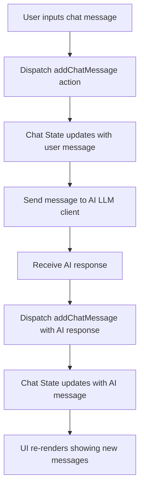

# Chat State

## Table of Contents

- [Overview](#overview)
- [State Structure](#state-structure)
- [Actions & Reducers](#actions--reducers)
- [Usage Example](#usage-example)
- [Integration Details](#integration-details)
- [Component Interaction Flow](#component-interaction-flow)

---

## Overview

The Chat State module manages the state related to AI chat interactions within the frontend application. It leverages Redux Toolkit to provide a type-safe, scalable way to track chat messages, both those sent by the user and those received from AI models.

This state slice stores chat messages as an ordered list and supports adding new messages or clearing the entire chat history. It facilitates a conversational UI that integrates AI model responses with the application's chat interface.

## State Structure

The state primarily consists of:

- `chats`: An array of chat messages.

Each chat message is represented by a type extending the generated GraphQL `AiChatMessage` with an additional optional flag `isUserInput` to distinguish user-submitted messages from AI responses.

### Types

```ts
// Extends AI chat message to include user message flag
interface IChatMessage extends AiChatMessage {
  isUserInput?: boolean;
}

// State holding chat messages
interface IChatState {
  chats: IChatMessage[];
}
```

## Actions & Reducers

The chat slice exposes reducer functions for managing chat state:

- `addChatMessage`: Adds a new chat message to the list.
- `clear`: Clears all chat messages.

These actions allow developers to append messages as the conversation progresses and reset the chat state when needed.

### Example reducer slice setup

```ts
import { createSlice, PayloadAction } from '@reduxjs/toolkit';
import { AiChatMessage } from '../generated/graphql';

const initialState: IChatState = {
  chats: [],
};

const houdiniSlice = createSlice({
  name: 'chat',
  initialState,
  reducers: {
    addChatMessage(state, action: PayloadAction<IChatMessage>) {
      state.chats.push(action.payload);
    },
    clear(state) {
      state.chats = [];
    },
  },
});

export const HoudiniActions = houdiniSlice.actions;
export const houdiniReducers = houdiniSlice.reducer;
```

## Usage Example

Below is a minimal example demonstrating how to dispatch an `addChatMessage` action and how to clear chat messages within React components.

```tsx
import React from 'react';
import { useDispatch, useSelector } from 'react-redux';
import { HoudiniActions } from '../store/chat';
import { IChatMessage } from '../store/chat';

function ChatExample() {
  const dispatch = useDispatch();
  const chats = useSelector((state) => state.chat.chats);

  const sendMessage = () => {
    const userMessage: IChatMessage = { text: "Hello AI!", type: "text", isUserInput: true };
    dispatch(HoudiniActions.addChatMessage(userMessage));
  };

  const clearChat = () => {
    dispatch(HoudiniActions.clear());
  };

  return (
    <div>
      <button onClick={sendMessage}>Send Message</button>
      <button onClick={clearChat}>Clear Chat</button>
      <ul>
        {chats.map((msg, idx) => (
          <li key={idx} style={{ fontWeight: msg.isUserInput ? 'bold' : 'normal' }}>
            {msg.text}
          </li>
        ))}
      </ul>
    </div>
  );
}

export default ChatExample;
```

## Integration Details

- **Redux Store:** The Chat State is included in the global Redux store facilitating unified state management.
- **GraphQL Types:** Uses the generated `AiChatMessage` types from the GraphQL schema for type safety and consistency.
- **UI Components:** Frontend components, such as the chat interface (`ChatPage`), interact with this state to display messages and send new ones.
- **Middleware:** No special middleware beyond Redux Toolkit is used; actions are standard synchronous.

## Component Interaction Flow



This flow highlights how user inputs and AI responses are sequentially integrated into the shared chat state, keeping UI and data in sync.

---

For full source and implementation details, see [`frontend/src/store/chat.ts`](/frontend/src/store/chat.ts).
