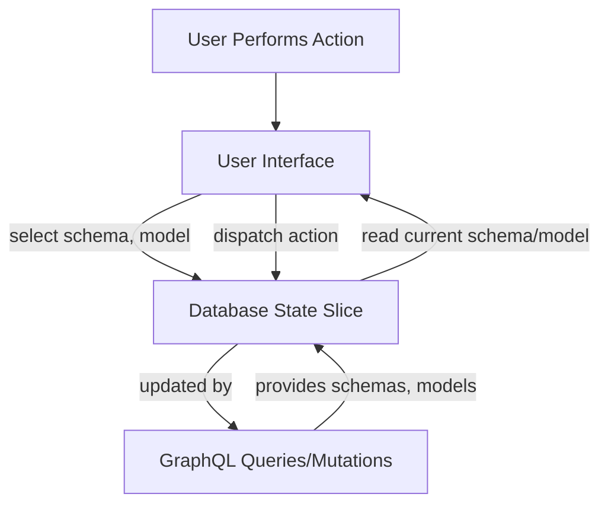

# Database State

## Table of Contents
- [Overview](#overview)
- [State Structure](#state-structure)
- [Usage in Frontend](#usage-in-frontend)
- [Key Concepts](#key-concepts)
- [Code Example](#code-example)
- [Integration Details](#integration-details)
- [State Flow Diagram](#state-flow-diagram)

---

## Overview

The **Database State** is a managed slice of the frontend application's global state dedicated to handling database-related information, particularly focusing on AI model types, selected models, database schema, and available model lists.

It enables components to keep track of the current database schema context, allowed AI model types for chat or query assistance, and the state of the selected AI model, facilitating dynamic UI updates and seamless user interactions involving database queries integrated with AI capabilities.

This state is built with Redux Toolkit, providing structured, predictable, and type-safe state management tailored for sophisticated frontend interactions with database and AI model data.

## State Structure

The **Database State** typically has the following shape:

- `schema`: The current database schema name selected by the user.
- `current`: The currently selected AI model type, including model ID, type, and optional token.
- `modelTypes`: A list of AI model type objects, each representing a model type available for use.
- `currentModel`: The ID or name of the specifically selected AI model.
- `models`: An array of available model names for the current type or context.

This structured state helps track which database and AI model configuration the user is working with, allowing for precise control over queries, chats, and model selection.

## Usage in Frontend

The **Database State** is accessed and manipulated primarily through React components using typed hooks and dispatch mechanisms. It supports:

- Selecting or switching the current database schema.
- Managing the list of supported AI model types (e.g., ChatGPT, Ollama).
- Keeping track of which AI model is currently in use.
- Storing the list of models that belong to the selected type.

### Example Dependencies in the Store Setup

- `@reduxjs/toolkit` for `createSlice` and state management.
- Local types representing AI models and Database schema.
- Interaction with GraphQL queries and mutations transforming this state.

## Key Concepts

- **Model Types vs Models:** Model Types represent categories or providers of AI models (like ChatGPT). Models are specific model versions or names within those types.

- **Schema Awareness:** The `schema` state reflects the selected database schema, allowing queries and AI interactions to be schema-contextual.

- **Current Selections:** Maintains both currently active AI model type and specific model to enable consistent API calls and UI behavior.

- **Redux Toolkit Slice:** This state is implemented as a Redux slice, creating actions and reducers to handle updates,
  ensuring consistent changes and enabling possible future persistence.

## Code Example

Below is a simplified example illustrating the definition of the database state slice with Redux Toolkit:

```ts
import { createSlice, PayloadAction } from '@reduxjs/toolkit';

// Represents a single AI Model Type
interface IAIModelType {
  id: string;
  modelType: string;
  token?: string;
}

// The Database State structure
interface IDatabaseState {
  schema: string;
  current?: IAIModelType;
  modelTypes: IAIModelType[];
  currentModel?: string;
  models: string[];
}

// Initial state
const initialState: IDatabaseState = {
  schema: '',
  modelTypes: [],
  models: [],
};

// Redux slice for database
const databaseSlice = createSlice({
  name: 'database',
  initialState,
  reducers: {
    setSchema(state, action: PayloadAction<string>) {
      state.schema = action.payload;
    },
    setModelTypes(state, action: PayloadAction<IAIModelType[]>) {
      state.modelTypes = action.payload;
    },
    setCurrentModelType(state, action: PayloadAction<{ id: string }>) {
      state.current = state.modelTypes.find(mt => mt.id === action.payload.id);
    },
    setCurrentModel(state, action: PayloadAction<string | undefined>) {
      state.currentModel = action.payload;
    },
    setModels(state, action: PayloadAction<string[]>) {
      state.models = action.payload;
    },
    addAIModelType(state, action: PayloadAction<IAIModelType>) {
      state.modelTypes.push(action.payload);
    },
    removeAIModelType(state, action: PayloadAction<{ id: string }>) {
      state.modelTypes = state.modelTypes.filter(mt => mt.id !== action.payload.id);
    },
  },
});

export const {
  setSchema,
  setModelTypes,
  setCurrentModelType,
  setCurrentModel,
  setModels,
  addAIModelType,
  removeAIModelType,
} = databaseSlice.actions;

export default databaseSlice.reducer;
```

## Integration Details

### How Database State fits in the system

- **Frontend Components:** Components like chat interfaces and database explorers reactively read from and write to this state to handle schema and AI model selections.

- **GraphQL Layer:** Integration with GraphQL queries and mutations updates this state when database schemas or AI models change.
  For example, querying available AI models triggers the population of `modelTypes` and `models`.

- **Redux Store:** This slice is combined with other slices (auth, common, settings) in the application's global Redux store, enabling consistent state management.

- **Typed Hooks:** Usage of typed `useAppSelector` and `useAppDispatch` hooks ensures type safety and developer productivity.

### Related Modules

- [Redux Store Configuration](/frontend/src/store/index.ts)
- [Authentication State](/frontend/src/store/auth.ts)
- [Settings State](/frontend/src/store/settings.ts)
- [Chat State](/frontend/src/store/chat.ts)

### Key Responsibilities

- Manage current database schema context.
- Track AI model types and selected model.
- Interface with backend queries to update available AI models and schema.
- Facilitate UI components’ state dependencies and user interactions.

## State Flow Diagram



---

For more details on the implementation and how this state integrates with API queries and mutations, see the [database slice source](/frontend/src/store/database.ts) and [GraphQL schema & resolvers](/core/graph/schema.resolvers.go).

This structure is foundational for providing a cohesive and responsive experience when interacting with different database schemas and AI-powered features.
