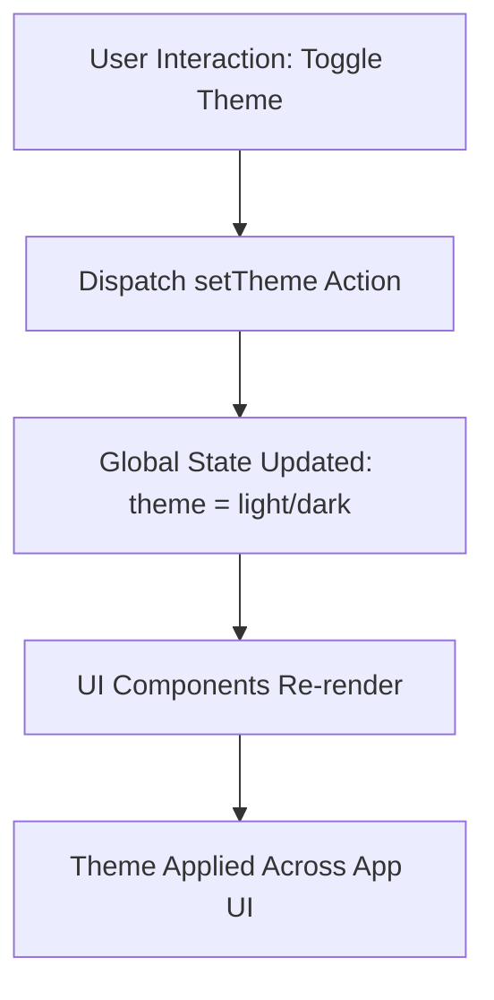

# Global State

The **Global State** module manages application-wide UI state that affects the overall look and feel of the application. It primarily handles the theme selection (light or dark mode) using Redux state management.

This state slice is foundational for providing a consistent user experience across different components and pages by centralizing global preferences.

---

## Table of Contents

- [Overview](#overview)
- [State Definition](#state-definition)
- [Actions and Reducers](#actions-and-reducers)
- [Usage Example](#usage-example)
- [Integration Details](#integration-details)
- [Mermaid Diagram: State Flow](#mermaid-diagram-state-flow)

---

## Overview

The global state within the frontend application controls UI-related settings that apply application-wide. Currently, the main state managed here is the **theme** setting, which dictates whether the UI uses a light or dark theme.

It uses **Redux Toolkit's** `createSlice` to define the state, action, and reducer in a concise and maintainable way.

## State Definition

The global state shape is defined as follows:

```ts
interface IGlobalState {
  theme: "light" | "dark";
}
```

The initial state sets the theme as `light`:

```ts
const initialState: IGlobalState = {
  theme: "light",
};
```

## Actions and Reducers

The slice consists of a single reducer:

- `setTheme`: Updates the `theme` state to either "light" or "dark" based on the dispatched action.

### Code Example

```ts
import { createSlice, PayloadAction } from '@reduxjs/toolkit';

interface IGlobalState {
  theme: "light" | "dark";
}

const initialState: IGlobalState = {
  theme: "light",
};

const globalSlice = createSlice({
  name: 'global',
  initialState,
  reducers: {
    setTheme(state: IGlobalState, action: PayloadAction<'light' | 'dark'>) {
      state.theme = action.payload;
    },
  },
});

export const GlobalActions = globalSlice.actions;
export const globalReducers = globalSlice.reducer;
```

- **`setTheme`**: Dispatch this action with payload `'light'` or `'dark'` to update the global theme.

## Usage Example

Integrate the global state with a React component:

```tsx
import { useAppDispatch, useAppSelector } from '../store/hooks';
import { GlobalActions } from '../store/global';

export function ThemeToggle() {
  const dispatch = useAppDispatch();
  const currentTheme = useAppSelector((state) => state.global.theme);

  const toggleTheme = () => {
    dispatch(GlobalActions.setTheme(currentTheme === 'light' ? 'dark' : 'light'));
  };

  return (
    <button onClick={toggleTheme}>
      Switch to {currentTheme === 'light' ? 'Dark' : 'Light'} Mode
    </button>
  );
}
```

## Integration Details

- **Redux Store**: The `globalReducers` is combined with other slice reducers in the root Redux store setup, enabling global state management.
- **UI Components**: Components like `ThemeToggle` or the root layout consume this state to apply corresponding themes.
- **Persistence**: Can be combined with `redux-persist` to persist user preferences across sessions.
- **Interaction with Other Modules**:
  - Works in conjunction with `settings` state for other app configurations.
  - Read by UI containers to apply CSS themes or Tailwind utility classes.

## State Flow Diagram



## Source

- [Global State Redux Slice](frontend/src/store/global.ts)
