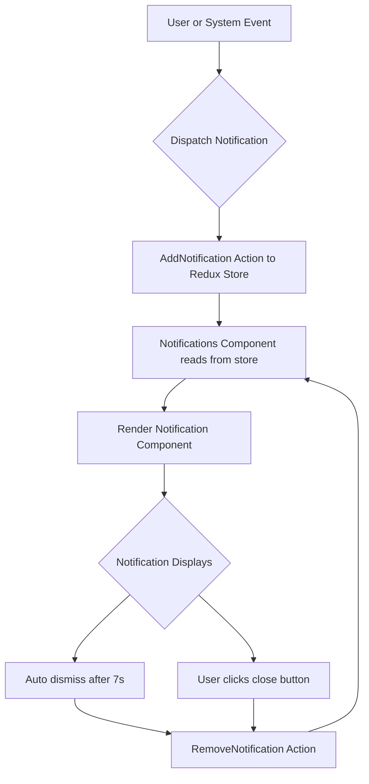

# Notification Helper

## Table of Contents
- [Introduction](#introduction)
- [Overview](#overview)
- [Key Concepts](#key-concepts)
- [Usage Example](#usage-example)
- [Component Details](#component-details)
- [Integration & Architecture](#integration--architecture)
- [Mermaid Diagram](#mermaid-diagram)
- [Source Code Reference](#source-code-reference)

---

## Introduction

The Notification Helper provides a centralized UI component for managing and displaying notification messages across the frontend application. It supports multiple notification types (such as success, error, warning, and default), automatic dismissal after a timeout, manual removal, and animated transitions, improving user feedback and interaction.


## Overview

Notifications are transient messages that inform users about system states, errors, achievements, or actions performed. This helper abstracts the logic of displaying such messages, including styling based on intent, managing lifecycle, and integrating with the global application state via Redux.

The main components involved are `Notification` (individual notification UI) and `Notifications` (container managing multiple notifications).


## Key Concepts

- **Notification Intents:** Types of notifications indicating their purpose or severity.
  - `default` (informative)
  - `success`
  - `error`
  - `warning`

- **Lifecycle Management:** Automatic removal of notifications after 7 seconds with manual dismissal also supported.

- **Animations:** Utilizes `framer-motion` for smooth entry and exit animations enhancing UI experience.

- **Redux Integration:** Notifications are managed in global state slice (`common`) allowing dispatching and removal from anywhere in the app.

- **Accessibility & Testability:** Implements `testId` support for easier testing and ARIA roles for accessibility.


## Usage Example

```tsx
import React from "react";
import { Notifications } from "frontend/src/components/notifications";
import { useAppDispatch } from "frontend/src/store/hooks";
import { CommonActions } from "frontend/src/store/common";

function App() {
  const dispatch = useAppDispatch();

  // Trigger a notification
  const notifyUser = () => {
    dispatch(CommonActions.addNotifications({
      id: "unique-id",
      message: "Operation successful!",
      intent: "success",
    }));
  };

  return (
    <div>
      <button onClick={notifyUser}>Notify</button>
      {/* Render notifications globally */}
      <Notifications />
    </div>
  );
}

export default App;
```


## Component Details

### `Notification` Component

Represents a single notification item.

- **Props:**
  - `notification`: The notification object containing `id`, `message`, and optional `intent`.

- **Features:**
  - Displays message and intent-specific styling.
  - Has a close button to remove the notification manually.
  - Automatically disappears after 7 seconds.


### `Notifications` Component

Manages the list of active notifications.

- **Behavior:**
  - Fetches the list of notifications from Redux store.
  - Renders each `Notification` with animation.
  - Cleans up notifications after delay or on user action.


### Animation

Implemented using `framer-motion`’s `AnimatePresence` and `motion.div` for entering and exiting effects.


## Integration & Architecture

The Notification Helper fits as a global UI utility within the frontend architecture, connecting the following:

- **Redux Store (`common` slice):** Notifications are managed as part of the global Redux state. The `CommonActions.addNotifications` and `removeNotifications` actions provide control over notification lifecycle.

- **UI Components:** Displays persistent notification UI with appropriate styles and accessibility.

- **Other UI Elements:** Any part of the UI can dispatch notifications to inform the user about results or errors.

- **Dependencies:**
  - `react`
  - `framer-motion` for animations
  - `classnames` for dynamic class management
  - Redux hooks for state management

- **System Touchpoints:**
  - Triggered by user actions, API responses, or internal app events.


## Mermaid Diagram




## Source Code Reference

- [Notification components and helpers](frontend/src/components/notifications.tsx)
- [Redux common slice for notifications](frontend/src/store/common.ts)
- [Notification dispatch helper](frontend/src/store/function.ts)

These files provide the full implementation of the notifications feature — from state management to UI rendering and user interaction.

---

By centralizing notification functionality, the Notification Helper improves user communication, error reporting, and feedback across the application, ensuring clear, consistent, and manageable UI alerts.
