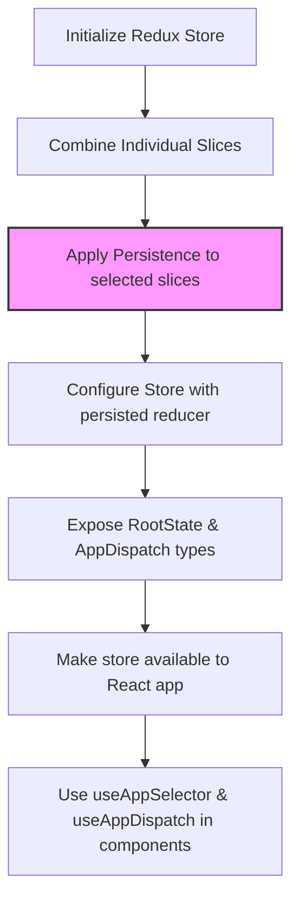

# Redux Store Configuration

## Table of Contents
- [Overview](#overview)
- [Store Setup](#store-setup)
- [Reducers and Slices](#reducers-and-slices)
- [Persisted State](#persisted-state)
- [Type Safety: RootState and AppDispatch](#type-safety-rootstate-and-appdispatch)
- [Integration in Frontend Architecture](#integration-in-frontend-architecture)
- [Example: Basic Store Configuration](#example-basic-store-configuration)

---

## Overview

The Redux Store Configuration forms the central state management layer for the WhoDB frontend application. It consolidates multiple reducers managing distinct parts of the application state—such as authentication, database data, UI settings, and chat interactions—into a single, unified store. Some parts of the state are persisted across sessions to provide a seamless user experience.

Redux Toolkit is used to simplify reducer and store creation, improving code maintainability and performance. The store makes the global state available throughout the React component tree via React-Redux bindings.

## Store Setup

The store uses `configureStore` from Redux Toolkit, which automatically sets up sensible defaults like the Redux DevTools extension and middleware including thunk for async actions.

Reducers from several slices are combined and some are wrapped with `persistReducer` from `redux-persist` to enable persistence:

- `auth` — manages authentication state and user profiles
- `database` — tracks database schema, selected AI models, and related info
- `common` — handles common UI states like notifications
- `global` — manages global app themes (e.g., light/dark mode)
- `settings` — controls app settings such as metrics collection
- `houdini` — deals with chat-related state (from Houdini GraphQL framework)

Once configured, a `persistor` is created and used together with the Redux store to persist specified slices to localStorage.

## Reducers and Slices

Each slice corresponds to a namespace in the global Redux state and defines the state structure, initial state, and reducers for synchronous updates.

- **Auth Slice**: Manages logged-in status, current user profile, and associated login credentials.
- **Database Slice**: Tracks current schema selection, AI model types used, and related model lists.
- **Common Slice**: Handles transient UI notifications.
- **Global Slice**: Controls the app theme, allowing toggling between "light" and "dark" modes.
- **Settings Slice**: Tracks feature toggles like metrics-enabled flag.
- **Houdini Slice**: Stores AI chat message history and states.

These slices expose actions that components dispatch to update state.

## Persisted State

Persistence is configured via `redux-persist` for specific slices where user preferences or authentication info need to survive page reloads or browser restarts.

This ensures that upon returning, users find their previous session state (e.g., logged-in user, theme choice, etc.) intact without needing to log in or reselect preferences.

## Type Safety: RootState and AppDispatch

The store exports:

- `RootState`: The inferred return type of `store.getState()`. Used as the type for `useSelector` hook selectors to ensure state access is strongly typed.

- `AppDispatch`: The type of the store's `dispatch` function. Used when calling `useDispatch` to fix typings for thunk and other middleware.

This improves development experience and reduces runtime errors by leveraging TypeScript's static typing.

## Integration in Frontend Architecture

- The store is the single source of truth for UI state.

- It is provided to the React app via `<Provider>` in the root component (`frontend/src/index.tsx`), enabling React components to use hooks `useAppSelector` and `useAppDispatch` for state consumption and dispatching.

- The slices correspond to distinct functional areas (auth, settings, chat, etc.), keeping state logically partitioned.

- Persistence boosts user experience by keeping data across sessions.

- Combined with `redux-persist` and configured with default middleware, it is ready to handle asynchronous GraphQL operations and local UI state seamlessly.

## Example: Basic Store Configuration

```ts
import { combineReducers, configureStore } from '@reduxjs/toolkit';
import { persistReducer, persistStore } from 'redux-persist';
import storage from 'redux-persist/lib/storage';

import authReducers from './auth';
import databaseReducers from './database';
import commonReducers from './common';
import globalReducers from './global';
import settingsReducers from './settings';
import houdiniReducers from './chat';

// Persist config example
const persistConfig = {
  key: 'root',
  storage,
  whitelist: ['auth', 'global', 'settings'], // slices to persist
};

// Combine root reducers
const rootReducer = combineReducers({
  auth: authReducers,
  database: databaseReducers,
  common: commonReducers,
  global: globalReducers,
  settings: settingsReducers,
  houdini: houdiniReducers,
});

// Wrap with persistence
const persistedReducer = persistReducer(persistConfig, rootReducer);

// Configure store with persisted reducer
export const reduxStore = configureStore({
  reducer: persistedReducer,
  // default middleware includes thunk and other useful middleware
});

// Create persistor
export const reduxStorePersistor = persistStore(reduxStore);

// Infer RootState and Dispatch types
export type RootState = ReturnType<typeof reduxStore.getState>;
export type AppDispatch = typeof reduxStore.dispatch;
```

---

## Source
- [frontend/src/store/index.ts](/frontend/src/store/index.ts)

---

This store configuration enables scalable, maintainable, and performant state management for the WhoDB frontend, playing a pivotal role in orchestrating UI state and bridging with backend GraphQL operations.

