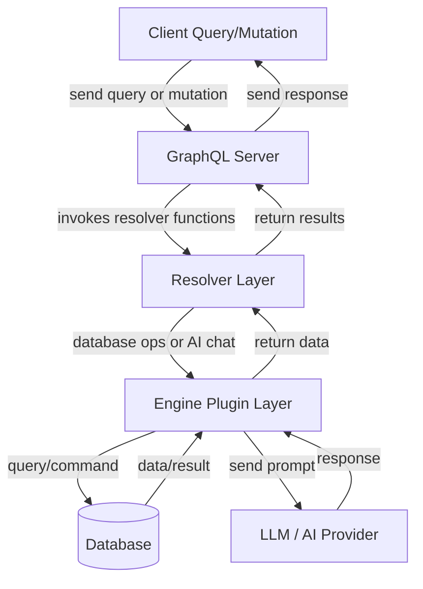

# Schema Definitions

This section provides an overview of the GraphQL schema definitions used in the backend of the WhoDB project. The schema defines the shape of the data, input parameters, enums, and operations (queries and mutations) that the GraphQL server supports. 

These schema definitions serve as the contract/interface between the frontend and backend, enabling typed, flexible, and powerful queries and mutations that interact with various database engines and AI integrations.

---

## Table of Contents

- [Overview](#overview)
- [Database Types](#database-types)
- [Core Types](#core-types)
- [Where Conditions for Filtering](#where-conditions-for-filtering)
- [Query Types](#query-types)
- [Mutation Types](#mutation-types)
- [Integration](#integration)
- [Example Schema Snippet](#example-schema-snippet)

---

## Overview

The schema defines types to represent databases, storage units (tables/collections), columns, rows, and relationships along with support for login profiles, AI providers/models, and application settings.

The schema supports both SQL and NoSQL databases, expressing relationships and data filtering logic with rich constructs for flexible client queries.

---

## Database Types

```graphql
enum DatabaseType {
  Postgres
  MySQL
  Sqlite3
  MongoDB
  Redis
  ElasticSearch
  MariaDB
  ClickHouse
}
```
- Enumerates supported database types.
- Used to specialize queries and operations according to specific database capabilities.

---

## Core Types

### Column
```graphql
"Represents a database column or field."
type Column {
  Type: String!
  Name: String!
}
```

### StorageUnit
```graphql
type StorageUnit {
  Name: String!
  Attributes: [Record!]!
}
```
Represents a storage entity, such as a table or collection, with a name and a list of attributes (key-value pairs).

### Record
```graphql
type Record {
  Key: String!
  Value: String!
}
```
Basic key-value pair used to describe fields or configuration.

### RowsResult
```graphql
type RowsResult {
  Columns: [Column!]!
  Rows: [[String!]!]!
  DisableUpdate: Boolean!
}
```
Used to return data rows with associated column metadata and control flags.

### GraphUnitRelationshipType
```graphql
enum GraphUnitRelationshipType {
  OneToOne
  OneToMany
  ManyToOne
  ManyToMany
  Unknown
}
```
Defines database relationship cardinalities.

### GraphUnitRelationship
```graphql
"Represents a relationship to another storage unit."
type GraphUnitRelationship {
  Name: String!
  Relationship: GraphUnitRelationshipType!
}
```

### GraphUnit
```graphql
"Represents a storage unit and its relationships for graph visualization."
type GraphUnit {
  Unit: StorageUnit!
  Relations: [GraphUnitRelationship!]!
}
```

---

## Where Conditions for Filtering

To enable complex querying and filtering, the schema defines condition input types:

- `WhereConditionType` enum to distinguish atomic and compound conditions:
  ```graphql
  enum WhereConditionType {
    Atomic
    And
    Or
  }
  ```

- `AtomicWhereCondition` defines single field constraints:
  ```graphql
  input AtomicWhereCondition {
    ColumnType: String!
    Key: String!
    Operator: String!
    Value: String!
  }
  ```

- `OperationWhereCondition` for nested logical expressions:
  ```graphql
  input OperationWhereCondition {
    Children: [WhereCondition!]!
  }
  ```

- `WhereCondition` is a polymorphic input representing a single condition or a logical grouping:
  ```graphql
  input WhereCondition {
    Type: WhereConditionType!
    Atomic: AtomicWhereCondition
    And: OperationWhereCondition
    Or: OperationWhereCondition
  }
  ```

These enable expressive filters for querying rows.

---

## Query Types

The Root Query type exposes:

- `Version`: Returns current server version.
- `Profiles`: Fetches all saved login profiles.
- `Database(type: String!)`: Lists databases by type.
- `Schema`: Lists schemas under current credentials.
- `StorageUnit(schema: String!)`: Lists storage units for a schema.
- `Row(schema: String!, storageUnit: String!, where: WhereCondition, pageSize: Int!, pageOffset: Int!)`: Returns paginated rows with optional filters.
- `RawExecute(query: String!)`: Executes raw queries.
- `Graph(schema: String!)`: Fetches graph of storage units and relations.
- `AIProviders`: Lists configured AI chat providers.
- `AIModel(providerID: String, modelType: String!, token: String)`: Lists AI models.
- `AIChat(...)`: Performs AI chat interaction.
- `SettingsConfig`: Reads current settings like metrics enable state.

---

## Mutation Types

Root Mutations include:

- `Login(credentials: LoginCredentials!)`: Authenticates user with credentials.
- `LoginWithProfile(profile: LoginProfileInput!)`: Login with a saved profile.
- `Logout`: Ends the session.
- `UpdateSettings(newSettings: SettingsConfigInput!)`: Updates config like metrics.
- `AddStorageUnit(schema: String!, storageUnit: String!, fields: [RecordInput!]!)`: Creates new storage unit.
- `UpdateStorageUnit(schema: String!, storageUnit: String!, values: [RecordInput!]!, updatedColumns: [String!]!)`: Updates storage unit properties.
- `AddRow(schema: String!, storageUnit: String!, values: [RecordInput!]!)`: Inserts a new data row.
- `DeleteRow(schema: String!, storageUnit: String!, values: [RecordInput!]!)`: Deletes data rows.

---

## Integration

- These schema definitions are implemented and linked with Go resolvers located in [`core/graph/schema.resolvers.go`](/core/graph/schema.resolvers.go).
- Supported database plugins (Postgres, MySQL, SQLite3, MongoDB, Redis, Elasticsearch, ClickHouse) map onto this schema to provide data dynamically.
- Client-side React components query these schemas via Apollo Client according to [`frontend/src/generated/graphql.tsx`](/frontend/src/generated/graphql.tsx) types and hooks.
- Authentication & permissions interact through mutations and queries with credential objects (`LoginCredentials`, `LoginProfileInput`).
- AI endpoints integrate with LLM clients to provide chat and model information.
- The graph types enable visualization components to render schema relationships.

---

## Example Schema Snippet

```graphql
# Enum to list supported database systems
enum DatabaseType {
  Postgres
  MySQL
  Sqlite3
  MongoDB
  Redis
  ElasticSearch
  MariaDB
  ClickHouse
}

# Represents a database table or collection
"""
A storage unit can be a table or collection depending on the database type.
"""
type StorageUnit {
  Name: String!
  Attributes: [Record!]!
}

# Key-value pairs used for table fields or input
input RecordInput {
  Key: String!
  Value: String!
  Extra: [RecordInput!]
}

# Top-level GraphQL query
"""
Root query type exposes client query-able data
"""
type Query {
  Version: String!
  Database(type: String!): [String!]!
  Schema: [String!]!
  StorageUnit(schema: String!): [StorageUnit!]!
  Row(
    schema: String!
    storageUnit: String!
    where: WhereCondition
    pageSize: Int!
    pageOffset: Int!
  ): RowsResult!
  RawExecute(query: String!): RowsResult!
  Graph(schema: String!): [GraphUnit!]!
  AIProviders: [AIProvider!]!
  AIModel(
    providerId: String
    modelType: String!
    token: String
  ): [String!]!
  AIChat(
    providerId: String
    modelType: String!
    token: String
    schema: String!
    input: ChatInput!
  ): [AIChatMessage!]!
  SettingsConfig: SettingsConfig!
}

# Root mutation type
"""
Defines mutations for authentication, data management & settings
"""
type Mutation {
  Login(credentials: LoginCredentials!): StatusResponse!
  Logout: StatusResponse!
  UpdateSettings(newSettings: SettingsConfigInput!): StatusResponse!
  AddStorageUnit(schema: String!, storageUnit: String!, fields: [RecordInput!]!): StatusResponse!
  UpdateStorageUnit(schema: String!, storageUnit: String!, values: [RecordInput!]!, updatedColumns: [String!]!): StatusResponse!
  AddRow(schema: String!, storageUnit: String!, values: [RecordInput!]!): StatusResponse!
  DeleteRow(schema: String!, storageUnit: String!, values: [RecordInput!]!): StatusResponse!
}
```

---

### Mermaid Diagram: GraphQL Query and Mutation Flow



This diagram illustrates the lifecycle of API requests starting from the client, going through the GraphQL server, resolver implementations, into the plugin engine that handles various database or AI integrations, and back.

---

For full schema details and implementation, see:
- [GraphQL Schema File](/core/graph/schema.graphqls)
- [GraphQL Resolvers](/core/graph/schema.resolvers.go)
- [Backend Engine](/core/src/engine/engine.go)

This structured schema approach provides a scalable, extensible, and type-safe API enabling rich database and AI-related operations within WhoDB.

---