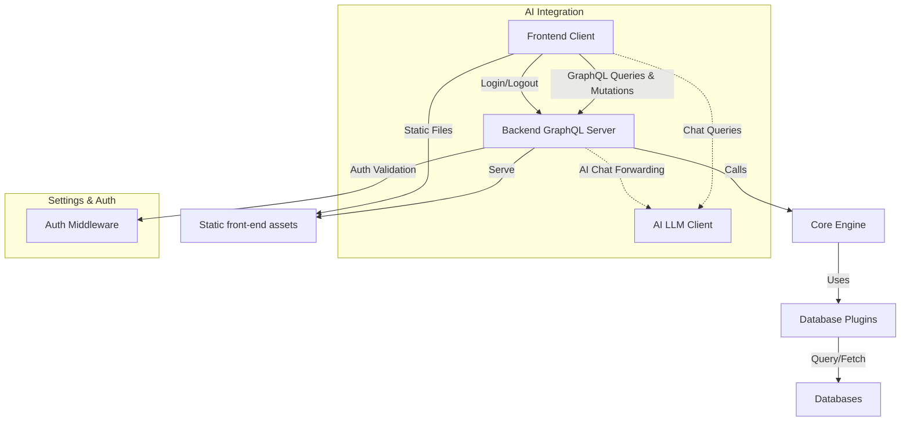

# Table of Contents
- [Introduction](#introduction)
- [Key Features](#key-features)
- [Architecture Overview](#architecture-overview)
- [Usage Examples](#usage-examples)
- [Integration Details](#integration-details)
- [Mermaid Diagram](#mermaid-diagram)
- [Relevant Source Files](#relevant-source-files)

---

## Introduction

The **WhoDB** project is an extensible database exploration and analytics platform that seamlessly integrates multiple database types and AI models, providing users with a unified interface for querying, visualization, and interactive AI-powered insights.

WhoDB combines a backend server implemented in Go (Golang) employing GraphQL APIs and flexible plugins for diverse databases, with a React-based frontend leveraging Apollo Client and Redux for state management. The system supports features like raw SQL execution, schema exploration, storage unit management, and AI chat interfaces.

This documentation offers a comprehensive overview of the project’s architecture, core components, and usage, facilitating developers and users to understand and extend WhoDB capabilities.

---

## Key Features

- **Multi-Database Support**: Modular plugins for PostgreSQL, MySQL/MariaDB, SQLite3, MongoDB, Redis, Elasticsearch, and ClickHouse.
- **Unified GraphQL API**: Single endpoint serving queries, mutations, and subscriptions, backed by gqlgen in Go.
- **UI/UX-Driven Frontend**: React components with routing, state management, and UI elements (tables, graphs, chat).
- **AI Integration**: Support for multiple Large Language Model (LLM) providers like OpenAI ChatGPT, Ollama, and Anthropic.
- **Dynamic Schema & Data Exploration**: Visual graph representations, flexible queries, and real-time updates.
- **Authentication & Profiles**: Secure login via credential profiles.
- **Settings & Telemetry**: Toggleable metrics and telemetry with user opt-in/out capability.

---

## Architecture Overview

### Backend Components

- **Core Engine (`core/src/src.go`)**: 
  - Manages database plugin lifecycle.
  - Registers all supported database plugins (Postgres, MySQL, MongoDB, etc.).
  - Provides unified interfaces for schema, query, and graph operations.

- **Database Plugins (`core/src/plugins/`)**: 
  - Each plugin encapsulates specific DB driver behavior and schema querying.
  - Includes connection management, schema introspection, raw query execution, and graph retrieval.

- **GraphQL Layer (`core/graph/`)**:
  - Defines schema (`schema.graphqls`), resolvers (`schema.resolvers.go`), and HTTP handlers.
  - Bridges frontend queries/mutations to engine and plugins.

- **Server Initialization (`core/server.go`)**:
  - Entry point that initializes engine, loads settings, bootstraps HTTP router.
  - Sets up signal handlers for graceful shutdown.

- **Authentication (`core/src/auth/`)**:
  - Middleware for verifying user tokens and managing sessions.

- **Environment Configuration (`core/src/env/env.go`)**:
  - Centralizes environment and configuration variables for database credentials, AI keys, etc.

### Frontend Components

- **React App (`frontend/src/app.tsx`)**:
  - Root component managing routing, layout, theme, and telemetry.

- **Apollo Client (`frontend/src/config/graphql-client.ts`)**:
  - Configures GraphQL client with no-cache policy to always fetch fresh data.

- **Redux Store (`frontend/src/store/index.ts`)**:
  - Combines slices for auth, common, database, global, settings, and chat.
  - Uses `redux-persist` for state persistence across sessions.

- **Routing (`frontend/src/config/routes.tsx`)**:
  - Public and internal (private) route definitions with protection.

- **UI Components (`frontend/src/components/`)**:
  - Building blocks like tables, dropdowns, buttons, editors, notifications, and graphs.

- **Pages (`frontend/src/pages/`)**:
  - Functional views for login, logout, chat, graph visualization, raw SQL execution, storage unit management, settings, and contact us.

### AI Integration

- **LLM Client (`core/src/llm/`)**:
  - Abstracts multiple LLM providers by unifying request/response handling.
  - Supports prompt completion, model listing, and chat features.

- **Chat API Resolvers & Components**:
  - Backend GraphQL resolvers forward AI chat messages.
  - Frontend chat page connects UI input with AI functionality.

---

## Usage Examples

### Initializing the Database Engine

```go
import (
  "github.com/clidey/whodb/core/src"
  "github.com/clidey/whodb/core/src/plugins/postgres"
  "github.com/clidey/whodb/core/src/plugins/mysql"
  "github.com/clidey/whodb/core/src/plugins/sqlite3"
  // other imports
)

func InitializeEngine() *engine.Engine {
  e := engine.Engine{}
  e.RegistryPlugin(postgres.NewPostgresPlugin())
  e.RegistryPlugin(mysql.NewMySQLPlugin())
  e.RegistryPlugin(sqlite3.NewSqlite3Plugin())
  // register other plugins...
  return &e
}

// Usage
engine := InitializeEngine()

```

### Starting the Server (simplified from `core/server.go`)

```go
func main() {
  log.Logger.Info("Starting WhoDB server...")

  // Load Settings
  settingsCfg := settings.Get()

  // Initialize Engine
  mainEngine := src.InitializeEngine()

  // Initialize Router with embedded files
  router := router.InitializeRouter(staticFiles)

  // Create HTTP Server
  srv := &http.Server{Handler: router, Addr: ":8080"}

  // Start Server
  if err := srv.ListenAndServe(); err != nil && err != http.ErrServerClosed {
    log.Logger.Fatalf("Server failed: %v", err)
  }

  // Handle graceful shutdown logic...
}
```

### Frontend Apollo Client Instantiation

```ts
import { ApolloClient, InMemoryCache, createHttpLink } from '@apollo/client'

const httpLink = createHttpLink({
  uri: '/api/query',
  credentials: 'same-origin',
})

export const graphqlClient = new ApolloClient({
  link: httpLink,
  cache: new InMemoryCache(),
  defaultOptions: {
    watchQuery: { fetchPolicy: 'no-cache' },
    query: { fetchPolicy: 'no-cache' },
    mutate: { fetchPolicy: 'no-cache' },
  },
})
```

---

## Integration Details

### Backend

- **WhoDB Core Engine** serves as the central orchestrator managing all database plugins. Each plugin implements `engine.PluginFunctions` providing:
  - Database/schema enumeration
  - Storage unit (table/collection) introspection
  - Data querying with filter & pagination
  - Graph data for relationships
  - Raw query execution & chat integration

- The **GraphQL layer** converts client requests into calls against the core engine plugins based on database type.

- **Server setup** combines embedded static web assets with backend APIs.

- **Authentication middleware** restricts access to protected routes.

### Frontend

- Provides a **modern SPA** delivering fast, dynamic UI:
  - Maintains auth state across sessions with Redux.
  - Uses Apollo Client to query/mutate backend GraphQL APIs.
  - Integrates with PostHog analytics for telemetry.

- **UI components** are highly reusable and designed for extensibility:
  - Tables support editing, multi-select, pagination.
  - Graph visualization uses ReactFlow for interactive schema graphs.

- **Routing** enforces auth and conditional access.

- Chat page allows AI conversations linked to database queries.

### Key Interaction Points



---

## Relevant Source Files

- [core/server.go](core/server.go) - Application server bootstrap and lifecycle management
- [core/src/src.go](core/src/src.go) - Core engine initialization & login profile management
- [core/src/plugins/](core/src/plugins/) - Database plugin implementations
- [core/graph/schema.resolvers.go](core/graph/schema.resolvers.go) - GraphQL resolver implementations
- [core/src/router/router.go](core/src/router/router.go) - HTTP router and middleware setup
- [frontend/src/app.tsx](frontend/src/app.tsx) - Top-level React application component
- [frontend/src/config/graphql-client.ts](frontend/src/config/graphql-client.ts) - Apollo client setup
- [frontend/src/components/](frontend/src/components/) - Reusable UI components
- [frontend/src/pages/](frontend/src/pages/) - React pages for app features
- [core/src/llm/](core/src/llm/) - Large Language Model integration
- [core/src/auth/auth.go](core/src/auth/auth.go) - Authentication middleware and utilities

---

The WhoDB system is designed to be an extensible platform bridging the gap between users and diverse databases with powerful AI assistance and user-friendly interfaces. Understanding its modular architecture, from database plugins to the React frontend, enables contribution and customization for various use cases.
