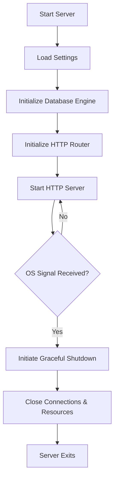
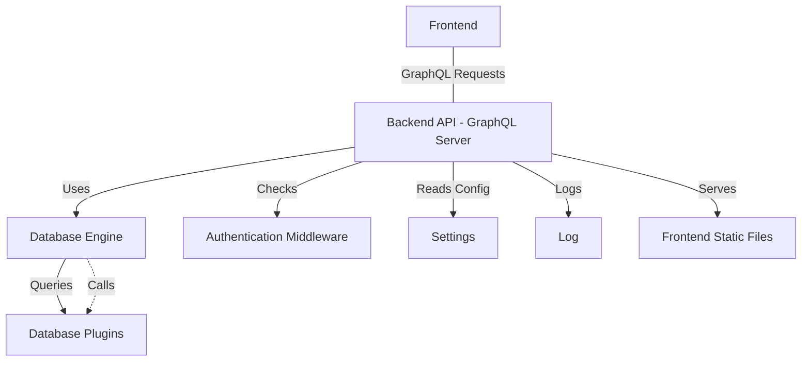

# Backend Setup

## Table of Contents

- [Introduction](#introduction)
- [Initialization Flow](#initialization-flow)
- [Configuration and Environment Variables](#configuration-and-environment-variables)
- [Engine Initialization and Plugins](#engine-initialization-and-plugins)
- [Router Setup and Middleware](#router-setup-and-middleware)
- [Server Start and Graceful Shutdown](#server-start-and-graceful-shutdown)
- [Integration Details](#integration-details)

---

## Introduction

This section explains how to set up and start the WhoDB backend server. The backend setup involves configuring environment variables, initializing the core database engine with its supported plugins, setting up HTTP routing (including GraphQL API and static file serving), and starting the HTTP server with graceful shutdown handling.

The backend server is implemented in Go and designed to be modular, allowing for various database plugins to be integrated seamlessly. This setup establishes the foundation that the frontend and API layers depend upon for data access and interaction.

For detailed source code, refer to the main server file: [core/server.go](/core/server.go)

---

## Initialization Flow

The server startup process involves the following major steps:

1. **Load Settings**: Load application settings from configuration or environment.
2. **Engine Initialization**: Set up the main `engine.Engine` instance with enabled database plugins.
3. **Router Initialization**: Prepare the HTTP router, including GraphQL handlers, middlewares, and static file serving.
4. **Start HTTP Server**: Begin listening on configured port.
5. **Signal Handling**: Listen for OS signals to trigger graceful shutdown.



---

## Configuration and Environment Variables

The backend server reads key environment variables to determine runtime configuration including:

- **Port**: The port on which the HTTP server listens, configurable via `PORT` environment variable.
- **API Gateway Flag**: To enable or disable API gateway features.
- **Database Credentials**: Supplied via environment or config files, used to initialize plugins.
- **Telemetry and Metrics Settings**: Loaded at startup to configure application behavior.

Environment variables are encapsulated via internal packages such as [`core/src/env/env.go`](/core/src/env/env.go) to provide typed access and defaults for ease of use.

Example retrieval of port with a fallback default:

```go
port := os.Getenv("PORT")
if port == "" {
  port = "8080"
}
```

---

## Engine Initialization and Plugins

WhoDB uses a modular [engine](https://github.com/clidey/whodb/blob/main/core/src/engine/engine.go) that supports various database backends via plugins. During backend setup:

- The server calls `src.InitializeEngine()`, which creates an `engine.Engine` instance.
- The engine registers multiple plugins representing supported databases, e.g., Postgres, MySQL, SQLite3, MongoDB, Redis, ElasticSearch, ClickHouse.

Each plugin encapsulates database-specific logic like schema introspection, query execution, and graph extraction.

Example snippet:

```go
func InitializeEngine() *engine.Engine {
  eng := engine.NewEngine()
  eng.RegistryPlugin(postgres.NewPostgresPlugin())
  eng.RegistryPlugin(mysql.NewMySQLPlugin())
  eng.RegistryPlugin(sqlite3.NewSqlite3Plugin())
  eng.RegistryPlugin(mongodb.NewMongoDBPlugin())
  eng.RegistryPlugin(redis.NewRedisPlugin())
  eng.RegistryPlugin(elasticsearch.NewElasticSearchPlugin())
  eng.RegistryPlugin(clickhouse.NewClickHousePlugin())
  return eng
}
```

This engine forms the core business logic backend that responds to queries and commands from the API layer.

---

## Router Setup and Middleware

The backend uses the [chi router](https://github.com/go-chi/chi) for HTTP routing combined with [gqlgen](https://gqlgen.com/) for GraphQL API handling.

The router setup includes:

- GraphQL endpoint (`/graphql`) with support for WebSocket subscriptions.
- REST-like API endpoints for profiles, storage units, rows, raw execution, and AI chat.
- Static file serving leveraging Go's `embed.FS` to serve React frontend files.
- Middlewares including:
  - Request ID
  - Real IP
  - Logger
  - CORS handling
  - Throttling
  - Recovery
  - Timeout
  - Authentication middleware that extracts and validates tokens.

Example router initialization code snippet:

```go
r := chi.NewRouter()
setupMiddlewares(r)
server := handler.NewExecutableSchema(graph.Config{Resolvers: &graph.Resolver{}})
graphqlServer := handler.New(server)
r.Handle("/graphql", graphqlServer)
// Add static file serving
fileServer(r, staticFiles)
```

---

## Server Start and Graceful Shutdown

The server starts by creating an `http.Server` with the configured router and port, then listens for incoming requests.

It also sets up OS signal handlers to catch termination signals (`SIGINT`, `SIGTERM`) to enable graceful shutdown:

- On signal, it creates a context with timeout.
- Calls server's `Shutdown` method to stop accepting new requests and cleanly close existing connections.
- Closes internal channels signaling shutdown.

Key code snippet:

```go
srv := &http.Server{Addr: fmt.Sprintf(":" + port), Handler: router}

// Listen for OS signals
quit := make(chan os.Signal, 1)
signal.Notify(quit, os.Interrupt, syscall.SIGTERM)

// Start server
go func() {
  if err := srv.ListenAndServe(); err != nil && !errors.Is(err, http.ErrServerClosed) {
    log.Fatalf("Server failed: %v", err)
  }
}()

<-quit // Wait for signal

ctx, cancel := context.WithTimeout(context.Background(), 10*time.Second)
defer cancel()

if err := srv.Shutdown(ctx); err != nil {
  log.Fatalf("Server forced to shutdown: %v", err)
}

log.Println("Server exiting")
```

This ensures resources are correctly freed, and the backend terminates without abrupt connection loss.

---

## Integration Details

The backend setup fits into the overall WhoDB architecture as the foundational layer that enables data interactions.

### Key Dependencies and Touchpoints

- **Settings**: From [`core/src/settings`](https://github.com/clidey/whodb/tree/main/core/src/settings), managing configuration like metrics enablement.
- **Environment Config**: Via [`core/src/env`](https://github.com/clidey/whodb/tree/main/core/src/env) providing environment variables and runtime flags.
- **Log**: Global logging initialized and used for info, error, and fatal logs via [`core/src/log`](https://github.com/clidey/whodb/tree/main/core/src/log).
- **Engine**: The core database engine in [`core/src/engine`](https://github.com/clidey/whodb/tree/main/core/src/engine) with pluggable database backends.
- **Router**: HTTP routing and GraphQL middleware defined in [`core/src/router`](https://github.com/clidey/whodb/tree/main/core/src/router).
- **Auth**: Authentication middleware applied via [`core/src/auth`](https://github.com/clidey/whodb/tree/main/core/src/auth) to protect backend API endpoints.
- **GraphQL Schema & Resolvers**: Implemented in [`core/graph`](https://github.com/clidey/whodb/tree/main/core/graph) exposing APIs for frontend and other clients.

### Interaction Diagram



### Responsibilities of Backend Setup

- Prepare environment and configuration.
- Initialize the core database engine with plugins.
- Set up HTTP server with necessary middleware, API, and static asset handling.
- Handle start, monitoring, and graceful shutdown of the backend server ensuring robustness.

This setup lays the foundation upon which the frontend and client applications securely and efficiently interact with various types of backend databases and AI capabilities.

---

For detailed implementation, visit the main backend server code: [core/server.go](/core/server.go)

Additional references:
- Engine Initialization: [core/src/src.go](/core/src/src.go)
- Router Setup: [core/src/router/router.go](/core/src/router/router.go)
- Authentication Middleware: [core/src/auth/auth.go](/core/src/auth/auth.go)
- Settings Management: [core/src/settings/settings.go](/core/src/settings/settings.go)
- Environment Variables: [core/src/env/env.go](/core/src/env/env.go)
- Database Plugins: [core/src/plugins](https://github.com/clidey/whodb/tree/main/core/src/plugins)
- GraphQL Resolvers: [core/graph/schema.resolvers.go](/core/graph/schema.resolvers.go)
