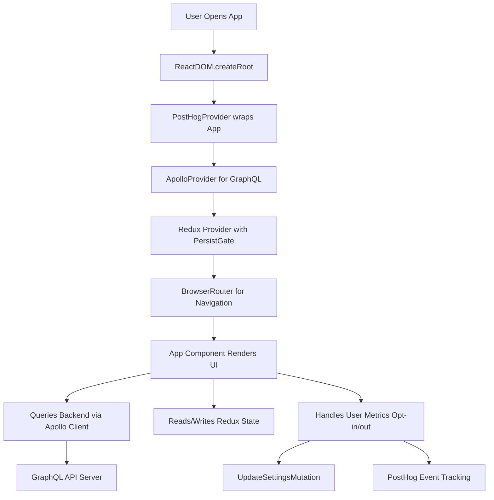

# Frontend Setup

This section covers the initial setup and architecture of the frontend application for WhoDB, detailing how the React app is initialized and connected with backend GraphQL services, state management, and analytics.

---

## Table of Contents

- [Overview](#overview)
- [Entry Point: `index.tsx`](#entry-point-indextsx)
- [Apollo Client Configuration](#apollo-client-configuration)
- [Redux Store Setup](#redux-store-setup)
- [Root App Component](#root-app-component)
- [Analytics Integration (PostHog)](#analytics-integration-posthog)
- [Integration and Dependencies](#integration-and-dependencies)

---

## Overview

The frontend of WhoDB is a React-based application that interfaces with the backend GraphQL API. It incorporates several modern libraries and patterns:

- **React 18** with concurrent features.
- **Apollo Client** for GraphQL data management.
- **Redux Toolkit** for centralized state management with persistence.
- **React Router DOM** for navigation.
- **PostHog** for user behavior tracking.

The app is bootstrapped via a single entry file which configures global providers, analytics, and renders the root `App` component.

---

## Entry Point: `index.tsx`

`index.tsx` is the main entry file that sets up and renders the React application. Key responsibilities:

- Initialize analytics tracking with PostHog.
- Create the React root using `ReactDOM.createRoot`.
- Wrap the app component with providers:
  - **ApolloProvider**: Connects to the GraphQL API.
  - **Redux Provider**: Supplies Redux store.
  - **PersistGate**: Ensures persisted Redux state is loaded.
  - **BrowserRouter**: Enables React Router navigation.
  - **PostHogProvider**: Provides analytics context.

### Example snippet from `index.tsx`:

```ts
import React from 'react';
import ReactDOM from 'react-dom/client';
import { ApolloProvider } from '@apollo/client';
import { Provider } from 'react-redux';
import { PersistGate } from 'redux-persist/integration/react';
import { BrowserRouter } from 'react-router-dom';
import { PostHogProvider } from 'posthog-js/react';
import { initPosthog } from './config/posthog';
import { graphqlClient } from './config/graphql-client';
import { reduxStore, reduxStorePersistor } from './store';
import App from './app';

const posthogClient = initPosthog();
const root = ReactDOM.createRoot(document.getElementById('root') as HTMLElement);

root.render(
  <PostHogProvider client={posthogClient}>
    <ApolloProvider client={graphqlClient}>
      <Provider store={reduxStore}>
        <PersistGate loading={null} persistor={reduxStorePersistor}>
          <BrowserRouter>
            <App />
          </BrowserRouter>
        </PersistGate>
      </Provider>
    </ApolloProvider>
  </PostHogProvider>
);
```

This setup ensures all context and state layers are available across the application.

---

## Apollo Client Configuration

The Apollo Client manages interaction with the backend GraphQL API:

- Configures a **HttpLink** pointing to the `/api/query` endpoint.
- Uses **InMemoryCache** for caching GraphQL results.
- Default fetch policies disable caching for queries and watch queries to always fetch fresh data.

### Example snippet from `graphql-client.ts`:

```ts
import { ApolloClient, InMemoryCache, createHttpLink } from '@apollo/client';

const uri = '/api/query';

const httpLink = createHttpLink({
  uri,
  credentials: 'same-origin',
});

export const graphqlClient = new ApolloClient({
  link: httpLink,
  cache: new InMemoryCache(),
  defaultOptions: {
    watchQuery: { fetchPolicy: 'no-cache' },
    query: { fetchPolicy: 'no-cache' },
  },
});
```

This configuration ensures real-time data access with minimal stale state.

---

## Redux Store Setup

The frontend uses **Redux Toolkit** along with **redux-persist** to manage application-wide state:

- Combines multiple slices (e.g., auth, database, settings, global, chat).
- Persists key sub-states across browser sessions.
- Provides typed hooks for dispatching actions and querying state safely.

### Basic structure from `store/index.ts`:

```ts
import { combineReducers, configureStore } from '@reduxjs/toolkit';
import { persistStore, persistReducer } from 'redux-persist';
import storage from 'redux-persist/lib/storage';
import authReducers from './auth';
import databaseReducers from './database';
import globalReducers from './global';
import settingsReducers from './settings';
import houdiniReducers from './chat';

const rootReducer = combineReducers({
  auth: authReducers,
  database: databaseReducers,
  global: globalReducers,
  settings: settingsReducers,
  chat: houdiniReducers,
});

const persistConfig = {
  key: 'root',
  storage,
  whitelist: ['auth', 'database', 'global', 'settings', 'chat'],
};

const persistedReducer = persistReducer(persistConfig, rootReducer);

export const reduxStore = configureStore({
  reducer: persistedReducer,
  middleware: (getDefaultMiddleware) =>
    getDefaultMiddleware({
      serializableCheck: false,
    }),
});

export const reduxStorePersistor = persistStore(reduxStore);
```

Typed hooks `useAppDispatch` and `useAppSelector` are provided in `store/hooks.ts` to facilitate type-safe Redux usage.

---

## Root App Component

The `App` component (defined in `app.tsx`) serves as the root UI container:

- Sets up routing using React Router.
- Applies theme (dark or light) based on Redux global state.
- Manages user preferences such as metrics opt-in/out.
- Synchronizes settings with the backend via GraphQL mutation.
- Renders notifications and routes.

This component ties together global UI concerns, user preferences, and navigation.

### Core flow snippet from `app.tsx`:

```tsx
import React, { useEffect, useCallback } from 'react';
import { useAppSelector, useAppDispatch } from './store/hooks';
import { useUpdateSettingsMutation } from './generated/graphql';
import { optInUser, optOutUser } from './config/posthog';
import { getRoutes } from './config/routes';

export function App() {
  const dispatch = useAppDispatch();
  const darkModeEnabled = useAppSelector(state => state.global.theme === 'dark');
  const metricsEnabled = useAppSelector(state => state.settings.metricsEnabled);
  const [updateSettings] = useUpdateSettingsMutation();

  const updateBackendWithSettings = useCallback(() => {
    updateSettings({ variables: { newSettings: { MetricsEnabled: String(metricsEnabled) }}});
    if (metricsEnabled) optInUser(); else optOutUser();
  }, [metricsEnabled, updateSettings]);

  useEffect(() => {
    updateBackendWithSettings();
  }, [updateBackendWithSettings]);

  return (
    <div className={`h-[100vh] w-[100vw] ${darkModeEnabled ? 'dark' : ''}`}>      
      {/* Render routes and other UI components here */}
    </div>
  );
}
```

---

## Analytics Integration (PostHog)

Analytics tracking is incorporated through PostHog:

- Initialized in the entry point with an API key and options.
- Controlled opt-in and opt-out functions manage user consent.
- PostHog context wraps the entire React app.

### Initialization example (`posthog.tsx`):

```ts
import posthog from 'posthog-js';

export function initPosthog() {
  const options = { api_host: 'https://app.posthog.com' };
  const posthogKey = process.env.REACT_APP_POSTHOG_API_KEY || '';
  if (posthogKey) {
    posthog.init(posthogKey, options);
  }
  return posthog;
}

export function optInUser() {
  posthog.opt_in_capturing();
}

export function optOutUser() {
  posthog.opt_out_capturing();
}
```

---

## Integration and Dependencies

The frontend setup revolves around integrating diverse technologies to deliver a responsive, data-driven UI:

- **React ecosystem:** Core UI rendering and component model.
- **Apollo Client:** Centralizes GraphQL communication, caching, and queries.
- **Redux Toolkit with Persistence:** Manages app state including auth, settings, and UI preferences.
- **React Router:** Client-side routing for navigation between pages.
- **PostHog Analytics:** User behavior analytics with privacy controls.

### Interaction Flow (Mermaid Diagram)



---

## References

- [Frontend Entry Point: `frontend/src/index.tsx`](https://github.com/clidey/whodb/tree/main/frontend/src/index.tsx)
- [Apollo Client Config: `frontend/src/config/graphql-client.ts`](https://github.com/clidey/whodb/tree/main/frontend/src/config/graphql-client.ts)
- [Redux Store Setup: `frontend/src/store/index.ts`](https://github.com/clidey/whodb/tree/main/frontend/src/store/index.ts)
- [App Component: `frontend/src/app.tsx`](https://github.com/clidey/whodb/tree/main/frontend/src/app.tsx)
- [PostHog Analytics Integration: `frontend/src/config/posthog.tsx`](https://github.com/clidey/whodb/tree/main/frontend/src/config/posthog.tsx)

---

This setup enables the WhoDB frontend to communicate efficiently with the backend, provide responsive state-driven UI, track user preferences and usage, and maintain a modern React codebase architecture.