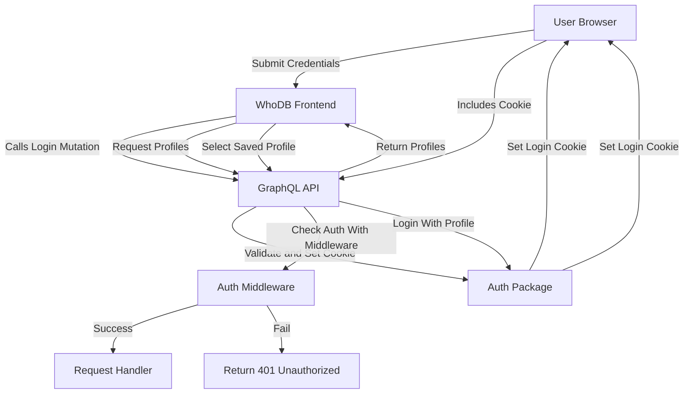

# Authentication & Profiles

Manage user authentication and database login profiles that enable secure and convenient access to database backends through WhoDB.

---

## Table of Contents
- [Overview](#overview)
- [Login Methods](#login-methods)
  - [Login with Credentials](#login-with-credentials)
  - [Login with Profile](#login-with-profile)
- [Authentication Middleware](#authentication-middleware)
- [Profile Management](#profile-management)
- [Integration Details](#integration-details)
- [Code Examples](#code-examples)
- [Sequence Diagram](#sequence-diagram)

---

## Overview

WhoDB supports authentication via either direct database credentials or saved login profiles. This abstraction allows users to authenticate against a variety of database backends using consistent methods, facilitating seamless interaction with the backend engine and GraphQL API.

Login credentials include parameters like username, password, host, database, and additional configurable options. Saved profiles store these credentials so users can quickly login without retyping.

Authentication is enforced at the HTTP handler level via middleware, protecting API routes while allowing selected public routes to be accessible without authentication.

---

## Login Methods

### Login with Credentials

Users provide the database connection details directly to authenticate and initiate a session.

- Input Validation: Ensures all required fields for the database type are provided.
- Session Establishment: Sets an encrypted cookie containing login credentials for subsequent authentication.

### Login with Profile

Uses a preconfigured login profile identified by an ID.

- Profile Selection: Users choose from saved profiles representing different database connections.
- Credentials Retrieval: Extracts stored credentials and applies them for authentication.

Both login flows return a status response indicating success or failure.

---

## Authentication Middleware

The middleware intercepts all incoming HTTP requests to the GraphQL API and related HTTP endpoints, performing these tasks:

- Detects public routes that do not require authentication (e.g., introspection queries or open APIs).
- Extracts credentials from cookies or HTTP headers.
- Validates token-based authentication or scopes.
- Injects user credential context for downstream handlers if authenticated.
- Rejects unauthorized requests with appropriate error responses.

This enforces security for sensitive operations and data while providing flexibility for unprotected resources.

---

## Profile Management

Login profiles encapsulate all necessary connection information for a database. Profiles can be: 
- Fetched via API queries to list all available profiles.
- Selected by the user during log in.
- Associated with current user session state.

Profiles include metadata like an alias, database type, host, username, and database name.

---

## Integration Details

Authentication & Profiles form the security foundation enabling:

- **Frontend LoginUI**: Provides user interfaces for credential input or profile selection.
- **GraphQL API**: Serves login related mutations (`Login`, `LoginWithProfile`, `Logout`) and queries for profile data.
- **Backend engine**: Represents current user credentials to select and connect to the appropriate plugin (database driver) through session state.
- **Middleware Enforcement**: Auth middleware validates request context for API protection.

### Key Dependencies
- `core/src/auth`: Implements login, logout, and middleware.
- `core/src/src.go`: Provides functions to get login profiles and credentials.
- `core/graph/schema.resolvers.go`: Contains GraphQL mutation resolvers for authentication.
- `frontend/src/store/auth.ts`: Manages frontend authentication state including profiles.
- `frontend/src/pages/auth/login.tsx`: UI page for user login via credentials or profiles.

---

## Code Examples

### Setting Login Cookie on Successful Login (Backend)
```go
import (
  "encoding/base64"
  "encoding/json"
  "net/http"
  "time"
  "github.com/clidey/whodb/core/graph/model"
)

func Login(w http.ResponseWriter, input *model.LoginCredentials) (*model.StatusResponse, error) {
  // Marshal login credentials
  loginInfoJSON, err := json.Marshal(input)
  if err != nil {
    return nil, err
  }

  // Encode credentials for cookie
  cookieValue := base64.StdEncoding.EncodeToString(loginInfoJSON)

  // Set login cookie for session
  cookie := &http.Cookie{
    Name:    "whoDB-login",
    Value:   cookieValue,
    Path:    "/",
    Expires: time.Now().Add(24 * time.Hour),
    HttpOnly: true,
    Secure: true,
  }
  http.SetCookie(w, cookie)

  return &model.StatusResponse{Status: true}, nil
}
```

### Authentication Middleware Setup (Simplified)
```go
import (
  "net/http"
  "github.com/clidey/whodb/core/src/auth"
  "github.com/go-chi/chi/v5"
)

func main() {
  r := chi.NewRouter()

  // Attach auth middleware
  r.Use(auth.AuthMiddleware)

  // Add your routes
  r.Post("/api/graphql", handleGraphQL)

  http.ListenAndServe(":8080", r)
}
```

### Using Profiles in Frontend Redux (Excerpt)
```ts
interface LocalLoginProfile extends LoginCredentials {
  id: string
  saved?: boolean
}

const initialState = {
  status: "unauthorized",
  profiles: [] as LocalLoginProfile[],
  current: undefined as LocalLoginProfile | undefined,
}

const authSlice = createSlice({
  name: "auth",
  initialState,
  reducers: {
    login(state, action: PayloadAction<LoginCredentials | LocalLoginProfile>) {
      const profile = action.payload as LocalLoginProfile
      state.current = profile
      state.status = "logged-in"
      // Add to profiles if new
      if (!state.profiles.find(p => p.id === profile.id)) {
        state.profiles.push(profile)
      }
    },
    logout(state) {
      state.status = "unauthorized"
      state.current = undefined
    },
  },
})
```

---

## Sequence Diagram



---

## Relevant Files
- [core/src/auth/login.go](./core/src/auth/login.go): Handles login logic and cookie setting.
- [core/src/auth/auth.go](./core/src/auth/auth.go): Middleware and auth utilities.
- [core/graph/schema.resolvers.go](./core/graph/schema.resolvers.go): GraphQL mutation resolvers for login/logout.
- [core/src/src.go](./core/src/src.go): Exposes login profiles and credentials.
- [frontend/src/store/auth.ts](./frontend/src/store/auth.ts): Frontend Redux slice for auth state.
- [frontend/src/pages/auth/login.tsx](./frontend/src/pages/auth/login.tsx): Frontend login page UI and logic.

---