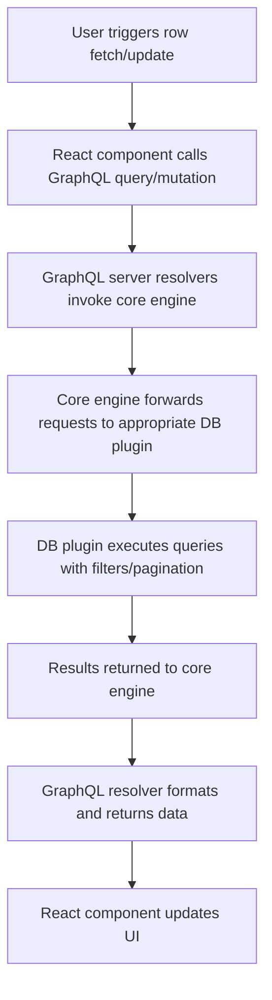

# Overview

The **Storage Unit Exploration** feature provides an interactive interface for users to explore, filter, paginate, and manipulate rows of data within a specific storage unit (table or collection) from a connected database. It supports a wide range of database types, adjusting the UI and behaviors based on the underlying database's capabilities.

This feature is a critical part of the WhoDB frontend that allows users to browse and manage their database data in a user-friendly way, leveraging rich GraphQL-powered querying and mutations on the backend.

# Table of Contents

- [Key Concepts](#key-concepts)
- [Features](#features)
- [Usage Example](#usage-example)
- [Architecture & Integration](#architecture-and-integration)
- [User Interface](#user-interface)
- [Technical Implementation](#technical-implementation)
- [Related Files and Links](#related-files-and-links)

---

## Key Concepts

- **Storage Unit**: A logical collection or table within a database schema from which rows can be queried and manipulated.
- **Rows**: The individual records or documents corresponding to a storage unit.
- **WhereCondition**: A complex filter structure enabling fine-grained queries with logic operators and atomic conditions.
- **Pagination**: Support to navigate large result sets with page size and page offset.

## Features

- Fetch and display rows from a selected storage unit.
- Support for filtering rows with complex conditions (`WhereCondition`).
- Pagination controls for navigating data pages.
- Inline row updates and row deletion.
- Adding new rows with dynamic form fields.
- Adaptability depending on the database type (SQL vs NoSQL).
- Integration with GraphQL backend via lazy queries and mutations.

## Usage Example

```tsx
import React, { useState } from 'react';
import { WhereCondition, RecordInput, StorageUnit } from 'frontend/src/generated/graphql';
import { useGetStorageUnitRowsLazyQuery, useAddRowMutation } from 'frontend/src/generated/graphql';

const ExampleExplore = ({ schema, unit }: { schema: string; unit: StorageUnit }) => {
  const [pageSize] = useState("15");
  const [currentPage, setCurrentPage] = useState(1);
  const [filters, setFilters] = useState<WhereCondition | undefined>(undefined);

  const [fetchRows, { loading, data }] = useGetStorageUnitRowsLazyQuery();
  const [addRow] = useAddRowMutation();

  // Load rows when schema, unit, page or filters change
  React.useEffect(() => {
    if (!schema || !unit) return;
    fetchRows({
      variables: {
        schema,
        storageUnit: unit.Name,
        pageSize: parseInt(pageSize, 10),
        pageOffset: (currentPage - 1) * parseInt(pageSize, 10),
        where: filters,
      },
    });
  }, [schema, unit, currentPage, filters, fetchRows, pageSize]);

  // Handle adding a row
  const handleAddRow = async (values: RecordInput[]) => {
    if (!schema || !unit) return;
    await addRow({
      variables: { schema, storageUnit: unit.Name, values },
    });
  };

  return (
    <div>
      {/* UI components for displaying rows, filters, pagination, and form for new row */}
    </div>
  );
};
```

<!-- Comment: The above uses GraphQL hooks to fetch and add rows dynamically -->

## Architecture and Integration

- **Frontend:** The ExploreStorageUnit React component queries the rows using Apollo Client's `useGetStorageUnitRowsLazyQuery`, and calls mutations like `useAddRowMutation` to add rows.
- **Backend:** These queries and mutations correspond to GraphQL resolvers which interface with the core database engine.
- **Core Engine:** Manages database connections, executes queries with filtering/pagination, and returns structured row results.
- **GraphQL Schema:** Provides types like `WhereCondition`, `RowsResult`, `RecordInput`, and defines the API for interacting with the storage units.

### Interaction Flow



## User Interface

- **Data Table:** Displays queried rows in a paginated, sortable table.
- **Filters Panel:** Provides interface to specify `WhereCondition` with columns, operators, and values.
- **Pagination Controls**: Allows navigating between pages.
- **New Row Form:** Allows user to input values for fields and submit new rows.
- **Row Editing:** Supports editing cell values inline with real-time updates on submission.

## Technical Implementation

- Uses React hooks (`useState`, `useEffect`, `useMemo`, `useCallback`) to handle state and effects.
- Leverages React Apollo lazy queries and mutations for interaction with backend.
- Manages controlled components for filter input and new row values.
- Validates and processes filter conditions according to database capabilities.
- Transfers contextual data like current user, database type, and schema.
- Handles differences between SQL and NoSQL storage units to adjust UI and functionality.

## Related Files and Links

- ExploreStorageUnit Component: [frontend/src/pages/storage-unit/explore-storage-unit.tsx](/frontend/src/pages/storage-unit/explore-storage-unit.tsx)
- GraphQL Queries & Mutations: [frontend/src/generated/graphql.tsx](/frontend/src/generated/graphql.tsx)
- GraphQL Schema Definitions: [core/graph/schema.graphqls](/core/graph/schema.graphqls)
- Backend Resolvers: [core/graph/schema.resolvers.go](/core/graph/schema.resolvers.go)
- Storage Unit Management UI: [frontend/src/pages/storage-unit/storage-unit.tsx](/frontend/src/pages/storage-unit/storage-unit.tsx)

---

This completes the overview of the Storage Unit Exploration feature, detailing its purpose, usage, integration with the backend, and user interface considerations.