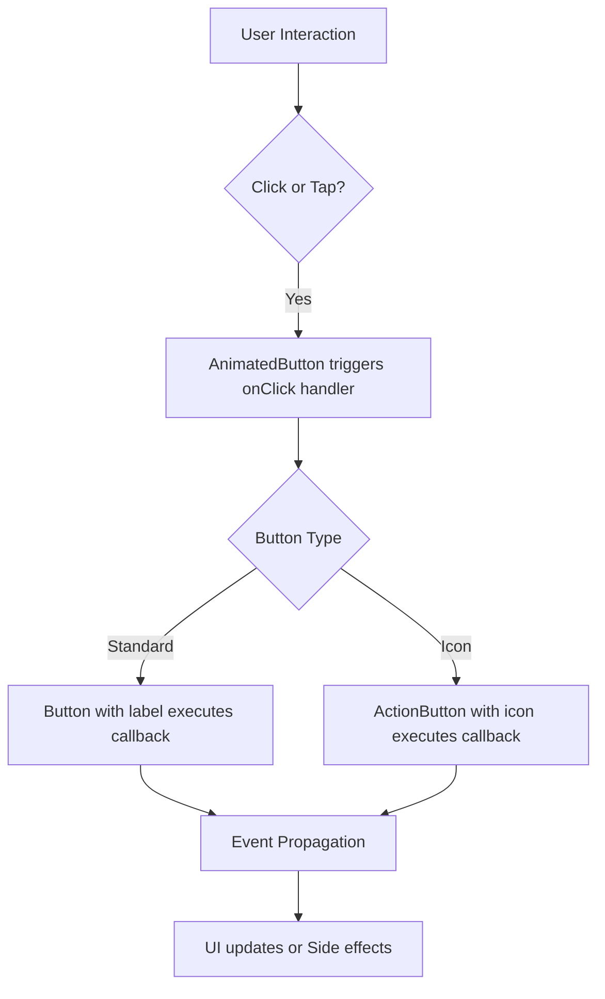

# Buttons

## Table of Contents

- [Introduction](#introduction)
- [Basic Usage](#basic-usage)
- [Animated Buttons](#animated-buttons)
- [Action Buttons](#action-buttons)
- [Properties and Customization](#properties-and-customization)
- [Integration Details](#integration-details)

---

## Introduction

The **Buttons** component set provides reusable, styled, and animated button elements for the frontend React application. These components enhance user interaction with consistent design, accessibility features, and animation support using Framer Motion.

This collection includes:

- **Button**: Standard clickable button with options for size and disabling.
- **AnimatedButton**: A wrapper button that adds animation capabilities.
- **ActionButton**: A specialized button that shows only an icon with hover and tap animations.

They allow for easy integration into UI forms, toolbars, dialogs, and other interactive elements.

---

## Basic Usage

### Importing and Usage

```ts
import { Button, AnimatedButton, ActionButton } from '../components/button';

// Basic button with label
<Button
  label="Click me"
  onClick={() => console.log('Button clicked')}
/>

// Disabled button (large size)
<Button
  label="Disable"
  disabled
  type="lg"
/>
```

This example shows how you can create a basic button with a label and a click handler. The `disabled` prop disables interaction, and `type` sets button size.

---

## Animated Buttons

**AnimatedButton** enhances the base `Button` with framer-motion animations.

```ts
import { AnimatedButton } from '../components/button';

// Animated button with label and click
<AnimatedButton
  label="Animate me"
  onClick={() => alert('Animated click')}
  className="my-2"
/>
```

This is suitable for buttons with user feedback on interaction like hover and click effects.

---

## Action Buttons

**ActionButton** is ideal for toolbar icons or buttons where only an icon is shown.

```tsx
import { ActionButton } from '../components/button';
import { Icons } from '../components/icons';

<ActionButton
  icon={Icons.Add}  // SVG icon component
  onClick={() => alert('Add action')}
  className="mx-1"
  containerClassName="inline-block"
/>
```

Features:
- Accepts any SVG icon.
- Tap and hover animations.
- Supports disabling interaction.

---

## Properties and Customization

| Prop             | Type                     | Description                                     | Default  |
|------------------|--------------------------|-------------------------------------------------|----------|
| `label`          | `string`                 | Text shown on the button (Button, AnimatedButton) | —        |
| `icon`           | `ReactElement`           | Icon rendered inside ActionButton               | —        |
| `className`      | `string`                 | Additional CSS classes for the button           | —        |
| `containerClassName` | `string`              | CSS classes for wrapper container (ActionButton only)| —       |
| `onClick`        | `(e) => void`            | Click event handler                             | —        |
| `disabled`       | `boolean`                | Disable button interaction                       | `false`  |
| `type`           | `'lg'` or `'sm'`         | Size variant (Button only)                       | `'sm'`   |
| `testId`         | `string`                 | Test identifier for automated UI tests          | —        |

The components are built with accessibility and flexibility in mind, supporting keyboard navigation and screen readers.

---

## Integration Details

### System Role
- Provide consistently styled buttons and icon buttons for the entire frontend application.
- Encapsulate animation logic to improve user experience.
- Serve as building blocks for forms, modals, toolbars, sidebars, and other interactive UI parts.

### Dependencies
- **React**: Functional components and properties.
- **Framer Motion**: For applying animations to button interactions.
- **classnames**: Utility for conditional CSS class composition.
- **tailwind-merge**: To merge Tailwind CSS classes safely.

### Interaction Pattern


### File Location
- Buttons are defined in [`frontend/src/components/button.tsx`](frontend/src/components/button.tsx)

---

### Example: Creating a Confirm and Cancel Button Group

```tsx
import React from 'react';
import { Button } from '../components/button';

function ConfirmCancelGroup() {
  return (
    <div className="flex space-x-2">
      <Button label="Confirm" type="lg" onClick={() => console.log('Confirmed')} />
      <Button label="Cancel" onClick={() => console.log('Cancelled')} />
    </div>
  );
}

export default ConfirmCancelGroup;
```

Use this group for dialogs or form submissions where clear actions with labels are required.

---

# Summary
The **Buttons** components in WhoDB frontend are essential UI controls that offer clean, accessible, and animated buttons for efficient user interactions. They integrate seamlessly with the application’s UI framework and complement other components like dropdowns, cards, and tables.

For implementation details and source review, see the source file: [`frontend/src/components/button.tsx`](frontend/src/components/button.tsx).

---