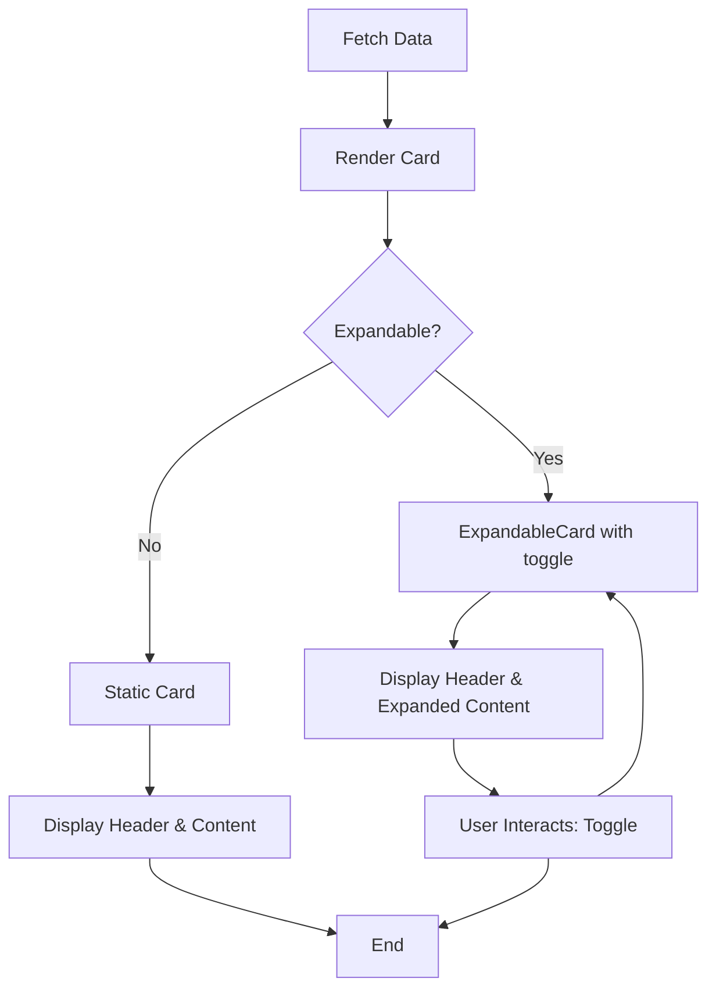

# Cards Component

The **Cards** component provides reusable UI elements that display content within a styled container, optionally enriched with icons, tags, loading states, and expandable/collapsible behavior. Cards are a fundamental visual building block used throughout the frontend to present storage units, data summaries, and grouped information clearly and accessibly.

---

## Table of Contents

- [Introduction](#introduction)
- [Key Components](#key-components)
  - [Card](#card)
  - [ExpandableCard](#expandablecard)
  - [Icon](#icon)
- [Usage Examples](#usage-examples)
- [Integration Details](#integration-details)
- [Design and Behavior](#design-and-behavior)
- [Architecture and Dependencies](#architecture-and-dependencies)

---

## Introduction

Cards are designed to encapsulate content blocks within visually distinct panels that can include an icon, tags, loading indicators, and other UI elements without requiring the consumer to deal with individual styles or layout details. The component supports metadata-based visual cues such as highlighting or loading feedback.

Expandable cards add toggle behavior to hide or show additional child content, useful for managing UI real-estate or conditionally revealing further details.

---

## Key Components

### Card

The `Card` component renders a styled container with optional icon, tag, and loading state.

**Props**:

- `className` *(optional)*: Additional CSS classes for the card container.
- `icon` *(optional)*: An icon component or element displayed in the card header.
- `tag` *(optional)*: A tag or label component to display alongside the icon.
- `children`: The content inside the card.
- `highlight` *(optional)*: When true, applies special styling to emphasize the card.
- `loading` *(optional)*: Shows a loading overlay with optional loading text.
- `loadingText` *(optional)*: Text shown while loading.

### ExpandableCard

Extends `Card` by providing expand/collapse functionality.

**Props**:

- `isExpanded` *(optional, boolean)*: Controls the expand state.
- `children`: Requires **two children** where:
  - First child: summary or header.
  - Second child: detailed/expanded content.
- `setToggleCallback` *(optional)*: Function to receive toggle callback.
- `collapsedTag` *(optional)*: Tag to show when card is collapsed.

### Icon

A small wrapper to display an SVG or React icon with default sizing and styling.

---

## Usage Examples

```tsx
import React from "react";
import { Card, ExpandableCard, Icon } from "./card";
import { Icons } from "../icons";

// Basic card with icon and content
export function StorageUnitCard() {
  return (
    <Card icon={<Icon component={Icons.Database} />} highlight={true}>
      <h3>Users Table</h3>
      <p>Contains user profile data.</p>
    </Card>
  );
}

// Expandable card example
export function ExpandableInfo() {
  const [expanded, setExpanded] = React.useState(false);

  return (
    <ExpandableCard isExpanded={expanded} setToggleCallback={setExpanded}>
      <div>Summary: Click to expand</div>
      <div>Detailed content goes here, visible when expanded.</div>
    </ExpandableCard>
  );
}
```

---

## Integration Details

- **Primary Usage:** Cards are heavily used in Storage Unit views, Settings pages, and List/Detail representations throughout the frontend UI.
- **Data Propagation:** Cards render UI based on API data fetched via GraphQL queries and mutations, often wrapping lists or summaries of database objects.
- **Interaction:** Expandable cards support toggling via internal state or parent-driven control, enabling progressive disclosure of information.
- **Styling:** Leverages Tailwind CSS classes merged with `classnames` and `tailwind-merge` utility for consistent appearance.

### Dependencies

- `react` and `react-dom` for React UI structure.
- `classnames` and `tailwind-merge` for dynamic class management.
- Related icons from `Icons` collection for consistent UI symbols.
- Animations powered by `framer-motion` for smooth expanding/collapsing.

### System Touchpoints

- Cards are contained within page layout components such as StorageUnitPage or Sidebar.
- Expanded state management interacts with Redux or local React state in parent components.
- Receiving children elements allows flexible insertion of dynamic UI elements.



---

## Design and Behavior

- Cards provide a clean rectangular panel with padding and border-radius.
- Optional icon area helps visually associate meaning (e.g., database, warning, info).
- `highlight` adds visual emphasis, useful for alerts or important cards.
- Loading state covers content with a backdrop and loading spinner/text.
- ExpandableCard requires explicit two children: summary and detailed, for semantic clarity.
- Expansion toggle uses smooth transitions for better UX.

---

## Source

- [Card component source code](core/src/components/card.tsx)

---

Cards are foundational UI building blocks, central to presenting complex data in a digestible, navigable format across the application interface.