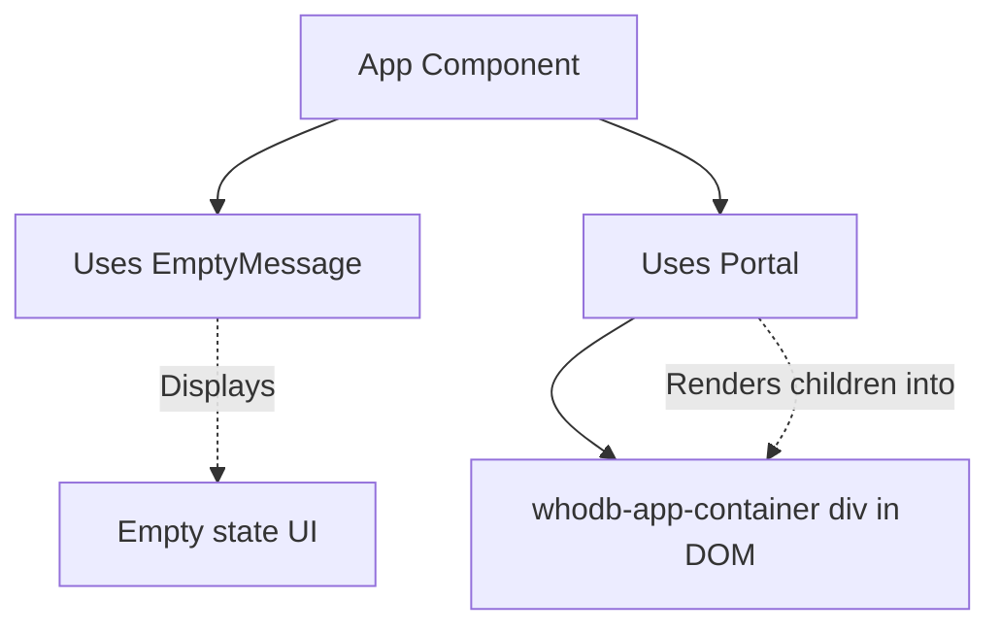

# Common UI Components

The **Common UI** module provides reusable user interface components that are shared across multiple parts of the frontend application. These components enhance the user experience by offering standardized, accessible, and customizable UI elements.

## Table of Contents

- [Overview](#overview)
- [EmptyMessage](#emptymessage)
- [Portal](#portal)
- [Integration Details](#integration-details)
- [Example Usage](#example-usage)
- [Component Interaction Diagram](#component-interaction-diagram)

---

## Overview

The common UI components encapsulate frequently used UI patterns such as displaying messages when no data is present and rendering content through React portals. These components help reduce duplication and promote consistency across the application.

Key components include:

- **EmptyMessage:** Displays a centered message with an icon, suitable for empty states or no data conditions.
- **Portal:** Renders children into a specific DOM element outside the main React hierarchy, facilitating modal or overlay implementations.

These components are written as React Functional Components (FC) with TypeScript for type safety.

---

## EmptyMessage

The `EmptyMessage` component is designed to display a friendly message when there is no content to show. It accepts an icon and a label string to inform users clearly about the empty state.

### Props

- `icon: ReactElement` — A React element representing the icon to display.
- `label: string` — The message text to show below the icon.

### Usage Example

```tsx
import React from 'react';
import { EmptyMessage } from 'frontend/src/components/common';
import { ReactComponent as InfoIcon } from './icons/info.svg';

const NoData = () => {
  return (
    <EmptyMessage
      icon={<InfoIcon className="h-16 w-16 text-gray-400" />}
      label="No data available. Please try again later."
    />
  );
};
```

This renders a centered info icon with the accompanying message.

---

## Portal

The `Portal` component uses React portals to render its children into a predefined DOM node with the id `whodb-app-container`. This is useful for UI elements like modals, popovers, or any content that needs to visually break out of the normal document flow.

### Props

- `children: ReactNode` — The content to render inside the portal.

### Usage Example

```tsx
import React from 'react';
import { Portal } from 'frontend/src/components/common';

const Modal = () => {
  return (
    <Portal>
      <div className="modal-overlay">
        <div className="modal-content">Modal Body</div>
      </div>
    </Portal>
  );
};
```

This setup ensures the modal content is appended to the property-designated container, typically outside the main app root node.

---

## Integration Details

These common UI components integrate with the frontend React application as foundational building blocks:

- **Dependencies:**
  - `react` and `react-dom` for React elements and portal rendering.
  - Styling via Tailwind CSS classes or similar.

- **Usage Context:**
  - `EmptyMessage` is widely used on pages or components where no results or data are found.
  - `Portal` is typically used for modals, overlays, dialogs, or dropdown menus that require rendering outside the parent hierarchy to avoid clipping or z-index issues.

- **System Touchpoints:**
  - These components are used across various frontend pages and components such as dashboards, modals, and notification popups.
  - The portal container must exist in the main DOM (usually defined in the core HTML layout or `index.html`) for the `Portal` component to function correctly.

- **Responsibilities:**
  - Provide accessible, styled, and customizable UI elements.
  - Facilitate UI consistency and maintainability.

---

## Component Interaction Diagram



This diagram illustrates how the `App` or any other component may use these common UI components, highlighting the portal's dependency on the presence of a dedicated DOM container.

---

## Source and Further Reading

- [frontend/src/components/common.tsx](/frontend/src/components/common.tsx)

This file contains the full implementation of the `EmptyMessage` and `Portal` components.

---

## Summary

The **Common UI** components offer essential, reusable UI elements that help maintain UI consistency and enhance user experience across the frontend application. Both `EmptyMessage` and `Portal` address common UI needs—empty states and rendering outside React's component tree respectively—ensuring modularity and ease of use.

By leveraging these components, developers can focus on page-specific logic while relying on standardized, maintainable UI building blocks.
