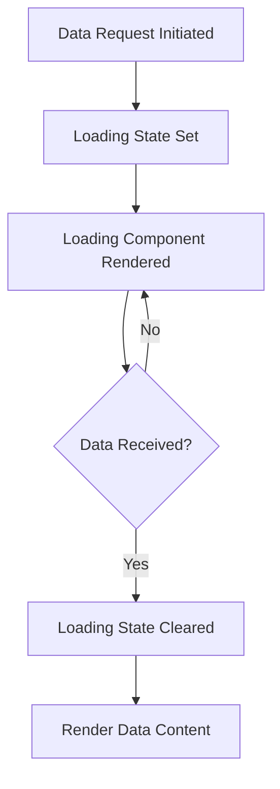
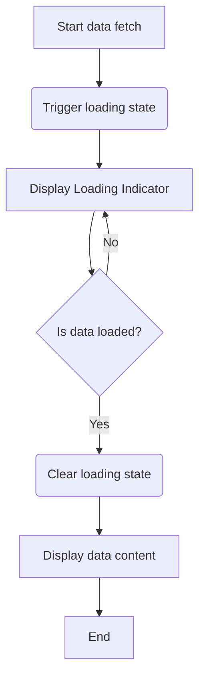

# Loading Indicators

Loading indicators are essential UI components that provide visual feedback to users during asynchronous operations, such as data fetching or processing. They improve user experience by informing users that the system is working and help to manage expectations regarding wait times.

This document covers the design, usage, and integration of loading indicators within the WhoDB frontend application.

---

## Table of Contents

- [Introduction](#introduction)
- [Component Overview](#component-overview)
- [Usage Examples](#usage-examples)
- [Customizing Loading Indicators](#customizing-loading-indicators)
- [Accessibility Considerations](#accessibility-considerations)
- [Integration Details](#integration-details)
- [Mermaid Diagram: Loading Indicator Flow](#mermaid-diagram-loading-indicator-flow)

---

## Introduction

Loading indicators visually communicate that a background operation is in progress, providing reassurance to users and preventing unnecessary duplicate actions or confusion about the application state. In WhoDB, loading indicators are designed to be minimal, stylistically consistent, and flexible enough to handle different loading scenarios.

---

## Component Overview

The loading functionality is implemented via React functional components, primarily:

- **`Loading`**: A versatile component rendering a spinner with optional text, customizable size, and visibility of text.

- **`LoadingPage`**: A full-page loading interface using `Loading` to indicate global or full-screen load states.

These components use a combination of CSS classes and conditional rendering to manage styles and states.

### Core Props for `Loading` Component

| Prop      | Type                | Description                                   |
|-----------|---------------------|-----------------------------------------------|
| `className` | `string`             | Additional CSS classes for the container.    |
| `hideText`  | `boolean`            | Hides the loading text if true.                |
| `loadingText` | `string`            | Custom text to show during loading (default "Loading..."). |
| `size`     | `'lg' | 'md' | 'sm'` | Defines spinner size (large, medium, small).  |

---

## Usage Examples

### Basic Loading Spinner

```tsx
import { Loading } from "./components/loading";

export function Example() {
  return <Loading size="md" loadingText="Please wait..." />;
}
```

### Full Page Loading

```tsx
import { LoadingPage } from "./components/loading";

export function AppLoader() {
  return <LoadingPage />;
}
```

### Conditionally Render Loading

```tsx
import React, { useState, useEffect } from "react";
import { Loading } from "./components/loading";

function DataFetcher() {
  const [loading, setLoading] = useState(true);

  useEffect(() => {
    fetchData().finally(() => setLoading(false));
  }, []);

  return loading ? <Loading /> : <div>Data Loaded!</div>;
}
```

---

## Customizing Loading Indicators

- **Size Variants** 
  - `sm`: Small spinner suitable for inline usage.
  - `md`: Medium spinner, default size for most use cases.
  - `lg`: Large spinner, ideal for prominent loading states.

- **Loading Text**: Customize or hide the displayed loading message.

- **Additional Styling**: Pass `className` for extra CSS styles or animated variants.

- **Dark Mode Support**: CSS classes adapt to the app theme automatically.

---

## Accessibility Considerations

- Provide meaningful **loading messages** so screen readers can inform users.
- Use **aria-busy** or other relevant ARIA attributes outside or alongside the component where appropriate.
- Avoid auto-dismissal that may confuse users by keeping the spinner visible until the load is complete.

---

## Integration Details

Loading indicators are integrated into multiple places in the frontend application to enhance user experience:

- **Pages**: Used in major pages like Login, Chat, Storage Unit Explorer, Settings, etc. to signal data loading.
- **API Integration**: Loading state is commonly tied to GraphQL query or mutation loading states, accessed via Apollo Client or Redux selectors.
- **Redux Store**: Global loading states can be managed via Redux slices (e.g., auth, data fetching).

### Dependencies

- `react`: For React components and hooks.
- `classnames`: For conditional and merged class name handling.
- `tailwind-merge`: To merge Tailwind CSS classes safely.

### Interaction Pattern



---

## Mermaid Diagram: Loading Indicator Flow



---

## Source

- Loading component code: `[frontend/src/components/loading.tsx](/frontend/src/components/loading.tsx)`
- Usage in pages: e.g., `[frontend/src/pages/auth/login.tsx](/frontend/src/pages/auth/login.tsx)`
- Redux integration: `[frontend/src/store/settings.ts](/frontend/src/store/settings.ts)`

---

Loading indicators are simple yet crucial UI elements that ensure a smooth, communicative experience, actively representing asynchronous states in WhoDB's rich frontend interface.