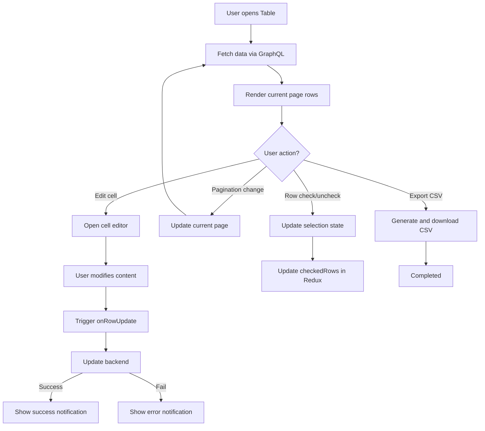

# Tables

## Table of Contents

- [Introduction](#introduction)
- [Key Concepts](#key-concepts)
- [Table Component Overview](#table-component-overview)
- [Usage Example](#usage-example)
- [Component Structure](#component-structure)
- [Integration Details](#integration-details)
- [Mermaid Diagram: Table Interaction Flow](#mermaid-diagram-table-interaction-flow)

---

## Introduction

The **Tables** component delivers a robust and feature-rich interface for displaying and interacting with tabular data in the frontend application. It supports advanced features like:

- Pagination
- Sorting
- Editing cells
- Bulk row selection
- Export to CSV
- Code preview within cells (e.g., SQL or JSON)

This component is a core UI building block used primarily in views displaying database query results or storage unit contents.

## Key Concepts

- **Pagination:** Breaks up row data into manageable pages, improving load times and user experience.
- **Row Editing:** Allows users to modify data inline with asynchronous update capabilities.
- **Sorting:** Users can change the sort order of columns.
- **Checkbox Selection:** Multi-row selection for batch operations.
- **Preview and Clipboard Features:** Preview cell content and copy to clipboard with ease.
- **Virtualization:** Uses `react-window` for performant rendering of large datasets.

## Table Component Overview

The `Table` component accepts the following key props:

- `columns`: An array of column names.
- `columnTags`: Optional tags specifying column data types or special behaviors.
- `rows`: An array of row data, each a string array or value array.
- `totalPages`: Number of pages available.
- `currentPage`: Currently displayed page index.
- `onPageChange`: Callback for user page navigation.
- `onRowUpdate`: Async callback triggered on row edits.
- `disableEdit`: Flag to disable all editing.
- `checkedRows`: A `Set<number>` representing selected row indices.
- `setCheckedRows`: Function to update the row selection.

Additionally, helper components such as `Pagination`, `TableRow`, and `TData` manage UI sub-parts.

### Performance

The table leverages **virtualization** to render only visible rows, crucial for maintaining performance with large datasets.

## Usage Example

```tsx
import React, { useState, useCallback } from 'react';
import { Table } from './components/table';

const columns = ['ID', 'Name', 'Email'];
const rows = [
  ['1', 'Alice', 'alice@example.com'],
  ['2', 'Bob', 'bob@example.com'],
];

export default function ExampleTable() {
  const [currentPage, setCurrentPage] = useState(1);
  const [checkedRows, setCheckedRows] = useState(new Set<number>());

  const handlePageChange = useCallback((page: number) => {
    setCurrentPage(page);
  }, []);

  const handleRowUpdate = async (row: Record<string, string | number>, updatedColumn: string) => {
    // Update backend or state
    console.log('Row updated:', row, 'Column:', updatedColumn);
  };

  return (
    <Table
      columns={columns}
      rows={rows}
      totalPages={3}
      currentPage={currentPage}
      onPageChange={handlePageChange}
      onRowUpdate={handleRowUpdate}
      checkedRows={checkedRows}
      setCheckedRows={setCheckedRows}
    />
  );
}
```

## Component Structure

### 1. `Table`

- Manages overall table rendering, sorting, searching, and page state.
- Renders headers, rows, and pagination controls.

### 2. `TableRow`

- Represents a single row.
- Supports `editable` cells and tracks checked state.
- Handles user events like row selection and cell edit confirmation.

### 3. `TData`

- Represents individual table cells.
- Handles edit mode toggling, preview toggling (e.g., for JSON, Markdown), copy-to-clipboard, and long-press actions.

### 4. `Pagination`

- Displays clickable page items and next/previous controls.
- Manages active page highlighting and user interaction.

### 5. Additional hooks

- `useExportToCSV` enables users to export displayed table data as a CSV file.
- `useLongPress` detects long press and click events for enhanced cell interactions.

## Integration Details

The `Table` component is a critical part of the frontend architecture integrated with:

- **GraphQL API:** Data used by the table is fetched via queries (e.g., getting rows from storage units).
- **Redux Store:** Checked rows and settings might be linked to global state.
- **Notification System:** User actions like row updates trigger notifications via global system.
- **Code Editor:** Inline code editing utilizes the embedded code editor component supporting SQL, JSON, and Markdown.

### Dependencies

- `react-table` for table logic (sorting, filtering, pagination abstraction).
- `react-window` for virtualization of rows.
- `classnames` and `tailwind-merge` for styling and class management.
- `lodash` for utility functions.

### System Touchpoints

- User interacts with `Table` UI
- Calls to backend GraphQL for data retrieval and updates
- State changes in Redux trigger UI updates
- Notifications dispatched on user actions and errors

## Mermaid Diagram: Table Interaction Flow



---

For implementation details, see the source file [table.tsx](frontend/src/components/table.tsx).