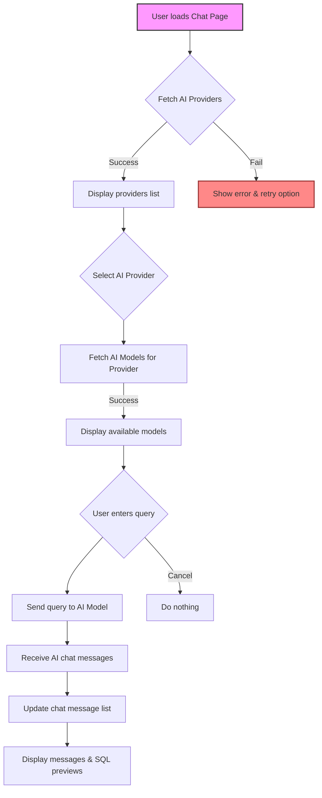

# Chat Page

The **Chat Page** provides an interactive AI-powered chat interface within the application, enabling users to query multiple AI models integrated with database context. It supports model selection, query input, displaying AI-generated responses, and showcasing SQL result previews when relevant.

---

## Table of Contents

- [Overview](#overview)
- [Core Features](#core-features)
- [Component Architecture](#component-architecture)
- [Usage Example](#usage-example)
- [Integration Details](#integration-details)
- [Mermaid Diagram: Interaction Flow](#mermaid-diagram-interaction-flow)
- [Related Source Files](#related-source-files)

---

## Overview

The Chat Page is designed to bridge AI conversational models with structured database query results. Users can interact with supported AI providers, select specific AI models, send queries, and receive rich AI responses that may include multiple turns and SQL data previews.

This interface enhances user productivity by combining natural language interaction with direct insights from the underlying databases.

---

## Core Features

- **AI Provider & Model Selection**: Choose among configured AI service providers and their available models.
- **Query Input**: Enter prompt or natural language queries to send to the AI models.
- **Chat History**: View a list of messages exchanged, including user inputs and AI-generated replies.
- **SQL Query Previews**: For responses incorporating SQL data, a table preview is displayed inline.
- **External Model Management**: Add and configure external AI models with API tokens.
- **Controlled UI States**: Loading indicators, error handling, and input disabling during submission.

---

## Component Architecture

The main component, `ChatPage`, organizes state and UI controls:

- **State Management:**
  - Tracks current query, selected AI provider, current model type, and tokens.
  - Manages chat message list and input disabling.
  - Supports external model addition via controlled form inputs.

- **Data Fetching:**
  - Uses lazy GraphQL queries to fetch AI providers, models, and chat responses.
  - Utilizes Redux store selectors to maintain application-wide state.

- **UI Components:**
  - Dropdowns for AI provider and model selection.
  - Input field for user queries.
  - Chat message list rendering, including specialized components for SQL response previews.
  - Buttons with event handlers for submitting queries and managing external models.

---

## Usage Example

```tsx
import React, { useState, useEffect } from 'react';
import { useAppSelector, useAppDispatch } from '../store/hooks';
import {
  useGetAiProvidersLazyQuery,
  useGetAiModelsLazyQuery,
  useGetAiChatLazyQuery
} from '../generated/graphql';
import Dropdown from '../components/dropdown';

const ChatPage: React.FC = () => {
  const dispatch = useAppDispatch();
  const [query, setQuery] = useState('');
  const [selectedProvider, setSelectedProvider] = useState<string | null>(null);
  const [selectedModel, setSelectedModel] = useState<string | null>(null);
  const [chatMessages, setChatMessages] = useState([]);

  const [getAiProviders] = useGetAiProvidersLazyQuery();
  const [getAiModels] = useGetAiModelsLazyQuery();
  const [getAiChat] = useGetAiChatLazyQuery();

  // Fetch AI providers on mount
  useEffect(() => {
    getAiProviders().then(resp => {
      if (resp.data?.AIProviders?.length) {
        setSelectedProvider(resp.data.AIProviders[0].ProviderId);
      }
    });
  }, [getAiProviders]);

  // Fetch models when provider changes
  useEffect(() => {
    if (selectedProvider) {
      getAiModels({ variables: { providerID: selectedProvider, modelType: 'chat', token: '' } }).then(resp => {
        if (resp.data?.AIModel?.length) {
          setSelectedModel(resp.data.AIModel[0]);
        }
      });
    }
  }, [selectedProvider, getAiModels]);

  const handleSubmit = async () => {
    if (!selectedProvider || !selectedModel) return;
    const { data } = await getAiChat({
      variables: {
        providerID: selectedProvider,
        modelType: 'chat',
        token: '',
        schema: '',
        input: { PreviousConversation: '', Query: query, Model: selectedModel, Token: '' }
      },
    });
    if (data?.AIChat?.length) {
      setChatMessages([...chatMessages, ...data.AIChat]);
    }
  };

  return (
    <div className="chat-page">
      <Dropdown
        items={[{ id: 'openai', label: 'OpenAI' }, { id: 'anthropic', label: 'Anthropic' }]}
        selected={selectedProvider}
        onChange={id => setSelectedProvider(id)}
      />
      <Dropdown
        items={/* derived from AI models */[]}
        selected={selectedModel}
        onChange={id => setSelectedModel(id)}
      />
      <textarea
        value={query}
        onChange={e => setQuery(e.target.value)}
        placeholder="Enter your query here..."
      />
      <button onClick={handleSubmit}>Send</button>
      <div className="chat-messages">
        {chatMessages.map((msg, idx) => (
          <div key={idx} className={`chat-message ${msg.Type === 'user' ? 'user' : 'ai'}`}>{msg.Text}</div>
        ))}
      </div>
    </div>
  );
};

export default ChatPage;
```

---

## Integration Details

The Chat Page integrates into the frontend React application and relies heavily on the GraphQL API to:{container}

- Fetch AI providers and available models via `useGetAiProvidersLazyQuery` and `useGetAiModelsLazyQuery`.
- Send queries and receive chat responses from `useGetAiChatLazyQuery`.
- Connects to Redux state for global information such as authentication and selected database profile.

### Dependencies

- **React & Redux:** State management and UI rendering.
- **Apollo Client (GraphQL):** Data fetching and mutations for AI interactions.
- **Dropdown, Input, Button components:** UI building blocks for selection and user input.

### System Touchpoints

- The page queries configured AI providers and models maintained by environment or backend configuration.
- Chat interaction is handled server-side, invoking AI LLM clients via the backend engine.
- Displays SQL database content inline where applicable, via integration between AI responses and database querying.

---

## Mermaid Diagram: Interaction Flow



---

## Related Source Files

- [Chat Page Component (frontend/src/pages/chat/chat.tsx)](frontend/src/pages/chat/chat.tsx)
- [AI Provider & Model Queries (frontend/src/generated/graphql.tsx)](frontend/src/generated/graphql.tsx)
- [GraphQL Resolvers Handling AI Chat (core/graph/schema.resolvers.go)](core/graph/schema.resolvers.go)
- [LLM Client for AI Chat (core/src/llm/llm_client.go)](core/src/llm/llm_client.go)
- [Authentication State (frontend/src/store/auth.ts)](frontend/src/store/auth.ts)
- [Redux Store Hooks (frontend/src/store/hooks.ts)](frontend/src/store/hooks.ts)

---

## Summary

The Chat Page enables a rich interface for interacting with AI models powered by backend large language model clients, complemented by database query results. It seamlessly integrates with backend GraphQL APIs and the Redux store for a smooth, responsive user experience.

With AI provider/model selection, post/query handling, and chat display capabilities, it forms a key feature in extending database applications with conversational AI assistance.
