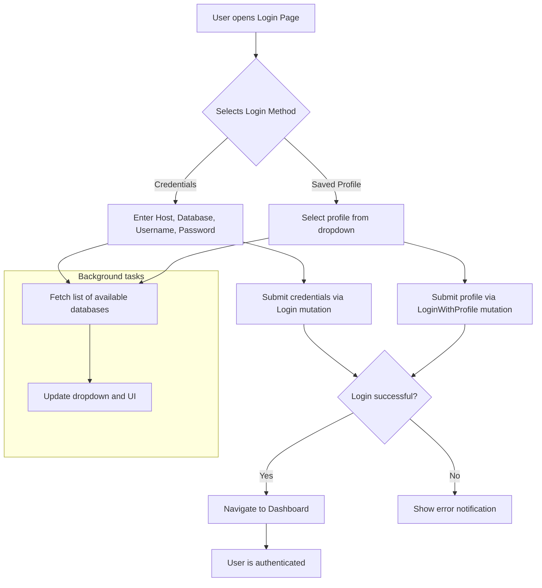

# Table of Contents

- [Overview](#overview)
- [Component Structure](#component-structure)
- [Usage Example](#usage-example)
- [Flow of Login Process](#flow-of-login-process)
- [Integration Details](#integration-details)
- [Related Source Files](#related-source-files)

---

## Overview

The **Login Page** component provides the user interface for authenticating users of the WhoDB application. It supports credentials-based login and login via stored profiles, enabling users to quickly connect to various database types such as PostgreSQL, MySQL, SQLite3, MongoDB, Redis, and others.

This page serves as the main gateway for users to establish a session with the backend API by entering or selecting their database access information. It also supports advanced connection options and dynamically loads available databases when the connection details change.

---

## Component Structure

The Login Page is implemented as a React functional component using TypeScript and integrates tightly with the backend GraphQL API. Key features include:

- **Database Type Selection:** Dropdown to select the type of database to connect to.
- **Credential Form:** Input fields for hostname, username, password, database name, and advanced options like ports or SSL.
- **Profile Support:** Allows users to select from saved login profiles for quick authentication.
- **Dynamic Databases Loading:** Fetches and updates list of available databases from the backend as the user changes connection details.
- **Form Validation and Submission:** Handles validation of inputs and executes login mutations.
- **Error Handling:** Displays relevant error messages for failed authentication or data issues.

Dependencies and Hooks:

- Uses Apollo Client's GraphQL mutations and queries to perform login and retrieve databases.
- Employs React Router for navigation.
- Connects to the centralized Redux store to manage authentication state.
- Uses various UI components including dropdowns, inputs, buttons, and notification systems.

---

## Usage Example

```tsx
import React, { useState, useEffect, ReactElement } from 'react';
import { useNavigate, useSearchParams } from 'react-router-dom';
import { useLoginMutation, useLoginWithProfileMutation, useGetDatabaseLazyQuery, useGetProfilesQuery } from '../../generated/graphql';
import { useAppDispatch, useAppSelector } from '../../store/hooks';
import { notify } from '../../store/function';
import { IDropdownItem, createDropdownItem } from '../../components/dropdown';

// Simplified sample LoginPage component snippet
const LoginPage: React.FC = () => {
  const [databaseType, setDatabaseType] = useState<IDropdownItem>({ id: 'Postgres', label: 'PostgreSQL' });
  const [hostName, setHostName] = useState('');
  const [database, setDatabase] = useState('');
  const [username, setUsername] = useState('');
  const [password, setPassword] = useState('');
  
  const [loginMutation] = useLoginMutation();
  const [getDatabases, { data: databasesData }] = useGetDatabaseLazyQuery();
  const dispatch = useAppDispatch();
  const navigate = useNavigate();

  // On database type or connection change, fetch available databases
  useEffect(() => {
    if (databaseType?.id && hostName) {
      getDatabases({ variables: { type: databaseType.id } });
    }
  }, [databaseType, hostName, getDatabases]);

  const handleSubmit = async () => {
    try {
      // Validate required fields here...
      await loginMutation({
        variables: {
          credentials: {
            Type: databaseType.id,
            Hostname: hostName,
            Username: username,
            Password: password,
            Database: database
          }
        }
      });
      navigate('/dashboard');
    } catch (error) {
      dispatch(notify('Login failed. Please check your credentials.', 'error'));
    }
  };

  return (
    <form onSubmit={(e) => { e.preventDefault(); handleSubmit(); }}>
      {/* Database Type Selector */}
      <Dropdown
        items={[createDropdownItem('Postgres', /* icon */ <></>), createDropdownItem('MySQL', <></>)]}
        selected={databaseType}
        onSelect={setDatabaseType}
      />

      {/* Connection inputs: host, username, password, database */}
      {/* ... */}

      <button type="submit">Log In</button>
    </form>
  );
};

export default LoginPage;
```

---

## Flow of Login Process



---

## Integration Details

The Login Page component is a critical part of the broader WhoDB application and integrates with various layers:

- **GraphQL API Integration:** Uses generated Apollo React hooks for mutations (`useLoginMutation`, `useLoginWithProfileMutation`) and queries (`useGetDatabaseLazyQuery`, `useGetProfilesQuery`) to interact with the backend server.

- **Redux Store:** Dispatches notifications and listens to authentication state changes for integrating login status.

- **Routing:** Utilizes `react-router-dom` for navigating between the login page and other authenticated routes upon successful login.

- **UI Components:** Leverages the reusable `Dropdown`, `Input`, `Button`, and notification components for a consistent user experience.

- **Backend Coordination:** Credentials entered on this page correspond to the backend database plugins configured in the system (e.g., Postgres, MySQL, MongoDB, Redis), where login mutations translate to backend authentication sessions.

- **Profile Management:** Supports managing multiple login profiles which are stored and loaded via GraphQL queries.

This component is pivotal in user authentication and setup, ensuring users can securely initialize their sessions and access other parts of the application seamlessly.

---

## Related Source Files

- [Login Page Source (frontend)](frontend/src/pages/auth/login.tsx)
- [Login Mutation GraphQL](frontend/src/pages/auth/login.mutation.graphql)
- [LoginWithProfile Mutation GraphQL](frontend/src/pages/auth/login-with-profile.mutation.graphql)
- [GraphQL Generated Hooks](frontend/src/generated/graphql.tsx)
- [Dropdown Component](frontend/src/components/dropdown.tsx)
- [Redux Store Hooks](frontend/src/store/hooks.ts)

These files together implement the login mechanism from UI to backend interaction.
