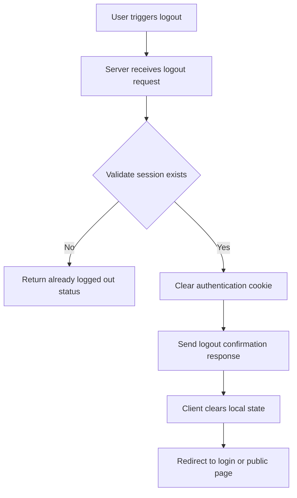

# Logout Logic

## Table of Contents
- [Introduction](#introduction)
- [Logout Flow](#logout-flow)
- [Code Example](#code-example)
- [Integration and Architecture](#integration-and-architecture)
- [References](#references)

## Introduction

The **Logout Logic** is responsible for securely ending a user's session in the application by clearing authentication credentials, typically stored in cookies or tokens. This process ensures that after logout, subsequent requests from the client are no longer authenticated, protecting user data and access control.

In the context of WhoDB, the Logout Logic involves invalidating the user's session cookie and notifying relevant parts of the system about the logout event. This facilitates a clean and secure logout process.

## Logout Flow

The logout process typically follows these steps:



- The client initiates logout.
- The server verifies the session and clears credentials by setting expired cookies.
- Confirmation is returned.
- The frontend updates its state accordingly.

## Code Example

Below is an example implementation of logout logic from `core/src/auth/logout.go` showing how the user cookie is cleared.

```go
package auth

import (
  "context"
  "net/http"
  "time"

  "github.com/clidey/whodb/core/graph/model"
)

// Logout clears the user's auth cookie to end the session.
func Logout(ctx context.Context) (*model.StatusResponse, error) {
  w, ok := ctx.Value("httpResponseWriter").(http.ResponseWriter)
  if !ok {
    // Response writer not available - cannot clear cookie
    return &model.StatusResponse{Status: false}, nil
  }

  // Set cookie with expired date to remove it on client
  expiredCookie := &http.Cookie{
    Name:     "auth",
    Value:    "",
    Path:     "/",
    Expires:  time.Unix(0, 0),
    MaxAge:   -1,
    HttpOnly: true,
    Secure:   true,
    SameSite: http.SameSiteLaxMode,
  }

  http.SetCookie(w, expiredCookie)

  return &model.StatusResponse{Status: true}, nil
}
```

### Notes
- The function expects the `http.ResponseWriter` in the request context under a known key (middleware attaches it).
- The HTTP cookie `auth` is forcibly expired, prompting the client browser to delete it.
- It returns a boolean status wrapped in a GraphQL response model.

## Integration and Architecture

### Key Integration Points

- **GraphQL Mutation:** The logout function is hooked to the `Logout` mutation resolver in the GraphQL layer, exposing it to clients.

- **HTTP Middleware:** Middleware injects the `http.ResponseWriter` into the request context making it accessible in the resolver logic. 

- **Client Handling:** On logout confirmation, client-side redux state for authentication is reset, and UI navigates to an unauthenticated route (e.g., login page).

- **Security:** Clearing the cookie immediately removes the valid auth token from the client, preventing unauthorized access.

### Dependencies

- `net/http` for HTTP cookie manipulation.
- `context` package for request-scoped context passing.
- GraphQL `model.StatusResponse` for consistent API response typing.

### Interaction Pattern

1. **Client UI** triggers logout (via button or automatic action).
2. **GraphQL API** endpoint receives mutation, processes logout.
3. **Server** clears cookie and sends confirmation.
4. **Client** updates UI state and redirects as needed.

Together, this maintains a secure, clear logout lifecycle across backend and frontend.

## References

- [Logout Go Implementation](core/src/auth/logout.go)
- [Logout Mutation Resolver](core/graph/schema.resolvers.go:mutationResolver.Logout)
- [Auth Middleware](core/src/auth/auth.go:AuthMiddleware)

---

For detailed understanding, review the [Logout.go source](/core/src/auth/logout.go) and how it integrates into the larger authentication flow.