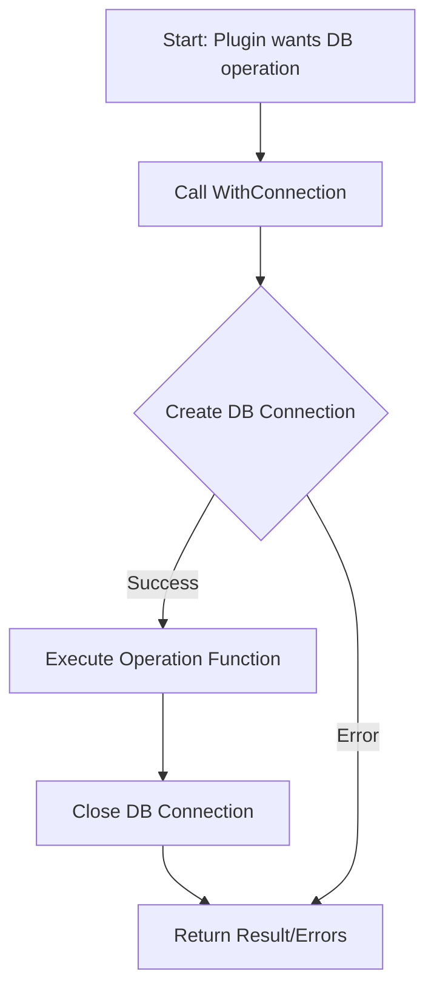

# Common Plugin Utilities

## Table of Contents

- [Overview](#overview)
- [WithConnection Utility Function](#withconnection-utility-function)
- [Usage Example](#usage-example)
- [Integration Details](#integration-details)
- [Architecture Context](#architecture-context)

---

## Overview

The **Common Plugin Utilities** provide foundational helper functions for managing database connections within various database plugins in the WhoDB system. These utilities primarily enable safe and reusable handling of database connections, ensuring proper acquisition and release of resources while performing operations.

A key function provided is `WithConnection`, which simplifies the pattern of opening a connection, executing a database operation, and guaranteeing resource cleanup, avoiding code duplication and promoting error safety.

This module abstracts the complexity of connecting to different databases within plugins, enabling consistent and efficient database interaction across the system.

---

## WithConnection Utility Function

### Description

`WithConnection` is a generic utility function designed to facilitate the following lifecycle within database plugins:

1. Establish a database connection using a provided configuration.
2. Execute a provided operation function that receives the database handle.
3. Close the database connection properly after the operation.

It abstracts common connection management patterns using the GORM ORM, providing plugins with a safe and convenient way to run queries or transactions.

### Type Definition

```go
// DBCreationFunc defines a function to create a GORM DB connection from a PluginConfig.
type DBCreationFunc func(pluginConfig *engine.PluginConfig) (*gorm.DB, error)

// DBOperation defines a generic function type representing a DB operation that accepts a GORM DB pointer and returns a result and an error.
type DBOperation[T any] func(db *gorm.DB) (T, error)

// WithConnection manages database connection lifecycle and executes user-defined DBOperation.
func WithConnection[T any](
  config *engine.PluginConfig,
  DB DBCreationFunc,
  operation DBOperation[T],
) (T, error)
```

### Parameters

- `config`: The plugin configuration containing credentials and connection info.
- `DB`: A callable function that creates a GORM database connection using the configuration.
- `operation`: The business logic operation to execute once a DB connection is established.

### Returns

- The result of the operation of generic type `T`.
- An error if any step fails.

### Behavior

- Opens a new DB connection using `DB(config)`.
- Calls `operation(db)` passing the DB instance.
- Ensures the DB connection is properly closed after execution.

---

## Usage Example

Below is an example illustrating how a plugin might use `WithConnection` to safely access a database and execute a query.

```go
import (
  "github.com/clidey/whodb/core/src/plugins"
  "gorm.io/gorm"
  "github.com/clidey/whodb/core/src/engine"
)

// Example operation to count rows in a table
func countRows(db *gorm.DB) (int64, error) {
  var count int64
  err := db.Table("users").Count(&count).Error
  return count, err
}

func performCount(config *engine.PluginConfig) (int64, error) {
  result, err := plugins.WithConnection(config, MySQLPlugin.DB, countRows)
  return result, err
}
```

This encapsulates connection setup and teardown automatically.

---

## Integration Details

- **This utility function is a foundational piece for all database plugins** (e.g., MySQL, Postgres, SQLite3, etc.), which implement their connection logic and pass it alongside their custom database operations.

- Plugin implementers call `WithConnection` to execute operations while **delegating resource management to this utility**, ensuring consistent connection handling.

- Errors during connecting or operation execution bubble up for appropriate handling in the calling plugin or resolver.

- By generic type parameterization, `WithConnection` supports operations returning any result type, making it flexible for queries, commands, or other DB-related tasks.

- It **depends on**:
  - The `engine.PluginConfig` type to extract configuration.
  - The GORM library for database connection (`*gorm.DB`).

---

## Architecture Context



- The utility function fits inside the **Core Plugin System**, called by different database-specific plugins (e.g., MySQL, PostgreSQL).

- This promotes **separation of concerns:** plugins focus on business logic and query formulation, while common connection lifecycle management is centralized.

- It ensures **reliable and safe resource release** in asynchronous or multiple concurrent request contexts.

- Related files:
  - [`core/src/plugins/common.go`](/core/src/plugins/common.go) — contains the definition and implementation of `WithConnection`.
  - Database plugin files such as:
    - [`core/src/plugins/mysql/mysql.go`](/core/src/plugins/mysql/mysql.go)
    - [`core/src/plugins/postgres/postgres.go`](/core/src/plugins/postgres/postgres.go)
    - [`core/src/plugins/sqlite3/sqlite3.go`](/core/src/plugins/sqlite3/sqlite3.go)

---

For more details, see the implementation source: [`core/src/plugins/common.go`](/core/src/plugins/common.go).
