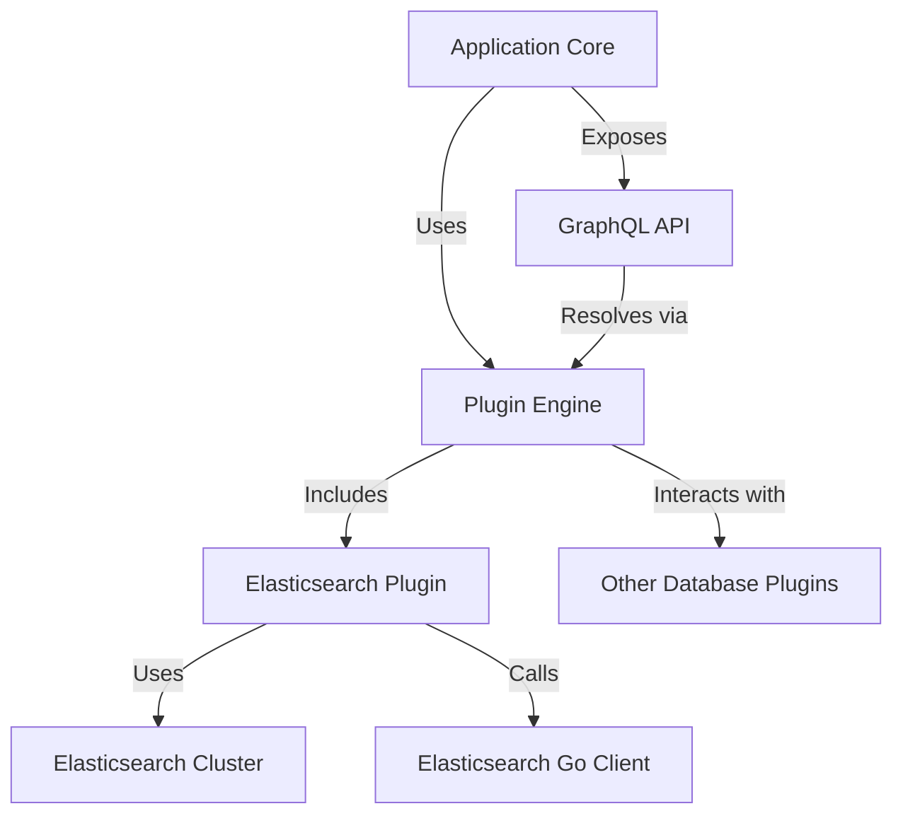

# Elasticsearch Plugin

The **Elasticsearch Plugin** provides an adapter layer enabling integration between the application and an Elasticsearch cluster. It implements standardized plugin interfaces to allow querying Elasticsearch indices, fetching metadata, and executing filtered queries transparent to the wider system.

This plugin facilitates schema discovery, data retrieval, and graph extraction, bridging the application's multi-database architecture and Elasticsearch's specialized API.

## Table of Contents

- [Overview](#overview)
- [Key Features](#key-features)
- [Initialization & Connection](#initialization--connection)
- [Core Methods](#core-methods)
  - [Checking Availability](#checking-availability)
  - [Get Databases (Indices)](#get-databases-indices)
  - [Get All Schemas](#get-all-schemas)
  - [Get Storage Units (Indices)](#get-storage-units-indices)
  - [Get Rows (Documents)](#get-rows-documents)
  - [Graph Retrieval](#graph-retrieval)
  - [Raw Execute](#raw-execute)
  - [Chat Interface](#chat-interface)
- [Integration & Architecture](#integration--architecture)
- [Example Usage](#example-usage)
- [Source Files](#source-files)

---

## Overview

The Elasticsearch Plugin integrates with an Elasticsearch cluster, enabling the application to:

- Retrieve available "databases" (Elasticsearch indices).
- Query documents with filters through Elasticsearch DSL queries.
- Discover schema structure from index mappings.
- Generate a graph model of relations based on index information.
- Process raw query execution.
- Support AI chat querying through underlying LLM integrations.

It implements the common `engine.PluginFunctions` interface expected by the system, ensuring consistent usage with other database plugins.

## Key Features

- **Dynamic Index Discovery:** Lists the indices (databases) available.
- **Schema Insight:** Retrieves list of indices as storage units with associated attributes.
- **Filtered Query Execution:** Converts generic where conditions to Elasticsearch DSL.
- **Graph Construction:** Infers graph relationships from index and document analysis.
- **Raw Query Support:** Ability to run a raw query and parse results.
- **AI Chat Integration:** Provides a chat interface leveraging AI for intelligent querying.

## Initialization & Connection

The plugin uses a custom `DB` method to create an Elasticsearch client. This method assembles connection options considering whether SSL is needed, handles host and port, and applies any required basic authentication.

The client performs a connection test by retrieving cluster info, validating availability before further operations.

```go
func DB(config *engine.PluginConfig) (*elasticsearch.Client, error) {
    // Construct configuration for Elasticsearch client based on PluginConfig
    // Includes host, port, SSL mode, and credentials
    cfg := elasticsearch.Config{
        Addresses: []string{ ... },
        Username:  config.Credentials.Username,
        Password:  config.Credentials.Password,
        // Other configuration
    }

    client, err := elasticsearch.NewClient(cfg)
    if err != nil {
        return nil, err
    }

    // Check client availability
    _, err = client.Info()
    if err != nil {
        return nil, err
    }

    return client, nil
}
```


## Core Methods

### Checking Availability

Returns whether the plugin can successfully connect and operate against the target Elasticsearch instance.

### Get Databases (Indices)

Retrieves a slice of elastic indices which the system treats as available databases.

### Get All Schemas

In Elasticsearch, schemas map directly to indices. This method returns all indices, effectively as all schemas.

### Get Storage Units (Indices)

Equivalent to getting tables or collections, storage units here represent Elasticsearch indices with attribute metadata derived from index mappings.

### Get Rows (Documents)

Fetches documents within an index with optional filters. The plugin converts a generic `WhereCondition` struct into Elasticsearch DSL filters internally.

### Graph Retrieval

Generates a relationship graph between indices or types by analyzing index settings and internal document relations.

### Raw Execute

Executes user-provided raw Elasticsearch DSL or SQL queries (if supported) against the cluster and returns parsed results.

### Chat Interface

Leverages the application’s large language model (LLM) integration to chat over Elasticsearch data by shaping prompts and interpreting model completions.

## Integration & Architecture

The Elasticsearch Plugin is part of the modular plugin system enabling the application to support multiple database types uniformly.

Key integration points:

- Implements the `engine.PluginFunctions` interface.
- Uses `engine.PluginConfig` to receive database connection parameters.
- Connects with the core engine logic for data retrieval and execution.
- Works with the GraphQL resolvers through `core/graph/schema.resolvers.go` to serve API requests.
- Injects into the main engine during `core/src/src.go:InitializeEngine()` alongside other plugins.

### Dependencies

- `github.com/elastic/go-elasticsearch/v8` for client & API calls.
- `encoding/json` for JSON marshaling/unmarshaling.
- Core engine concepts from `core/src/engine`.
- Go standard libraries: `net/url`, `fmt`, `context`.

## Example Usage

A simplified example of raw execution using the plugin:

```go
package main

import (
  "context"
  "fmt"
  "github.com/clidey/whodb/core/src/engine"
  "github.com/clidey/whodb/core/src/plugins/elasticsearch"
)

func main() {
  config := &engine.PluginConfig{
    Credentials: &engine.Credentials{
      Hostname: "localhost",
      Port: "9200",
      Username: "",
      Password: "",
      Type: "ElasticSearch",
    },
  }

  plugin := elasticsearch.NewElasticSearchPlugin()

  if !plugin.IsAvailable(config) {
    fmt.Println("Elasticsearch not available")
    return
  }

  query := `{ "query": { "match_all": {} } }`
  result, err := plugin.RawExecute(config, query)
  if err != nil {
    fmt.Println("Error executing query:", err)
    return
  }

  fmt.Println("Query Result:", result)
}
```

## Architecture Diagram



## Source Files

- [core/src/plugins/elasticsearch/elasticsearch.go](/core/src/plugins/elasticsearch/elasticsearch.go) - Main plugin implementation.
- [core/src/plugins/elasticsearch/db.go](/core/src/plugins/elasticsearch/db.go) - Database connection setup.
- [core/src/plugins/elasticsearch/graph.go](/core/src/plugins/elasticsearch/graph.go) - Graph construction logic.

---

By implementing this plugin, the system can treat Elasticsearch as a first-class database backend, supporting intuitive querying, schema introspection, and AI chat capabilities seamlessly alongside other supported databases.