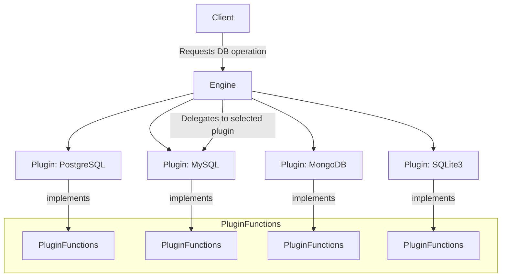

# Engine Core

The Engine Core serves as the foundational abstraction layer for the WhoDB system's support of multiple database backends. It manages the database plugins, enabling uniform interaction with heterogeneous database engines such as PostgreSQL, MySQL, SQLite3, MongoDB, Redis, Elasticsearch, and ClickHouse.

This core component provides a unified interface for querying schemas, storage units (tables or collections), graph relationships, raw SQL execution, chat integration, and more. It allows the system to dynamically select and delegate operations to the appropriate database plugin based on the database type.

---

## Table of Contents

- [Overview](#overview)
- [Core Concepts](#core-concepts)
- [Engine Struct and Plugin Management](#engine-struct-and-plugin-management)
- [Key Data Structures](#key-data-structures)
- [Primary Operations](#primary-operations)
- [Example Usage](#example-usage)
- [Integration Details](#integration-details)

---

## Overview

The engine package encapsulates the logic needed to support multiple database types through dedicated plugins. It centralizes database-specific details behind a common interface called `PluginFunctions`. This enables the WhoDB backend and API to remain database-agnostic while leveraging specific features and connection mechanics for each database type.

Each database type plugin implements necessary functions such as retrieving available databases and schemas, exploring tables (storage units), executing queries, and providing AI chat capabilities where supported.

## Core Concepts

- **Plugin:** Represents a database-specific implementation supporting a standardized set of operations.
- **PluginFunctions:** Interface defining the operations a plugin must implement.
- **Engine:** Central registry that holds the available plugins and dispatches operations to the correct plugin based on database type.
- **StorageUnit:** Abstraction representing a database table or collection including its attributes.
- **GraphUnit:** Represents storage units and their inter-relationships for schema visualization.

## Engine Struct and Plugin Management

The `Engine` struct stores a collection of plugins and exposes methods to:

- Register a new plugin.
- Choose a plugin by database type.

### Engine struct

```go
// Engine manages registered database plugins
// and selects the appropriate plugin based on type.
type Engine struct {
  Plugins []*Plugin
}

// Register a plugin with the engine
func (e *Engine) RegistryPlugin(plugin *Plugin) {
  e.Plugins = append(e.Plugins, plugin)
}

// Choose returns the plugin matching the given database type
func (e *Engine) Choose(databaseType DatabaseType) *Plugin {
  for _, p := range e.Plugins {
    if p.Type == databaseType {
      return p
    }
  }
  return nil
}
```

## Key Data Structures

### Plugin

Represents a database plugin with its function implementations and type.

```go
// Plugin represents a database plugin instance
// implementing PluginFunctions interface.
type Plugin struct {
  PluginFunctions
  Type DatabaseType
}
```

### StorageUnit

Models a logical database entity like a table or collection. Contains a name and a list of attributes (fields).

```go
// StorageUnit represents a table or collection
// with a name and its attributes (fields)
type StorageUnit struct {
  Name       string
  Attributes []Record
}
```

### GraphUnit

Models storage units and their relationships for schema graph visualization.

```go
// GraphUnit represents a storage unit along with its
// relational edges (relationships).
type GraphUnit struct {
  Unit      StorageUnit
  Relations []GraphUnitRelationship
}
```

## Primary Operations

### Engine Initialization

The engine is initialized by registering all supported plugins for each database type:

- Postgres
- MySQL
- MariaDB
- SQLite3
- MongoDB
- Redis
- Elasticsearch
- ClickHouse

This setup is typically done once at server startup.

### Plugin Selection

At runtime, when an operation is requested for a specific database type, the engine selects the appropriate plugin via `Engine.Choose()`, enabling delegation.

### Storage Unit Model Conversion

The engine provides helper functions to convert internal StorageUnit data to the GraphQL representation used in API responses.

## Example Usage

Here is an example demonstrating plugin registration and selecting a plugin for an operation:

```go
import (
  "github.com/clidey/whodb/core/src/engine"
  "github.com/clidey/whodb/core/src/plugins/postgres"
  "github.com/clidey/whodb/core/src/plugins/mysql"
)

func InitializeEngine() *engine.Engine {
  eng := &engine.Engine{}
  
  // Register plugins for supported databases
  eng.RegistryPlugin(postgres.NewPostgresPlugin())
  eng.RegistryPlugin(mysql.NewMySQLPlugin())
  // Add other plugins similarly...

  return eng
}

func ExampleGetDatabases(eng *engine.Engine, dbType engine.DatabaseType) ([]string, error) {
  plugin := eng.Choose(dbType)
  if plugin == nil {
    return nil, fmt.Errorf("unsupported database type: %s", dbType)
  }

  // Mock config represents credentials and options for plugin
  config := engine.NewPluginConfig(nil) // Provide actual credentials

  // Use plugin to get list of databases
  return plugin.GetDatabases(config)
}
```

## Mermaid Diagram



## Integration Details

- **As Core Component:** The Engine sits at the core of the WhoDB backend, acting as the abstraction and dispatch layer for database operations.
- **Dependency Relationships:** Depends on the individual database plugins implementing `PluginFunctions`.
- **Usage in GraphQL Resolvers:** Resolvers invoke engine methods to query or mutate data, automatically routed by database type.
- **Settings & Profiles:** Works alongside authentication and settings packages that provide credentials and configuration.

## Related Files

- [core/src/src.go](../core/src/src.go) — Engine initialization and plugin registration
- [core/src/engine/plugin.go](../core/src/engine/plugin.go) — Key plugin types and interfaces
- [core/src/plugins/postgres/postgres.go](../core/src/plugins/postgres/postgres.go) — Postgres plugin implementation
- [core/graph/schema.graphqls](../core/graph/schema.graphqls) — GraphQL types related to Engine core

---

The Engine Core provides a flexible, extendable, and uniform means to support diverse database backends, facilitating the modular growth and reliable operation of WhoDB's backend services.