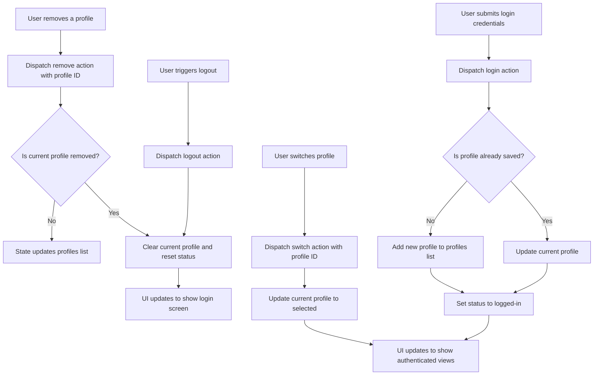

# Authentication State

This section documents the **Authentication State** management within the WhoDB frontend application. It leverages Redux Toolkit to handle user authentication status, manages login profiles, and streamlines user session management.

---

## Table of Contents

- [Overview](#overview)
- [State Structure](#state-structure)
- [Reducers and Actions](#reducers-and-actions)
- [Code Example](#code-example)
- [Integration Details](#integration-details)
- [Diagram: Authentication State Workflow](#diagram-authentication-state-workflow)

---

## Overview

The Authentication State module provides a centralized mechanism to manage user authentication details, including:

- Tracking login status (e.g., logged-in, unauthorized)
- Managing multiple login profiles
- Handling current authenticated user context
- Supporting login, logout, profile switching, and profile removal operations

This enables consistent, global state management of authentication-related data across the React application, improving maintainability and user experience.

---

## State Structure

The authentication state consists of:

- **status**: A string that reflects whether the user is logged in or unauthorized.
- **current**: An optional object representing the currently logged-in profile, containing user credentials, a unique ID, and an optional `Saved` flag.
- **profiles**: An array of user login profiles stored locally, allowing users to quickly select and switch between saved authentication credentials.

This structure supports multi-profile management while facilitating easy state transitions.

---

## Reducers and Actions

The state management is handled via a Redux slice that defines the following reducers:

- **login**: Sets or updates the current login profile. Accepts either plain credentials or an existing profile.
- **switch**: Switches the current profile by selecting a stored profile based on its ID.
- **remove**: Removes a stored profile from the profiles list by its ID.
- **logout**: Clears the current state, effectively logging the user out.
- **setLoginProfileDatabase**: Updates the selected database for a specified login profile.

All changes are reflected in the Redux store, allowing subscription by React components to update UI or trigger side effects.

---

## Code Example

```ts
import { createSlice, PayloadAction } from '@reduxjs/toolkit';

// Local profile type extending server-provided credentials
type LocalLoginProfile = LoginCredentials & { Id: string; Saved?: boolean };

// Interface for auth state
interface IAuthState {
  status: 'logged-in' | 'unauthorized';
  current?: LocalLoginProfile;
  profiles: LocalLoginProfile[];
}

const initialState: IAuthState = {
  status: 'unauthorized',
  profiles: [],
};

const authSlice = createSlice({
  name: 'auth',
  initialState,
  reducers: {
    // Login action: set current profile and update profiles list
    login(state, action: PayloadAction<LoginCredentials | LocalLoginProfile>) {
      const profile = action.payload as LocalLoginProfile;
      state.current = profile;
      state.status = 'logged-in';

      // Save profile if not present
      if (!state.profiles.find(p => p.Id === profile.Id)) {
        state.profiles.push({ ...profile, Saved: true });
      }
    },

    // Switch current profile by ID
    switch(state, action: PayloadAction<{id: string}>) {
      const target = state.profiles.find(p => p.Id === action.payload.id);
      if (target) {
        state.current = target;
        state.status = 'logged-in';
      }
    },

    // Remove a saved profile by ID
    remove(state, action: PayloadAction<{id: string}>) {
      state.profiles = state.profiles.filter(p => p.Id !== action.payload.id);
      if (state.current?.Id === action.payload.id) {
        state.current = undefined;
        state.status = 'unauthorized';
      }
    },

    // Clear current user session
    logout(state) {
      state.current = undefined;
      state.status = 'unauthorized';
    },

    // Update database selection for a profile
    setLoginProfileDatabase(state, action: PayloadAction<{id: string; database: string}>) {
      const profile = state.profiles.find(p => p.Id === action.payload.id);
      if (profile) {
        profile.Database = action.payload.database;
      }
      if (state.current?.Id === action.payload.id) {
        state.current.Database = action.payload.database;
      }
    },
  },
});

export const {
  login,
  switch: switchProfile,
  remove: removeProfile,
  logout,
  setLoginProfileDatabase,
} = authSlice.actions;

export default authSlice.reducer;
```

```ts
// Helper to generate unique IDs for profiles can be integrated here
import { v4 as uuidv4 } from 'uuid';

// Usage example:
// dispatch(login({ Id: uuidv4(), Hostname: 'localhost', Username: 'admin', ... }))
```

---

## Integration Details

- **Redux Store**: This auth slice integrates into the global Redux store (see [store configuration](../Redux%20Store%20Configuration)) to be accessible throughout the frontend.
- **React Components**: Components such as the login page, sidebar, and auth guards consume this state to adapt UI based on login status.
- **Authentication Middleware**: Works in tandem with backend authentication middleware to ensure secure session management.
- **Profile Management**: Enables persistence and switching of DB connection profiles, easing user login workflows.

### Key Touchpoints

- **Frontend pages** like `LoginPage` dispatch `login` and `logout` actions.
- **Sidebar Navigation** adapts navigation items based on `status` and `current` user profile.
- **API Requests** receive authentication context from this state indirectly via middleware.

---

## Diagram: Authentication State Workflow



---

## Source

- [frontend/src/store/auth.ts](frontend/src/store/auth.ts)