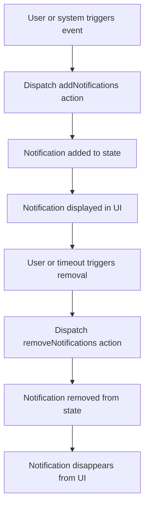

# Common State

## Overview

The **Common State** slice handles cross-cutting concerns and UI state shared across multiple parts of the frontend application. Primarily, it manages **notifications**, enabling components to display, add, and remove transient user messages such as errors, warnings, success alerts, or informational prompts.

This centralized management simplifies notification lifecycle control and ensures consistent user feedback throughout the app.

---

## Table of Contents

- [Purpose](#purpose)
- [State Shape](#state-shape)
- [Actions](#actions)
- [Reducers](#reducers)
- [Usage Example](#usage-example)
- [Mermaid Diagram](#mermaid-diagram)
- [Integration Details](#integration-details)
- [Source Reference](#source-reference)

---

## Purpose

The Common State slice encapsulates notification messages for the UI. Notifications often provide timely feedback about operations such as form submissions, authentication errors, or system events.

Centralizing notification management enables:

- Consistent notification display
- Easy addition and removal of messages
- Decoupling UI notification logic from business logic

---

## State Shape

The state managed by this slice has the following shape:

```ts
interface INotification {
  id: string
  message: string
  intent?: 'default' | 'success' | 'error' | 'warning'
}

interface ICommonState {
  notifications: INotification[]
}
```

- **notifications:** Array of current notifications with unique IDs, messages, and intents describing display style.

---

## Actions

The Common State slice provides these main actions:

- `addNotifications(notification: INotification)`: Add a new notification to the list.
- `removeNotifications(notification: INotification)`: Remove a specific notification by `id`.

These actions let components push or clear notifications effectively.

---

## Reducers

The reducer logic manages updating the notifications array based on actions.

```ts
const commonSlice = createSlice({
  name: 'common',
  initialState: { notifications: [] } as ICommonState,
  reducers: {
    addNotifications(state, action: PayloadAction<INotification>) {
      state.notifications.push(action.payload);
    },
    removeNotifications(state, action: PayloadAction<INotification>) {
      state.notifications = state.notifications.filter(
        (n) => n.id !== action.payload.id
      );
    },
  },
});

export const CommonActions = commonSlice.actions;
export const commonReducers = commonSlice.reducer;
```

---

## Usage Example

Below is a minimal example showing how to dispatch a notification:

```ts
import { useAppDispatch } from '../store/hooks';
import { CommonActions } from '../store/common';
import { v4 as uuidv4 } from 'uuid';

function notifyUser(message: string, intent: 'success' | 'error' = 'default') {
  const dispatch = useAppDispatch();

  dispatch(
    CommonActions.addNotifications({
      id: uuidv4(),
      message,
      intent,
    })
  );
}

// In a component:
// notifyUser('Data saved successfully!', 'success');
```

This approach can be used throughout the React app to reliably add messages.

---

## Mermaid Diagram

A simple flow showing the notification lifecycle managed by the Common State:



---

## Integration Details

- **Redux Slice:** Defined using Redux Toolkit's `createSlice` within `frontend/src/store/common.ts`.
- **Actions & Reducer Exported:** Allows integration in the root Redux store (`frontend/src/store/index.ts`).
- **Connected UI:** Notification components (`frontend/src/components/notifications.tsx`) subscribe to the notification slice for rendering.
- **Dispatch Usage:** Any component or utility can dispatch notification actions via typed hook `useAppDispatch`.

This slice acts as a foundational part of UI state management enabling user feedback.

---

## Source Reference

- [common.ts (Redux slice)](frontend/src/store/common.ts)
- [notifications.tsx (UI component)](frontend/src/components/notifications.tsx)
- [hooks.ts (Typed hooks)](frontend/src/store/hooks.ts)
- [function.ts (helper for notifications)](frontend/src/store/function.ts)

---

With Common State managing notifications globally, the application can provide reliable, consistent communication to users regarding system events and actions.
