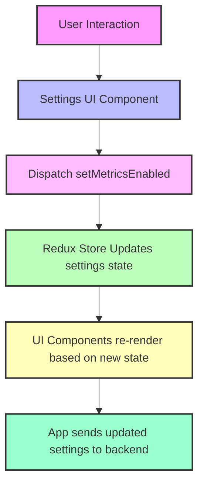

# Settings State

## Table of Contents
- [Overview](#overview)
- [State Structure](#state-structure)
- [Actions and Reducers](#actions-and-reducers)
- [Usage Example](#usage-example)
- [Integration Details](#integration-details)
- [Architecture and Flow](#architecture-and-flow)

---

## Overview

The **Settings State** module manages application-wide user and system settings within the frontend React application using Redux Toolkit. Its primary focus is on tracking and controlling whether telemetry and performance metrics collection is enabled or disabled.

This state slice helps facilitate:
- User opt-in/out for telemetry.
- Centralized control of metrics settings.
- Propagation of settings changes across components.

The settings state is designed for easy extension to accommodate future application settings as needed.

---

## State Structure

The settings state is encapsulated in the interface:

```ts
interface ISettingsState {
  /** Whether telemetry/performance metrics tracking is enabled */
  metricsEnabled: boolean;
}
```

The state tracks the `metricsEnabled` flag as a boolean.

---

## Actions and Reducers

Redux Toolkit's `createSlice` is used to define the following:

- **initial state:**
  ```ts
  const initialState: ISettingsState = {
    metricsEnabled: false,
  };
  ```

- **Reducers:**
  - `setMetricsEnabled`: An action that updates the `metricsEnabled` boolean in the state.

```ts
const settingsSlice = createSlice({
  name: 'settings',
  initialState,
  reducers: {
    setMetricsEnabled(state, action: PayloadAction<boolean>) {
      state.metricsEnabled = action.payload;
    },
  },
});

export const SettingsActions = settingsSlice.actions;
export const settingsReducers = settingsSlice.reducer;
```

This setup allows components to dispatch the `setMetricsEnabled` action to update the metrics flag in the global Redux store.

---

## Usage Example

Here is a minimal example demonstrating how to use the Settings state in a React component:

```tsx
import React from 'react';
import { useAppSelector, useAppDispatch } from '../store/hooks';
import { SettingsActions } from '../store/settings';

const MetricsToggle = () => {
  const dispatch = useAppDispatch();
  const metricsEnabled = useAppSelector(state => state.settings.metricsEnabled);

  const toggleMetrics = () => {
    dispatch(SettingsActions.setMetricsEnabled(!metricsEnabled));
  };

  return (
    <label>
      <input
        type="checkbox"
        checked={metricsEnabled}
        onChange={toggleMetrics}
      />
      Enable Telemetry
    </label>
  );
};

export default MetricsToggle;
```

### Dispatch
- `dispatch(SettingsActions.setMetricsEnabled(true | false))`: Updates the global metrics setting.

### Selector
- `useAppSelector(state => state.settings.metricsEnabled)`: Reads current flag for UI display.

---

## Integration Details

The Settings State is integrated as part of the global Redux store configuration:

- **Store inclusion**: The Settings reducer is combined with other slices like Auth, Database, Chat, and Global.
- **Persistence**: Settings state can be persisted via `redux-persist` to survive page reloads.
- **Usage across app**:
  - Settings state is referenced in high-level components like the main `App` component.
  - It controls behavioral features such as user telemetry preferences and metrics opt-in/out.

**Dependencies & Relations:**
- Relies on React-Redux hooks (`useAppSelector`, `useAppDispatch`) for accessing and modifying state.
- Complements other global state slices, enabling cross-feature synchronization.
- Works with the backend via GraphQL mutation to persist settings changes ([UpdateSettings mutation](../GraphQL%20Schema%20and%20Resolvers#updatesettingsmutation)).

---

## Architecture and Flow



This flow explains how the user's interaction with the settings interface triggers a state update in Redux, leading to UI feedback and synchronization with the backend.

---

## Source

- [Settings State Implementation (settings.ts)](../frontend/src/store/settings.ts)

---

This state management approach offers a simple yet powerful way to handle telemetry preferences that can be expanded with additional settings in future updates.