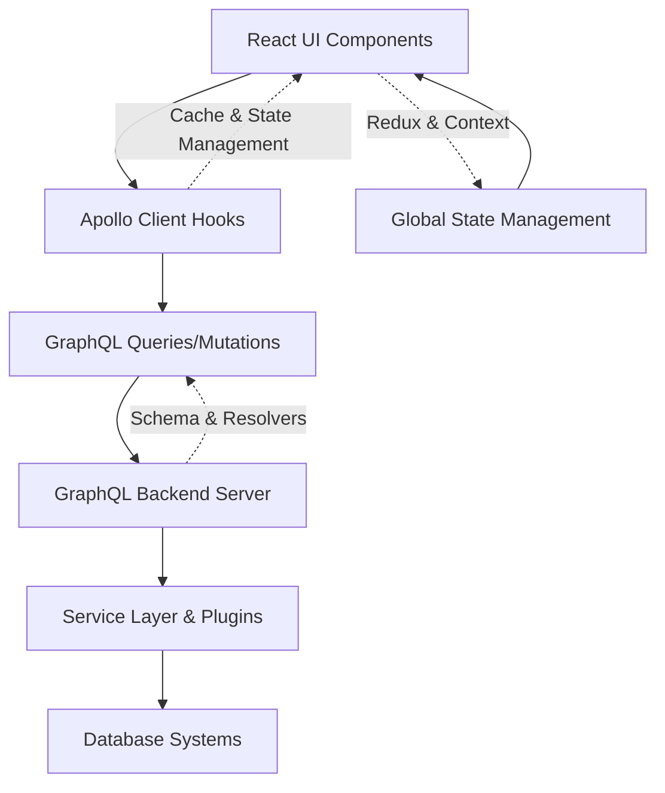

# Frontend Apollo Client Hooks

This document covers the Apollo Client hooks generated and used in the frontend application to interact with the backend GraphQL API. These hooks provide strongly typed React Query and Mutation interfaces, enabling seamless and type-safe communication with the GraphQL server.

---

## Table of Contents

- [Overview](#overview)
- [Setup and Usage](#setup-and-usage)
- [Commonly Used Hooks](#commonly-used-hooks)
- [Code Example](#code-example)
- [Integration Details](#integration-details)
- [Architecture Flow](#architecture-flow)
- [Relevant Files](#relevant-files)

---

## Overview

The frontend leverages Apollo Client to manage GraphQL requests and cache. Using GraphQL code generation, the project auto-generates React hooks corresponding to operations defined in the GraphQL schema. These hooks include:

- Query hooks (e.g., `useGetProfilesQuery`) for fetching data.
- Lazy query hooks (e.g., `useGetSchemaLazyQuery`) for on-demand fetching.
- Mutation hooks (e.g., `useLoginMutation`) for sending data-modifying requests.

Each hook provides TypeScript types for inputs and outputs, ensuring integration safety and editor support.

---

## Setup and Usage

Apollo Client is configured with:

- A **HTTP link** pointing to `/api/query` for query and mutation requests.
- **No-cache fetch policies** to always fetch fresh data, disabling cache reads.

The generated hooks are imported from the `frontend/src/generated/graphql.tsx` module, which is built from GraphQL schema and operation definitions.

Typical usage involves invoking a hook in a React component to send a request and access loading, error, and data states.

---

## Commonly Used Hooks

| Hook Name                         | Type      | Description                              |
|----------------------------------|-----------|------------------------------------------|
| `useGetProfilesQuery`             | Query     | Fetch all user login profiles             |
| `useGetSchemaQuery`               | Query     | Fetch list of database schemas            |
| `useGetDatabaseQuery`             | Query     | Fetch databases by database type          |
| `useGetStorageUnitsQuery`         | Query     | Fetch storage units in a schema            |
| `useGetStorageUnitRowsQuery`      | Query     | Fetch data rows from a storage unit       |
| `useLoginMutation`                | Mutation  | Perform user login                         |
| `useLoginWithProfileMutation`    | Mutation  | Login using saved profile                  |
| `useLogoutMutation`               | Mutation  | Logs out current user                      |
| `useAddRowMutation`               | Mutation  | Add a row of data in a storage unit        |
| `useUpdateStorageUnitMutation`   | Mutation  | Update storage unit properties             |
| `useDeleteRowMutation`            | Mutation  | Delete rows from a storage unit             |
| `useGetAiProvidersQuery`          | Query     | Fetch configured AI chat providers          |
| `useGetAiModelsQuery`             | Query     | Fetch AI models available for a provider    |
| `useGetAiChatQuery`               | Query     | Perform AI chat completion via LLM          |

Additional lazy and suspense variants of these hooks are available for optimized loading strategies.

---

## Code Example

```ts
import React from 'react';
import { useGetProfilesQuery, useLoginMutation } from '../generated/graphql';

function LoginStatusComponent() {
  // Fetch profiles using auto-generated hook
  const { data, loading, error } = useGetProfilesQuery();

  // Prepare mutation hook
  const [login, { loading: loginLoading, error: loginError }] = useLoginMutation();

  const handleLogin = async () => {
    try {
      const response = await login({
        variables: {
          credentials: {
            hostname: 'localhost',
            username: 'admin',
            password: 'password123',
            database: 'mydb',
            type: 'Postgres',
          },
        },
      });
      console.log('Login successful', response.data);
    } catch (e) {
      console.error('Login failed', e);
    }
  };

  if (loading) return <p>Loading profiles...</p>;
  if (error) return <p>Error loading profiles: {error.message}</p>;

  return (
    <div>
      <h2>Available Profiles</h2>
      <ul>
        {data?.Profiles.map(profile => (
          <li key={profile?.id || profile?.Id}>{profile?.alias || 'No Alias'}</li>
        ))}
      </ul>

      <button onClick={handleLogin} disabled={loginLoading}>
        {loginLoading ? 'Logging in...' : 'Login'}
      </button>
      {loginError && <p>Error: {loginError.message}</p>}
    </div>
  );
}

export default LoginStatusComponent;
```

---

## Integration Details

- **Location:** The client code uses these hooks mainly in pages and components to replace direct Apollo client invocations.
- **Type Safety:** The hooks ensure strict typing from GraphQL schema, minimizing runtime errors.
- **Backend APIs:** These hooks correspond directly to API operations implemented in the backend core's GraphQL schema and resolvers.
- **State Management:** Often combined with Redux and React context for managing global app state, e.g., auth state or UI indicators.
- **Real-time Data:** Support for query polling and suspense queries enable responsive and up-to-date UIs.

They serve as the primary binding between frontend UI components and backend GraphQL data layer.

---

## Architecture Flow



---

## Relevant Files

- [generated GraphQL hooks](frontend/src/generated/graphql.tsx) — Auto-generated Apollo React hooks.
- [GraphQL schema definitions](core/graph/schema.graphqls) — Defines operations that generate these hooks.
- [Apollo client setup](frontend/src/config/graphql-client.ts) — Configures Apollo instance used by hooks.
- [Main App](frontend/src/app.tsx) — Example usage of these hooks in components.

---

Using these hooks greatly simplifies data fetching, mutation, and synchronization tasks in the frontend, enhancing developer experience and frontend consistency when working with the WhoDB GraphQL API.