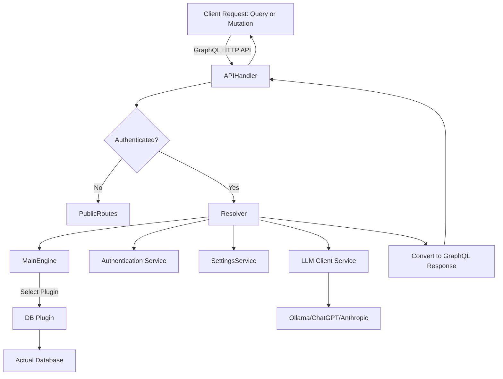

# GraphQL Resolvers

## Table of Contents

- [Introduction](#introduction)
- [Overview of GraphQL Resolvers](#overview-of-graphql-resolvers)
- [Structure of Resolvers in WhoDB](#structure-of-resolvers-in-whodb)
- [Key Mutation Resolvers](#key-mutation-resolvers)
- [Key Query Resolvers](#key-query-resolvers)
- [Resolver Workflow and Integration](#resolver-workflow-and-integration)
- [Sample Code Example](#sample-code-example)
- [Component Integration and Dependencies](#component-integration-and-dependencies)
- [Mermaid Diagram: Resolver Interaction Flow](#mermaid-diagram-resolver-interaction-flow)

---

## Introduction

GraphQL Resolvers in WhoDB serve as the bridge between incoming GraphQL client requests and the underlying business logic, data retrieval, and manipulation layers of the backend. They define how each query or mutation in the GraphQL schema gets resolved by invoking appropriate services, plugins, and authentication checks.

This document explains the design, structure, and functionality of the GraphQL resolvers in WhoDB, illuminating their roles and how they integrate within the overall system.

## Overview of GraphQL Resolvers

Resolvers are functions mapped to GraphQL queries and mutations according to the schema definition. They receive query params and context, perform needed operations such as querying databases or modifying data, and return results or errors.

In WhoDB, the resolvers facilitate:

- User authentication (login, logout)
- Configuration updates (e.g., settings)
- Database schema explorations (schemas, tables/storage units)
- Data querying and management (rows, raw SQL execution)
- Graph construction (schema graph visualization)
- AI model and chat interactions via integrated LLM clients

They act as the API endpoint logic connecting the frontend UI and the backend engine.

## Structure of Resolvers in WhoDB

The resolvers are implemented across two main resolver types:

- **Mutation resolvers**: Handle operations that modify state like logging in, logging out, updating settings, and adding/updating/deleting storage units and rows.
- **Query resolvers**: Handle read-only data fetching such as fetching version info, login profiles, databases, schema details, rows data, graph units, and AI-related capabilities.

A common `Resolver` struct is used for dependency injection into all resolver functions.

## Key Mutation Resolvers

| Mutation              | Purpose                                                            |
|-----------------------|--------------------------------------------------------------------|
| `Login`               | Authenticates a user based on supplied login credentials.          |
| `LoginWithProfile`    | Logs in using a saved profile for faster authentication.           |
| `Logout`              | Clears current user session, effectively logging out the user.     |
| `UpdateSettings`      | Updates application-wide settings such as telemetry preferences.   |
| `AddStorageUnit`      | Creates a new storage unit (e.g. table or collection) in a schema. |
| `UpdateStorageUnit`   | Updates metadata details of a storage unit.                        |
| `AddRow`              | Adds a new row of data in the given storage unit.                   |
| `DeleteRow`           | Removes rows with specified criteria from a storage unit.          |

These mutations primarily interact with the `MainEngine` and `auth` subsystems to perform the relevant updates.

## Key Query Resolvers

| Query              | Purpose                                                             |
|--------------------|---------------------------------------------------------------------|
| `Version`          | Returns the current backend/application version string.            |
| `Profiles`         | Fetches all saved login profiles available in the system.           |
| `Database`         | Lists available databases filtered by type.                         |
| `Schema`           | Fetches available schemas for the authenticated user.               |
| `StorageUnit`      | Lists storage units (tables/collections) within a schema.           |
| `Row`              | Retrieves data rows with support for filters and pagination.        |
| `RawExecute`       | Executes raw SQL or query string and returns raw result sets.       |
| `Graph`            | Provides the graph representation of the database schema.           |
| `AIProviders`      | Lists configured AI chat providers available for use.               |
| `AIModel`          | Lists supported models for a given AI provider and model type.      |
| `AIChat`           | Sends a prompt to an AI chat model and gets a conversational reply. |
| `SettingsConfig`   | Exposes current application settings such as metrics config.       |

These queries map to core data retrieval functions and plugin interfaces.

## Resolver Workflow and Integration

1. **Authentication Layer:** Certain resolvers require an authenticated user. The authentication middleware integrates with the resolver context to enforce access controls.

2. **Engine Plugin Usage:** Resolvers use the `MainEngine` to select appropriate database plugins based on the requested database type, gaining access to plugin-specific query and mutation methods.

3. **Credential Handling:** Credentials are fetched from the context (through auth middleware) and used to configure the plugin connection.

4. **Business Logic Invocation:** Depending on the query or mutation, resolvers invoke engine or plugin methods to get or modify data.

5. **Data Translation:** StorageUnits, Rows, and other internal engine types are converted into GraphQL model types before returning responses.

6. **AI LLM Integration:** Queries and mutations related to AI models or chat use the LLM client abstractions to get completions or chat responses.


## Sample Code Example

Here is a simplified example illustrating a query resolver for fetching database names by type:

```go
func (r *queryResolver) Database(ctx context.Context, typeArg string) ([]string, error) {
  // Choose appropriate plugin for the database type
  plugin := src.MainEngine.Choose(engine.DatabaseType(typeArg))
  if plugin == nil {
    return nil, fmt.Errorf("unsupported database type: %s", typeArg)
  }

  // Get user credentials from context
  credentials := auth.GetCredentials(ctx)
  config := engine.NewPluginConfig(credentials)

  // Check plugin availability
  if !plugin.IsAvailable(config) {
    return nil, fmt.Errorf("plugin for %s not available", typeArg)
  }

  // Query databases using the plugin
  return plugin.GetDatabases(config)
}
```

## Component Integration and Dependencies

- **GraphQL Schema & gqlgen:** Resolvers are tied closely to the GraphQL schema defined in `/core/graph/schema.graphqls` and generated code from `gqlgen` (configured via `core/gqlgen.yml`).

- **Main Engine & Plugins:** Resolvers invoke `MainEngine` to choose the correct plugin (e.g., Postgres, MySQL, MongoDB, Redis) for executing database operations.

- **Authentication:** Resolvers depend on `auth` middleware and helper functions to verify and obtain user credentials for each request.

- **Model Translation:** Internal engine types are converted to graphql models defined in `/core/graph/model` before sending to clients.

- **LLM Integration:** AI chat and model queries interact with the `llm` package to send prompts and receive completions.

- **HTTP REST API:** Besides serving GraphQL, some resolvers' functionality is exposed via RESTful HTTP handlers in `/core/graph/http.resolvers.go`.

- **Logging & Settings:** Resolvers can interact with centralized logging and settings modules to provide comprehensive application support.

## Mermaid Diagram: Resolver Interaction Flow

