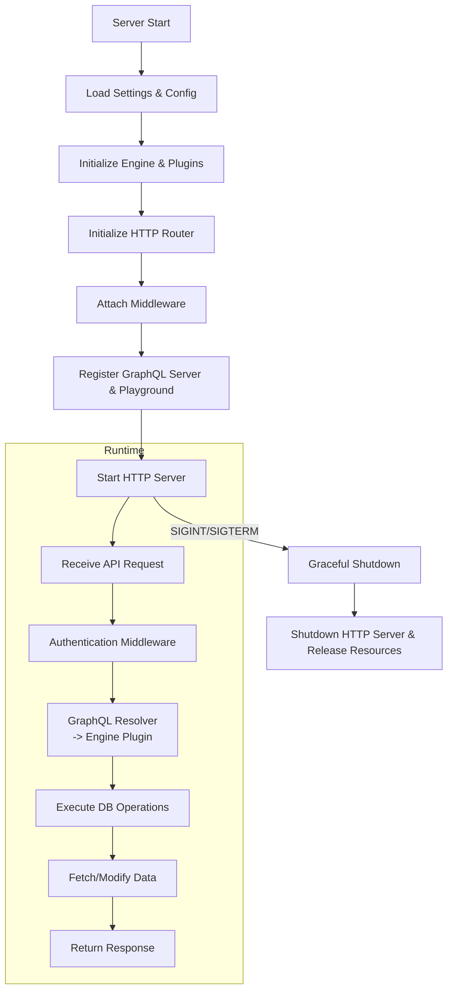
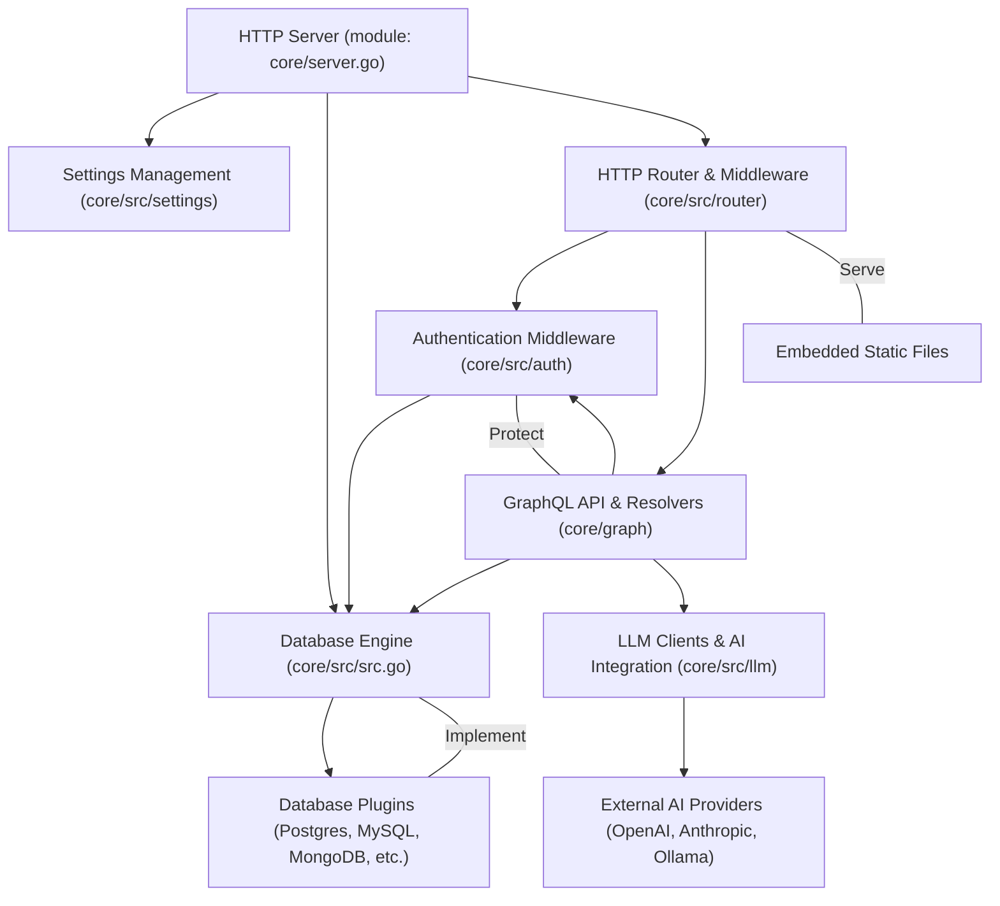

# Backend Architecture

The backend architecture of WhoDB is designed to provide a modular, extensible, and robust environment for managing database connections, executing queries, serving APIs, and integrating AI-powered features. It leverages Go for its core server, database plugins to support multiple backend databases, GraphQL for API interactions, and integrates authentication and settings management to regulate access and behavior.

---

## Table of Contents

- [Overview](#overview)
- [Core Components](#core-components)
  - [Server Initialization](#server-initialization)
  - [Engine and Plugins](#engine-and-plugins)
  - [Routing and API](#routing-and-api)
  - [Authentication](#authentication)
  - [Settings Management](#settings-management)
  - [AI Integration](#ai-integration)
- [Data Flow](#data-flow)
- [Integration Details](#integration-details)
- [Example: Server Entry Point](#example-server-entry-point)
- [Architecture Diagram](#architecture-diagram)

---

## Overview

WhoDB’s backend serves as the backbone to manage and expose database-related functionalities to frontend clients via GraphQL and REST interfaces. It is designed as an extensible platform with support for multiple database types, AI-enhanced querying, and dynamic schema operations, all accessed through a unified API.

The system is implemented in Go and orchestrates:

- Configuration loading and settings management.
- Initialization of the database plugin engine.
- HTTP API routing with authentication and request middleware.
- GraphQL schema handling and resolver implementations.
- Lifecycle management including graceful startup and shutdown.

## Core Components

### Server Initialization

The entry point (`core/server.go`) sets up the HTTP server by gathering configuration, loading settings, initializing the main database engine with plugins, and wiring up routing with embedded static files. It listens on a defined port and supports graceful shutdown on OS signals.

Key responsibilities:

- Load configuration from environment variables or config files.
- Initialize engine with database-specific plugins.
- Setup HTTP router with middleware and GraphQL endpoints.
- Start the HTTP server and manage graceful termination.

### Engine and Plugins

WhoDB uses a modular **Engine** (`core/src/src.go`) that holds multiple database plugins. Each plugin corresponds to a different database type (e.g., Postgres, MySQL, MongoDB, Redis, SQLite3, ElasticSearch, ClickHouse). The engine is responsible for:

- Registering plugins.
- Selecting the appropriate plugin based on database type.
- Executing queries and managing database schemas through plugin interfaces.

Each plugin implements the `PluginFunctions` interface (`core/src/engine/plugin.go`) which defines methods for database operations such as:

- Schema and storage unit retrieval
- Row-level data operations (add, update, delete)
- Graph structures of database tables
- Raw SQL execution
- Chat/AI interactions

### Routing and API

The HTTP server uses a router (`core/src/router/router.go`) based on the Chi framework that:

- Sets up middlewares: logging, recovery, CORS, timeout, throttling, and request identification.
- Registers the GraphQL server endpoint (`/graphql`) using gqlgen.
- Serves static files and SPA fallback through embedded file systems (`core/src/router/file_server.go`).
- Provides a playground GUI for development environments for live GraphQL query testing (`core/src/router/playground.go`).

The GraphQL resolvers (`core/graph/schema.resolvers.go`) implement backend logic to:

- Handle authentication-based mutations and queries.
- Delegate database operations to the engine and appropriate plugins.
- Manage user settings, profiles, and AI-related queries.

### Authentication

Authentication middleware (`core/src/auth/auth.go`) protects API operations by:

- Validating authorization tokens or credentials in incoming requests.
- Allowing public routes and introspection operations without authentication.
- Injecting credential information into request context for downstream access.

Login (`core/src/auth/login.go`) and logout (`core/src/auth/logout.go`) manage user session state via cookies and produce status responses.

### Settings Management

Settings are managed via `core/src/settings/settings.go`, which currently prominently handles metrics enablement configuration. The settings system:

- Provides interfaces to get and update configuration fields.
- Offers extendability for future settings management.

---

### AI Integration

The backend integrates with various large language model (LLM) providers via `core/src/llm`. The LLM clients unify communication with services such as Ollama, ChatGPT (OpenAI), and Anthropic. LLM clients:

- Prepare appropriate request payloads and headers.
- Send HTTP requests and handle streaming or non-streaming responses.
- Obtain the list of supported models.
- Serve as a backend for AI-powered chat features exposed in the GraphQL API.

### Data Flow



## Integration Details

- **Server Initialization** relies on `settings`, `src` (engine), `router`, and `log` packages.
- **Engine (`src`)** imports and registers various database plugins such as Postgres, MySQL, MongoDB, Redis, etc.
- **Router** integrates Chi for HTTP server routing, gqlgen for GraphQL API, and middleware for security and operational resilience.
- **Authentication** integrates with HTTP handlers to protect GraphQL endpoints.
- **GraphQL Resolvers** bridge between the API surface and core engine functionality.
- **AI LLM Clients** abstract interaction with external AI services to enable chat and completion features.

Dependencies:

| Component       | Description                                       | Dependency                             |
|-----------------|-------------------------------------------------|--------------------------------------|
| Server          | Main app lifecycle and HTTP server               | settings, src, router, log, env       |
| Engine          | Database plugin engine                            | plugins (Postgres, MySQL, etc.)       |
| Router          | HTTP routing, API handling                        | Chi, gqlgen, middleware, auth         |
| Authentication  | User credential management                        | auth package, cookies, token          |
| Settings        | Configuration state management                    | settings package                      |
| AI Chat         | LLM client integrations                           | llm package, external APIs (OpenAI)  |

---

## Example: Server Entry Point

```go
package main

import (
  "embed"
  "fmt"
  "log"
  "net/http"
  "os"
  "os/signal"
  "context"
  "time"

  "github.com/clidey/whodb/core/src/log"
  "github.com/clidey/whodb/core/src/settings"
  "github.com/clidey/whodb/core/src/src"
  "github.com/clidey/whodb/core/src/router"
)

//go:embed build
var staticFiles embed.FS

func main() {
  log.Logger.Info("Starting WhoDB server...")

  // Load application settings
  settingsCfg := settings.Get()

  // Initialize the core engine with all plugins
  engine := src.InitializeEngine()

  // Initialize the HTTP router with embedded static files
  httpHandler := router.InitializeRouter(staticFiles)

  // Select port from environment or default
  port := os.Getenv("PORT")
  if port == "" {
    port = "8080"
  }

  srv := &http.Server{
    Addr:    fmt.Sprintf(":" + port),
    Handler: httpHandler,
  }

  // Start server
  go func() {
    if err := srv.ListenAndServe(); err != nil && err != http.ErrServerClosed {
      log.Fatalf("ListenAndServe error: %v", err)
    }
  }()

  log.Logger.Infof("Server running on port %s", port)

  // Graceful shutdown on SIGINT/SIGTERM
  stop := make(chan os.Signal, 1)
  signal.Notify(stop, os.Interrupt)

  <-stop
  log.Logger.Info("Shutting down server...")

  ctx, cancel := context.WithTimeout(context.Background(), 5*time.Second)
  defer cancel()
  if err := srv.Shutdown(ctx); err != nil {
    log.Logger.Fatalf("Server shutdown failed: %v", err)
  }

  log.Logger.Info("Server stopped gracefully")
}
```

Source file: [core/server.go](/core/server.go)

---

## Architecture Diagram



---

This architecture balances extensibility, backend service robustness, and user-centric features like AI-powered querying and rich API interactions.

Each component is designed to operate independently yet coherently as a single system via well-defined interfaces and plugin abstractions.
