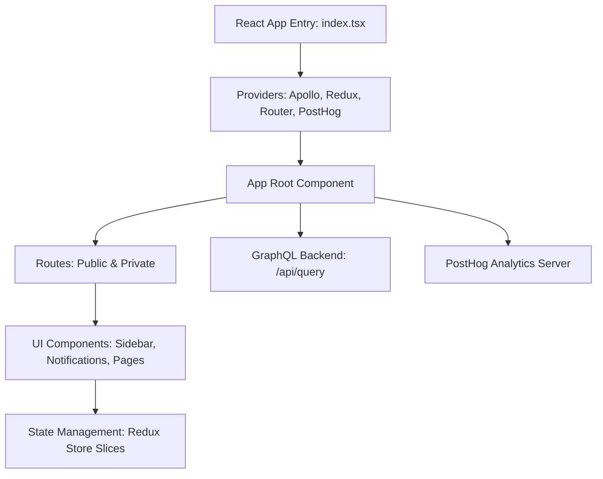

# Frontend Architecture

The frontend architecture of WhoDB is designed as a modern React application, leveraging state management, GraphQL data fetching, modular components, and integration with analytics and routing frameworks. It offers a seamless and scalable UI for managing databases, exploring schemas, executing raw SQL, and engaging with AI-powered chat functionality.

---

## Table of Contents

- [Key Concepts](#key-concepts)
- [Core Technologies](#core-technologies)
- [Application Structure](#application-structure)
- [State Management](#state-management)
- [GraphQL Integration](#graphql-integration)
- [Routing and Navigation](#routing-and-navigation)
- [UI Components](#ui-components)
- [Analytics Integration](#analytics-integration)
- [Example: Apollo Client Setup](#example-apollo-client-setup)
- [Integration Diagram](#integration-diagram)

---

## Key Concepts

- **React Single Page Application (SPA):** The app uses React for building interactive UI components and managing user interfaces dynamically.
- **GraphQL:** Utilizes Apollo Client to communicate with a GraphQL backend, enabling declarative data fetching.
- **Redux Toolkit with Persistence:** State is managed globally using Redux Toolkit slices, with persistent storage for authentication, settings, and chat state.
- **Routing:** React Router manages navigation between public and private views with role-based protection.
- **Analytics:** PostHog integration enables telemetry with opt-in/out control.

## Core Technologies

- **React**: Component-based library for UI.
- **Apollo Client**: Handles GraphQL queries, mutations, and caching.
- **Redux Toolkit**: Simplifies Redux state management.
- **React Router Dom**: Client-side routing.
- **Tailwind CSS**: Utility-first CSS framework for styling.
- **Framer Motion**: Animation framework for UI transitions.
- **React Flow**: Graph visualization library for displaying schema graphs.

## Application Structure

The application initializes in [`frontend/src/index.tsx`](/frontend/src/index.tsx) where React’s root is created and the main `App` component is rendered inside context providers:

- **ApolloProvider**: Provides GraphQL client.
- **Redux Provider + PersistGate**: Manages and persists global app state.
- **Router**: Routes the app.
- **PostHog**: Analytics tracking client.

The top-level component is `App` in [`frontend/src/app.tsx`](/frontend/src/app.tsx), orchestrating:

- Route setup (public vs private routes).
- Global theme selection (dark mode).
- Synchronizes metric settings with backend and analytics opt-in/opt-out state.
- Displays notifications, sidebar, and page content.

### Directory Highlights

- **`components/`**: Reusable UI elements like buttons, cards, inputs, dropdowns, notifications, loading spinners, and the graph visualization components.
- **`pages/`**: Main views like Login, Logout, Chat, Storage Unit Exploration and Management, Settings, Contact Us, Raw SQL Execution, and Graph Visualization.
- **`store/`**: Redux slices and hooks for state management.
- **`config/`**: Setup files including GraphQL client and PostHog initialization.

## State Management

State is managed using Redux Toolkit slices:

- **Auth slice**: Manages user login profiles, login status, and current profile.
- **Settings slice**: Manages user preferences like metrics enablement.
- **Database slice**: Holds current database schema, AI model types, and selected AI model.
- **Chat slice**: Caches chat messages in chat interface.

The store is configured with persistence using `redux-persist` to ensure state is retained across browser reloads.

### Example: Combining Reducers

```ts
import { combineReducers, configureStore } from '@reduxjs/toolkit';
import { persistReducer, persistStore } from 'redux-persist';
import storage from 'redux-persist/lib/storage';

import authReducer from './auth';
import settingsReducer from './settings';

const rootReducer = combineReducers({
  auth: authReducer,
  settings: settingsReducer,
  // other slices...
});

const persistConfig = { key: 'root', storage, whitelist: ['auth', 'settings'] };

const persistedReducer = persistReducer(persistConfig, rootReducer);

export const store = configureStore({
  reducer: persistedReducer,
});

export const persistor = persistStore(store);
```

## GraphQL Integration

The frontend uses Apollo Client configured in [`frontend/src/config/graphql-client.ts`](/frontend/src/config/graphql-client.ts) to connect to the backend GraphQL API at `/api/query`. Queries and mutations are generated from the GraphQL schema and used throughout components for data operations.

Apollo’s in-memory cache is configured with `fetchPolicy: 'no-cache'` to ensure fresh data.

## Routing and Navigation

Routes are defined in [`frontend/src/config/routes.tsx`](/frontend/src/config/routes.tsx) as categorized public and internal routes:

- **Public Routes:** e.g., Login page.
- **Internal Routes:** e.g., Dashboard, Storage Unit pages, Graph Visualization, Chat, Logout, Settings.

A `PrivateRoute` component enforces authentication, redirecting unauthenticated users to the login page. Nested route configurations enable composable navigation and UI organization.

The **Sidebar** component at [`frontend/src/components/sidebar/sidebar.tsx`](/frontend/src/components/sidebar/sidebar.tsx) provides navigational elements, database/schema selectors, and profile management.

## UI Components

The UI layers consist of reusable React components:

- **Buttons and Inputs:** e.g., [`frontend/src/components/button.tsx`](/frontend/src/components/button.tsx), [`frontend/src/components/input.tsx`](/frontend/src/components/input.tsx)
- **Dropdowns:** Typed dropdown component with support for icons.
- **Tables:** Highly interactive tables in [`frontend/src/components/table.tsx`](/frontend/src/components/table.tsx) with support for sorting, pagination, inline editing, selections, and CSV export.
- **Graph Components:** React Flow based Graph and Edge components render schema graphs.
- **Notifications:** Animated notification system for user feedback.
- **Code Editor:** Advanced syntax-highlighted code editor supporting SQL, Markdown, and JSON using CodeMirror 6.

## Analytics Integration

PostHog is initialized in [`frontend/src/config/posthog.tsx`](/frontend/src/config/posthog.tsx) with capabilities to opt users in or out of telemetry tracking. The `App` component listens for changes in metrics preferences and triggers backend updates accordingly.

## Example: Apollo Client Setup

```ts
import { ApolloClient, HttpLink, InMemoryCache } from '@apollo/client';

const httpLink = new HttpLink({
  uri: '/api/query',
  credentials: 'same-origin', // send cookies if needed
});

const graphqlClient = new ApolloClient({
  link: httpLink,
  cache: new InMemoryCache(),
  defaultOptions: {
    watchQuery: { fetchPolicy: 'no-cache' },
    query: { fetchPolicy: 'no-cache' },
    mutate: { fetchPolicy: 'no-cache' },
  },
});

export default graphqlClient;
```

## Integration Diagram



## Integration Details

- **App Lifecycle:** The React app bootstraps by rendering `App` inside multiple providers.
- **Routing:** React Router handles navigation between pages according to authentication state.
- **Data Fetching:** Apollo Client sends GraphQL requests to the backend (`/api/query`) for querying schemas, storage units, rows, AI models, and settings.
- **State Management:** Redux slices maintain UI state and user preferences centrally, with persistence.
- **Sidebar:** Provides dynamic context-aware navigation based on current user profile and selected database/schema.
- **Analytics:** PostHog runs in the background tracking usage, respecting user opt-in/out.

## Source Files

- Apollo Client setup: [`frontend/src/config/graphql-client.ts`](/frontend/src/config/graphql-client.ts)
- Main React entry: [`frontend/src/index.tsx`](/frontend/src/index.tsx)
- Root application component: [`frontend/src/app.tsx`](/frontend/src/app.tsx)
- Routing definitions: [`frontend/src/config/routes.tsx`](/frontend/src/config/routes.tsx)
- Sidebar navigation: [`frontend/src/components/sidebar/sidebar.tsx`](/frontend/src/components/sidebar/sidebar.tsx)
- State store configuration: [`frontend/src/store/index.ts`](/frontend/src/store/index.ts)

---

This architecture provides a scalable and maintainable frontend environment enabling WhoDB to deliver rich database exploration, AI integrations, and flexible user experience.