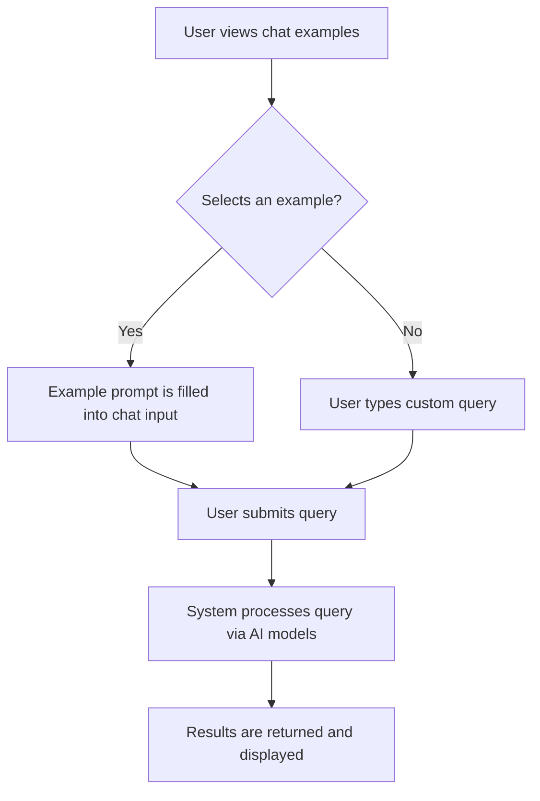

# Demo and Examples

## Table of Contents

- [Overview](#overview)
- [Chat Examples Array](#chat-examples-array)
- [Usage in Chat Interface](#usage-in-chat-interface)
- [Example Code Snippet](#example-code-snippet)
- [Mermaid Diagram: Chat Example Flow](#mermaid-diagram-chat-example-flow)
- [Integration Details](#integration-details)

---

## Overview

The **Demo and Examples** section provides predefined example prompts and interactions designed to assist users in experimenting with the chat feature integrated into the application. These examples serve as starting points or inspiration for users to understand the capabilities of the AI-powered chat interface.

Offering a catalog of common or illustrative chat queries, these examples help showcase how to interact with the system effectively, encouraging exploration and ease of use.


## Chat Examples Array

The chat examples are defined as an array of objects where each object has:

- `icon`: A visual SVG icon representing the nature of the example.
- `description`: Textual explanation or sample prompt to guide the user.

These examples are imported from the centralized `Icons` component to maintain consistent UI presentation.


## Usage in Chat Interface

Within the chat page component, these examples may be displayed as clickable suggestions or prompt starters. Clicking on an example populates the user input and triggers the chat query flow, allowing users to see immediate responses based on well-formed prompts.

This improves discoverability of the chat feature and provides quick insights into meaningful queries across different database or AI model contexts.


## Example Code Snippet

```ts
// Import the common icon components
import { Icons } from "../components/icons";

/**
 * Predefined chat examples to guide user queries
 */
export const chatExamples = [
  {
    icon: <Icons.Database />,  // Example icon for database-related query
    description: "Show me all customers who placed orders last month."
  },
  {
    icon: <Icons.ChatBubble />, // Icon representing chat or message
    description: "What are the top selling products this year?"
  },
  {
    icon: <Icons.Chart />, // Icon indicating visualization or data analysis
    description: "Display a sales trend graph for the past 6 months."
  }
];
```


## Mermaid Diagram: Chat Example Flow




## Integration Details

The chat examples feature is integrated within the **Chat Page** of the frontend React application:

- **Dependencies:**
  - `Icons` component for SVG icons.
  - Redux and Apollo Client to manage state and interact with backend GraphQL APIs.

- **Touchpoints:**
  - Displayed in the chat user interface as selectable example prompts.
  - On selection, it updates the chat input state and triggers the AI chat query.

- **Purpose:**
  - Improve usability by providing meaningful ready-made prompts.
  - Demonstrate the capability of the AI-powered query system.
  - Encourage users to explore capabilities without needing to formulate queries from scratch.

- **Related Files:**
  - Chat page implementation: `/frontend/src/pages/chat/chat.tsx`
  - Icons: `/frontend/src/components/icons.tsx`
  - Chat examples: `/frontend/src/pages/chat/examples.ts`


For full source details, see the chat examples file [here](frontend/src/pages/chat/examples.ts).
