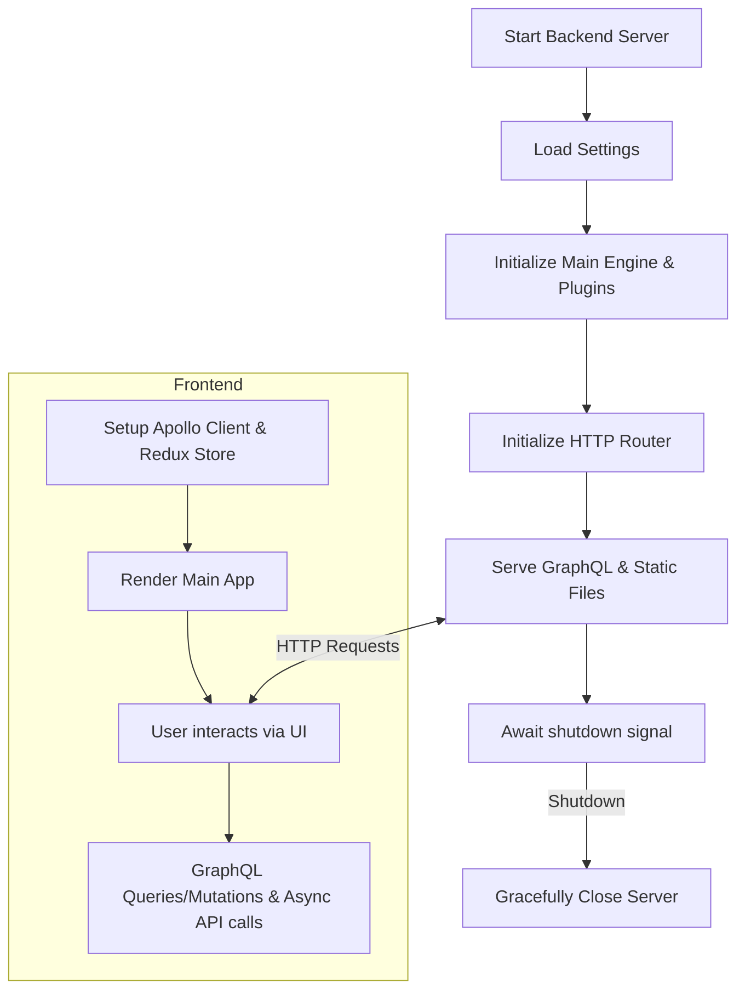

# Quick Start Guide

This guide will help you get started quickly with WhoDB, covering the essential steps to set up, launch, and interact with the application. Whether you're aiming to run the backend server, start the frontend UI, or deploy via Docker, this guide will give you a streamlined workflow.

---

## Table of Contents
- [Prerequisites](#prerequisites)
- [Backend Setup](#backend-setup)
  - [Initialize Engine](#initialize-engine)
  - [Start Server](#start-server)
- [Frontend Setup](#frontend-setup)
  - [Configure Apollo Client](#configure-apollo-client)
  - [Run Frontend](#run-frontend)
- [Docker Deployment](#docker-deployment)
- [Integration Overview](#integration-overview)
- [Example: Querying Database Via GraphQL](#example-querying-database-via-graphql)

---

## Prerequisites
- Go 1.19+ installed
- Node.js 16+ and npm/yarn
- Docker (optional, for containerized deployment)

---

## Backend Setup

The backend server is a Go application that initializes the WhoDB core engine, sets up the HTTP router including GraphQL APIs, and serves static frontend assets.

### Initialize Engine
The application loads supported database plugins and configured login profiles on startup.

```go
import (
  "github.com/clidey/whodb/core/src"  // Core engine and plugins
)

engine := src.InitializeEngine()
// engine includes all DB plugins like Postgres, MySQL, SQLite3, MongoDB, Redis, Elasticsearch, ClickHouse
```

### Start Server
The server listens on a configured port and initializes middleware and endpoints.

```go
import (
  "net/http"
  "os"
  "github.com/clidey/whodb/core/src/router"
  "github.com/clidey/whodb/core/src/settings"
  "github.com/clidey/whodb/core/src/log"
  "embed"
)

var staticFiles embed.FS  // Embedded frontend assets

func main() {
  settingsCfg := settings.Get()  // Load global settings

  // Initialize HTTP router with embedded static files
  routerHandler := router.InitializeRouter(staticFiles)

  port := os.Getenv("PORT")
  if port == "" {
    port = "8080"  // default port
  }

  srv := &http.Server{
    Addr:    ":" + port,
    Handler: routerHandler,
  }

  log.Logger.Infof("Starting WhoDB server on port %s", port)

  if err := srv.ListenAndServe(); err != nil && err != http.ErrServerClosed {
    log.Logger.Fatalf("Server failed: %v", err)
  }
}
```

More detailed lifecycle management handles graceful shutdown on OS signals to prevent data loss.

---

## Frontend Setup

The frontend is a React application configured with Apollo Client for GraphQL, Redux Toolkit for state management, and PostHog for user analytics.

### Configure Apollo Client

Apollo Client is configured to connect to the backend's `/api/query` GraphQL endpoint with no-cache policy.

```ts
import { ApolloClient, createHttpLink, InMemoryCache } from '@apollo/client'

const uri = '/api/query'
const httpLink = createHttpLink({ uri: uri, credentials: 'include' })

const graphqlClient = new ApolloClient({
  link: httpLink,
  cache: new InMemoryCache(),
  defaultOptions: {
    watchQuery: { fetchPolicy: 'no-cache' },
    query: { fetchPolicy: 'no-cache' },
    mutate: { fetchPolicy: 'no-cache' },
  },
})

export default graphqlClient
```

### Run Frontend

Use standard React scripts to run or build the frontend.

```bash
npm install
npm start
```

The app will start on `http://localhost:3000` (or configured port).

---

## Docker Deployment

WhoDB offers a Docker deployment option for quick setup.

- Use the official Clidey Quick container image.
- Environment variables configure connections, credentials, and settings.

```yaml
version: '3.9'
services:
  whodb:
    image: clidey/whodb:latest
    ports:
      - "8080:8080"
    environment:
      - PORT=8080
      - ... # Your DB credentials and tokens
    volumes:
      - ./data:/data
```

This isolated container runs server and serves static frontend.

---

## Integration Overview

- **Backend (`core/server.go`):** Orchestrates initialization of settings, engine plugins, and HTTP server with GraphQL and static file support.
- **Engine (`core/src/src.go`):** Centralizes plugin management (Postgres, MySQL, SQLite3, MongoDB, Redis, etc.) and provides database credentials and profile retrieval.
- **Router (`core/src/router/router.go`):** Configures HTTP routing, GraphQL server (`/graphql` endpoint), middlewares (auth, logging, CORS), and static assets.
- **Auth middleware (`core/src/auth/auth.go`):** Implements authentication and authorization for API requests.
- **Frontend (`frontend/src/index.tsx`):** Bootstrap React app, injects Apollo Client, Redux store, PostHog, and React Router context.



---

## Example: Querying Database Via GraphQL

Use GraphQL queries to fetch database info after login:

```graphql
query GetDatabases($type: String!) {
  Database(type: $type)
}
```

Using Apollo Client in React:

```tsx
import { useQuery } from '@apollo/client'
import { gql } from '@apollo/client'

const GET_DATABASES = gql`
  query GetDatabases($type: String!) {
    Database(type: $type)
  }
`

function DatabasesList({ dbType }: { dbType: string }) {
  const { data, loading, error } = useQuery(GET_DATABASES, { variables: { type: dbType } })

  if (loading) return <p>Loading...</p>
  if (error) return <p>Error: {error.message}</p>

  return (
    <ul>
      {data.Database.map((dbName: string) => (
        <li key={dbName}>{dbName}</li>
      ))}
    </ul>
  )
}
```

---

For more backend implementation details, see [core/server.go](/core/server.go) and [core/src/src.go](/core/src/src.go).

For frontend architecture and setup, see [frontend/src/index.tsx](/frontend/src/index.tsx) and [frontend/src/config/graphql-client.ts](/frontend/src/config/graphql-client.ts).
