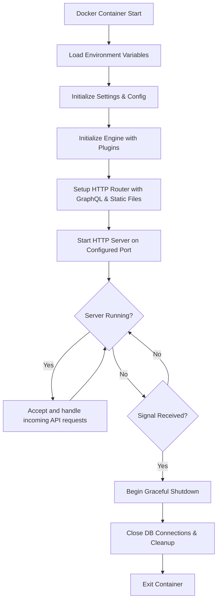

# Docker Deployment

## Table of Contents
- [Introduction](#introduction)
- [Prerequisites](#prerequisites)
- [Setting Up Docker](#setting-up-docker)
- [Building the Docker Image](#building-the-docker-image)
- [Running the Container](#running-the-container)
- [Configuration via Environment Variables](#configuration-via-environment-variables)
- [Graceful Shutdown in Docker](#graceful-shutdown-in-docker)
- [Integration Details](#integration-details)

---

## Introduction

This section guides you through deploying WhoDB using Docker, enabling you to encapsulate the entire backend application into a containerized environment. Docker simplifies deployment by bundling all dependencies and required services into a single image, promoting consistency across environments.

The Docker deployment includes the main server application, configured to initialize its settings, database plugins, and HTTP APIs within the container. It also supports signal handling for clean shutdowns, to safely free resources such as database connections.

## Prerequisites

- Docker installed on your system.
- Basic familiarity with Docker commands and concepts.
- A prepared environment with necessary configuration (environment variables or files).

## Setting Up Docker

To containerize the WhoDB server, you typically need a `Dockerfile` describing the build process. Although this file is not provided here directly, the following steps assume a typical Go application Docker setup.

## Building the Docker Image

Run the following command in the project root (where the `Dockerfile` is located):

```bash
# Build the Docker image tagged as whodb-server
docker build -t whodb-server .
```

This will compile the Go server, embed the necessary assets, and generate a Docker image containing all files needed to run the WhoDB backend.

## Running the Container

You can start the container with customizable parameters:

```bash
# Run the container exposing port 8080
# Include environment variables and volume mounts as needed

docker run -d --name whodb -p 8080:8080 \
  -e WHO_DB_ENV=production \
  -e WHO_DB_PORT=8080 \
  whodb-server
```

Replace `WHO_DB_ENV`, `WHO_DB_PORT`, and other environment variables to configure the runtime behavior.

## Configuration via Environment Variables

The WhoDB server reads various environment variables to control its behavior. These include:

- `WHO_DB_PORT`: Network port to listen on (default 8080)
- `WHO_DB_ENV`: Environment mode (e.g., development, production)
- Various database connection strings and credentials.

Within the container, these variables can be passed using the `-e` flag or through Docker Compose definitions.

## Graceful Shutdown in Docker

The server is designed to handle UNIX signals (`SIGINT`, `SIGTERM`) to gracefully shut down:

- It listens for termination signals.
- On reception, it starts a context with a timeout.
- Invokes `srv.Shutdown(ctx)` to stop accepting new requests and finish serving ongoing ones.
- Closes any other open resources.

This behavior prevents data loss or corruption in the database or during message processing.

## Integration Details

### How Docker Fits in the WhoDB Architecture

- All backend components and static frontend files are embedded into the Go binary.
- The Docker container runs the server by executing this binary.
- Configuration is passed through environment variables or mounted volumes.
- Networking is exposed via container ports bridged to the host.

### Dependencies

- **Go runtime**: The binary is compiled for a specific OS/architecture.
- **Embedded Static Assets**: Served via the `fileServer` in the HTTP router inside the binary.
- **Database Plugins**: Postgres, MySQL, MongoDB, etc., accessed over network by the running container.
- **Signal Handling & Context**: Managed inside the server to ensure proper lifecycle within container environments.

### Call Flow / Interaction



This diagram represents the lifecycle within the Docker container.

### Relevant Source Files

- Main server entry point and startup logic: [`core/server.go`](core/server.go)
- HTTP router and GraphQL setup: [`core/src/router/router.go`](core/src/router/router.go)
- Static file serving with SPA fallback: [`core/src/router/file_server.go`](core/src/router/file_server.go)
- Signal handling and graceful shutdown: in [`core/server.go`](core/server.go)
- Plugin initialization (database support): [`core/src/src.go`](core/src/src.go)

Continuing from these files, the backend orchestrates the server lifecycle, integrated within a Docker container.
