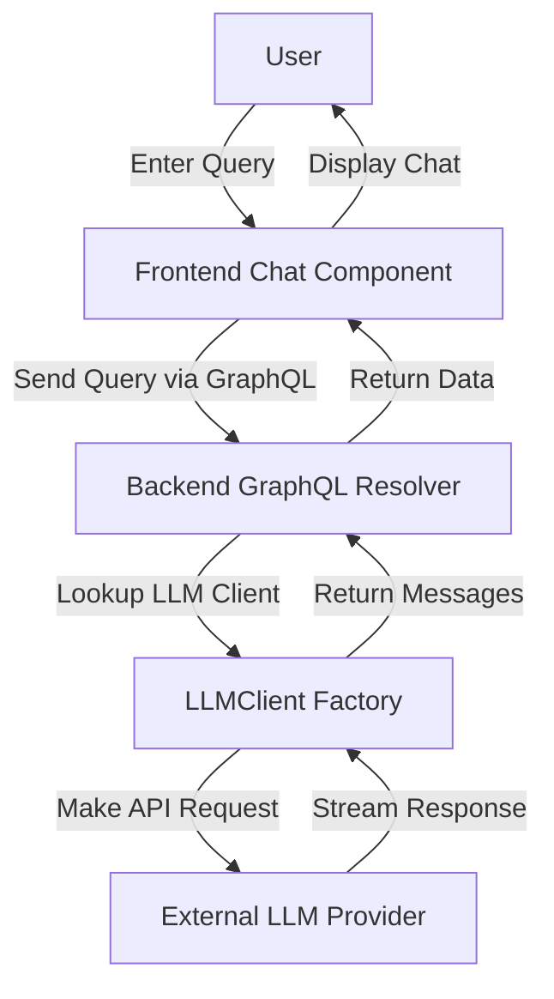

# AI Chat Interface

## Table of Contents

- [Overview](#overview)
- [Chat Flow](#chat-flow)
- [Client Integration](#client-integration)
- [Using the AI Chat Interface](#using-the-ai-chat-interface)
- [Code Example](#code-example)
- [Mermaid Diagram](#mermaid-diagram)
- [Architecture and Dependencies](#architecture-and-dependencies)

---

## Overview

The AI Chat Interface feature provides an interactive conversational environment where users can engage with various large language models (LLMs) integrated into the WhoDB system. This interface supports submitting natural language queries and receiving AI-generated responses, including contextual database insights and SQL query completions.

This feature bridges user input with backend LLM services (such as Ollama, ChatGPT, and Anthropic), allowing conversational interaction that can include query understanding, generation, and data retrieval, facilitating smarter and more intuitive database exploration.

## Chat Flow

1. **User Input:** Users enter text queries in the chat UI.
2. **Request Handling:** The frontend sends the chat input, along with metadata like selected AI provider, model, and token, to the backend API.
3. **LLM Invocation:** The backend selects the appropriate LLM client based on configuration and performs request preparation, HTTP calls, and streaming response parsing.
4. **Response Processing:** The raw AI response is parsed, transformed into structured `AIChatMessage` data, which can include generated text and related database query results.
5. **Display:** The frontend renders the messages, including optionally formatted SQL responses and conversational text.

## Client Integration

- **Backend LLM Clients:** The backend uses the `LLMClient` abstraction to call multiple providers. File references:
  - [LLM Client Implementation](https://github.com/clidey/whodb/blob/main/core/src/llm/llm_client.go)
  - [Ollama Client](https://github.com/clidey/whodb/blob/main/core/src/llm/ollama_client.go)
  - [ChatGPT Client](https://github.com/clidey/whodb/blob/main/core/src/llm/chatgpt_client.go)
  - [Anthropic Client](https://github.com/clidey/whodb/blob/main/core/src/llm/anthropic_client.go)

- **GraphQL API:** Chat interactions are exposed as GraphQL queries/mutations, enabling easy frontend integration:
  - See `AIChat` query resolver in [GraphQL Resolvers](https://github.com/clidey/whodb/blob/main/core/graph/schema.resolvers.go)

- **Frontend React Components:**
  - The chat UI supports selecting AI providers, models, entering queries, and displaying chat messages.
  - See the chat page implementation for full details.

- **State Management:** Redux slices manage AI providers, models, and chat messages enabling stateful and reactive UI.

## Using the AI Chat Interface

Users can:

- Select from configured AI providers.
- Choose active AI models.
- Enter natural language or SQL queries.
- Receive AI-generated responses optionally enhanced with database query results.
- Manage conversation context enabling multi-turn queries.

This interface helps database users leverage AI to generate insights, diagnose queries, or explore datasets more effectively.

## Code Example

Below is a simplified example of how the backend's LLM client is invoked for chat completions:

```go
import (
  "context"
  "github.com/clidey/whodb/core/src/llm"
  "github.com/clidey/whodb/core/src/engine"
)

func ProcessAIChat(
    ctx context.Context,
    pluginConfig *engine.PluginConfig,
    schema string,
    model string,
    previousConversation string,
    query string,
) ([]*llm.ChatMessage, error) {

  llmClient := llm.Instance(pluginConfig)
  if llmClient == nil {
    return nil, fmt.Errorf("failed to create LLM client")
  }

  // Call the chat completion method
  messages, err := llmClient.Complete(query, llm.LLMModel(model), nil)
  if err != nil {
    return nil, err
  }

  return messages, nil
}
```

This snippet retrieves an LLM client instance based on the plugin configuration and performs a completion operation, returning the generated messages.

## Mermaid Diagram



## Architecture and Dependencies

- **Backend:** 
  - The core LLM client logic is encapsulated in the [llm](https://github.com/clidey/whodb/tree/main/core/src/llm) package.
  - Multiple LLM providers are supported via separate client implementations.
  - The chat GraphQL API is exposed via the [core/graph schema and resolvers](https://github.com/clidey/whodb/tree/main/core/graph).
  - Authentication and plugin selection ensure calls are made with correct credentials.

- **Frontend:**
  - Chat UI components use Apollo Client to consume the GraphQL API.
  - State management with Redux tracks user selections and chat state.
  - Components and hooks are defined within the [frontend/src/pages/chat](https://github.com/clidey/whodb/tree/main/frontend/src/pages/chat) directory.

- **Integration:**
  - The chat interface leverages backend AI capabilities to enhance user query experience.
  - Backend interacts with database plugins to fetch related data where relevant.

For more implementation details, explore the LLM client and GraphQL resolver implementations:
- [LLM Client Source](https://github.com/clidey/whodb/blob/main/core/src/llm/llm_client.go)
- [GraphQL Resolvers](https://github.com/clidey/whodb/blob/main/core/graph/schema.resolvers.go)
- [Chat page React source](https://github.com/clidey/whodb/blob/main/frontend/src/pages/chat/chat.tsx)

---

This overview provides a foundation for understanding the AI Chat Interface's design, usage, and integrations across the WhoDB application.
