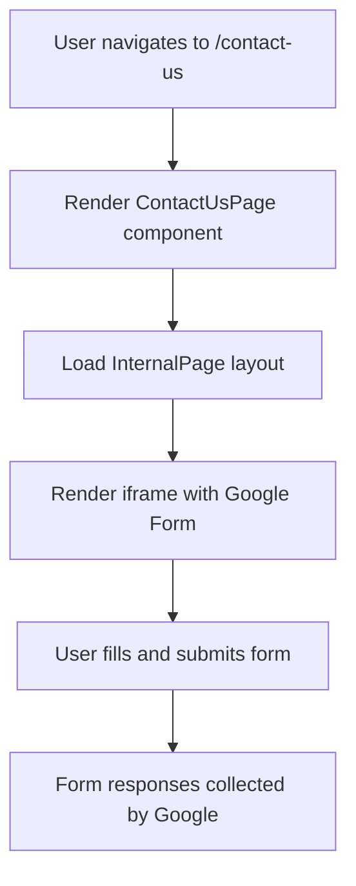

# Contact Us Page

The **Contact Us** page provides a simple interface within the WhoDB frontend application to allow users to submit feedback or get in touch with the development team via an embedded Google Form.

This page is integrated as an internal route in the application, maintaining the app's consistent layout and navigation experience.

---

## Table of Contents

- [Overview](#overview)
- [Component Structure](#component-structure)
- [Embed Integration](#embed-integration)
- [Navigation and Routing](#navigation-and-routing)
- [Customizations and Extensibility](#customizations-and-extensibility)
- [Mermaid Diagram: Page Flow](#mermaid-diagram-page-flow)
- [Source Reference](#source-reference)

---

## Overview

The Contact Us page serves as a feedback channel embedded directly into WhoDB's web interface. It leverages an iframe to display a Google Form, enabling users to send their comments or requests without leaving the application.

This approach ensures data collection is simple, secure, and integrated into the workflow of the app without requiring additional backend infrastructure.

## Component Structure

The Contact Us page is implemented as a React Functional Component:

- **ContactUsPage:** The main page component.
- **InternalPage:** A wrapper component from common UI components, used to provide standard page layout, including menus and sidebars.

### Basic Example

```tsx
import { FC } from "react";
import { InternalPage } from "../components/page";

const ContactUsPage: FC = () => {
  return (
    <InternalPage
      routes={[
        { name: "Contact Us", path: "/contact-us" }
      ]}
    >
      <div className="flex flex-col items-center justify-center h-full">
        <iframe
          src="https://docs.google.com/forms/d/e/1FAIpQLSd4CCkZvqcixPWFCOVPAkQ8XxC_NZc3rP29W1khG7gDt3W1XQ/viewform?embedded=true"
          frameBorder="0"
          className="w-full h-[650px] rounded-md"
          title="Contact Us"
        />
      </div>
    </InternalPage>
  );
};

export default ContactUsPage;
```

- Wraps content within an `InternalPage`, which integrates seamlessly with overall site navigation and UI.
- Displays a centered iframe pointing to the Google Form.
- Styles the iframe for width, height, and rounded corners.

## Embed Integration

The iframe URL targets a Google Forms instance managed by Team Clidey, responsible for collecting user feedback.

Integrating via an iframe:

- Eliminates the need for building a custom form backend.
- Protects user data with Google Forms' security features.
- Provides a familiar and accessible form experience.

The iframe properties:

- `src`: The public Google Form embed URL.
- `frameBorder`: Set to 0 for a seamless look.
- Styling attributes use Tailwind CSS classes (`w-full`, `h-[650px]`, `rounded-md`) for responsiveness and aesthetics.

## Navigation and Routing

This page is typically shown as part of internal routes.

- The route `/contact-us` links to this page.
- The navigation structure is defined in the app's routing configuration.
- The page utilizes `InternalPage` to maintain consistent sidebar and breadcrumb navigation.

## Customizations and Extensibility

You can alter or extend this page by:

- Updating the iframe `src` URL to point to a different form or feedback collection mechanism.
- Customizing styles around the iframe or page layout.
- Adding additional content (e.g., contact details, support info) alongside the form.
- Implementing form submission handling on your own backend if desired rather than using Google Forms.

## Mermaid Diagram: Page Flow



This diagram highlights the simple flow of rendering and usage of the Contact Us page within the WhoDB frontend.

## Source Reference

- **Component Implementation:** [frontend/src/pages/contact-us/contact-us.tsx](frontend/src/pages/contact-us/contact-us.tsx)
- **InternalPage Wrapper:** [frontend/src/components/page.tsx](frontend/src/components/page.tsx)
- **Routing Configuration:** [frontend/src/config/routes.tsx](frontend/src/config/routes.tsx)


---

## Integration Details

- **Frontend:** This page is a React component rendered within the Single Page Application.
- **Routing:** Exposed at `/contact-us` as an internal route, ensuring auth and app layout behaviors.
- **Embedding:** Uses Google's service to offload form management.
- **Styling:** Follows app-wide Tailwind CSS conventions.

This page is a lightweight, focused part of the frontend, allowing user feedback collection without backend complexity. The minimal implementation helps keep support and maintenance easy, leveraging external platforms.

---