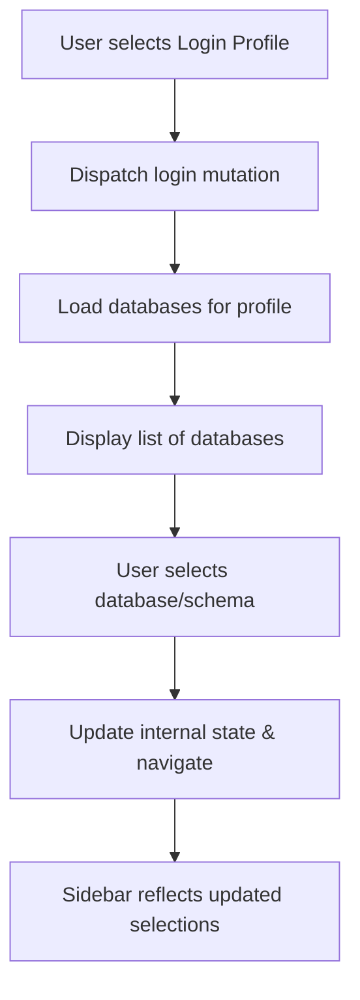
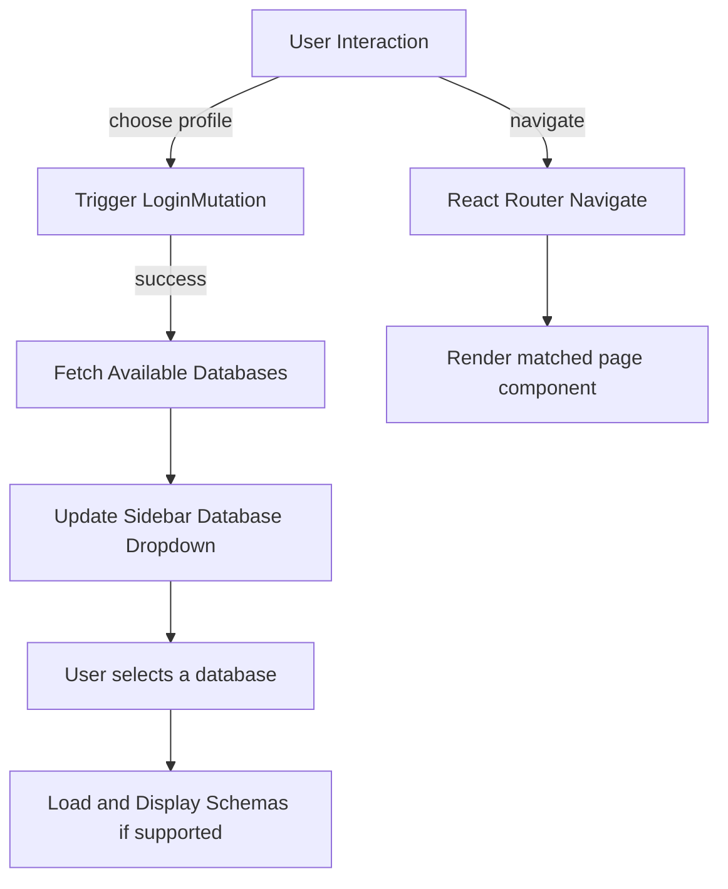

# Sidebar Navigation

## Table of Contents

- [Overview](#overview)
- [Component Structure](#component-structure)
- [Features](#features)
- [Usage Example](#usage-example)
- [Integration Details](#integration-details)
- [Data Flows and Middleware](#data-flows-and-middleware)
- [Mermaid Diagram](#mermaid-diagram)
- [Source Code](#source-code)

---

## Overview

The **Sidebar Navigation** component serves as the main navigation panel for the WhoDB frontend application. It provides users with easy access to different parts of the application including database profiles, schemas, key routes, and auxiliary pages such as settings and contact.

Designed as a collapsible sidebar panel, it dynamically adapts based on the authenticated user's current profile and associated database type, enhancing user experience by tailoring navigation options.


## Component Structure

The Sidebar is implemented as a React Functional Component (`React.FC`) located at [frontend/src/components/sidebar/sidebar.tsx](/frontend/src/components/sidebar/sidebar.tsx). It internally uses several subcomponents and hooks for interactive UI and data fetching:

- **SideMenu**: represents a nested menu or collapsible section within the sidebar
- **Dropdowns**: for selections like login profiles, databases, schemas
- **Animation Hooks**: from framer-motion to animate expansion and collapse
- **Routing Hooks**: React Router's `useNavigate` and `useLocation` for route control
- **Redux State Selectors and Dispatchers**: to get authentication and navigation state


## Features

- **Profile Management**: Displays and allows switching between existing login profiles.
- **Database Selection**: Shows available databases based on the current profile's type.
- **Schema Selection**: For databases supporting schema concepts, provides a dropdown to select the active schema.
- **Route Navigation**: Provides links to major app sections such as Dashboard (Storage Units), Graph Visualization, Raw Query Execution, Chat, Settings, Contact Us, and Logout.
- **Dynamic Menu Items**: Menu items adjust based on database capabilities and user status.
- **Animated UI**: Smooth expansion and collapse animations for menu and sidebar.
- **Event Handling**: Efficient handlers for menu toggling, profile change, and other sidebar interactions.


## Usage Example

```tsx
import { FC } from 'react';
import { useNavigate, useLocation } from 'react-router-dom';
import { useAppSelector, useAppDispatch } from '../store/hooks';
import { useLoginMutation, useLoginWithProfileMutation } from '../generated/graphql';
import { Dropdown, createDropdownItem } from '../components/dropdown';
import { Sidebar } from '../components/sidebar/sidebar';

const AppSidebar: FC = () => {
  const navigate = useNavigate();
  const location = useLocation();
  const dispatch = useAppDispatch();
  const profiles = useAppSelector(state => state.auth.profiles);
  const currentProfile = useAppSelector(state => state.auth.current);

  // Render Sidebar
  return (
    <Sidebar />
  );
};
```

This simplified snippet highlights importing and usage of the Sidebar component and related hooks. The full implementation manages more state and calls APIs to fetch databases and schemas.


## Integration Details

The Sidebar Navigation integrates tightly into the WhoDB frontend architecture:

- **Redux Store**: Accesses `auth`, `database`, and `global` slices for user login state, selected profile, databases, schemas, and theme.
- **GraphQL Queries & Mutations**: Utilizes Apollo Client generated hooks (`useGetDatabaseQuery`, `useGetSchemaQuery`, `useLoginMutation`, `useLoginWithProfileMutation`) for fetching user databases, schemas, performing login, and profile switching.
- **React Router**: Integrates with routing to navigate programmatically upon user actions.
- **UI Components**: Composes from Dropdowns, Buttons, Icon components, and Framer Motion for smooth UI transitions.

### Interaction pattern:



This pattern shows how selecting a login profile leads to fetch and update of databases, schemas, and corresponding UI updates.


## Mermaid Diagram




## Source Code

- Primary implementation: [frontend/src/components/sidebar/sidebar.tsx](/frontend/src/components/sidebar/sidebar.tsx)
- Related route configuration: [frontend/src/config/routes.tsx](/frontend/src/config/routes.tsx)
- Auth & database queries: [frontend/src/generated/graphql.tsx](/frontend/src/generated/graphql.tsx)
- Redux integration: [frontend/src/store/index.ts](/frontend/src/store/index.ts)
- Utility functions: [frontend/src/utils/functions.ts](/frontend/src/utils/functions.ts)


---

## Summary

The Sidebar Navigation is a crucial UI component in the WhoDB frontend, facilitating seamless user navigation, authentication profile management, and dynamic adaptation based on backend data status. It leverages React, Redux, Apollo GraphQL, and advanced UI techniques to provide a responsive and user-friendly sidebar experience.

It abstracts the complexities of routing, data fetching, and state syncing behind an intuitive visual component.

For more detailed development, exploration of the above source files is recommended.
