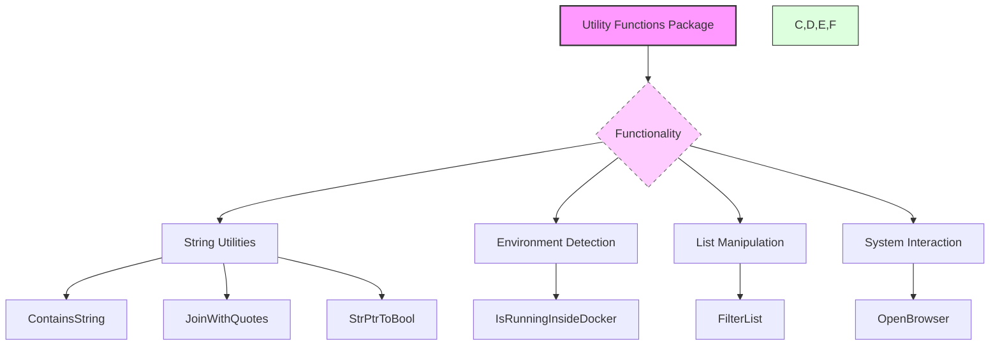

# Utility Functions

Utility functions serve as reusable building blocks that facilitate common tasks throughout the application. These functions help promote code reuse, maintainability, and consistency in how typical operations are performed, such as string processing, environment detection, list filtering, and interaction with the runtime environment.

---

## Table of Contents

- [Overview](#overview)
- [String Utilities](#string-utilities)
- [Environment Detection](#environment-detection)
- [List Manipulation](#list-manipulation)
- [System Interaction](#system-interaction)
- [Example Usage](#example-usage)
- [Integration Details](#integration-details)

---

## Overview

This module provides general-purpose helper functions used across both backend and frontend parts of the application. By centralizing commonly needed utilities, the app ensures consistent behavior and reduces duplicated code in different packages or components.

Key goals of these functions include:

- Simplify common tasks such as checking membership in slices, string formatting, or JSON validation.
- Facilitate environment and platform detection for conditional logic (e.g., detecting if running inside Docker).
- Support generic filtering and higher-order operations.
- Enable system interactions such as opening URLs in the default browser.

The following sections describe some core utility functions.

---

## String Utilities

### `ContainsString`

Checks whether a given string element exists within a slice of strings.

**Signature:**
```go
func ContainsString(slice []string, element string) bool
```

**Example:**

```go
list := []string{"apple", "banana", "cherry"}
found := ContainsString(list, "banana")  // returns true
missing := ContainsString(list, "dates") // returns false
```

### `JoinWithQuotes`

Joins a list of strings into a single string with each element quoted and separated by commas.

**Signature:**
```go
func JoinWithQuotes(arr []string) string
```

**Example:**

```go
items := []string{"id", "name", "age"}
result := JoinWithQuotes(items)  // "'id','name','age'"
```

### `StrPtrToBool`

Converts a pointer to string representing a boolean value to the actual Boolean.

**Signature:**
```go
func StrPtrToBool(s *string) bool
```

**Use Case:**
Useful when parsing values that might be *string from external sources into booleans safely.

---

## Environment Detection

### `IsRunningInsideDocker`

Determines whether the application is currently running inside a Docker container.

**Signature:**
```go
func IsRunningInsideDocker() bool
```

**Description:**
Detects presence of typical Docker environment artifacts or conditions.

**Example use:**
Information from this function can be used to adjust default paths, logging behavior, or runtime options:

```go
if IsRunningInsideDocker() {
    log.Infof("Running inside Docker container.")
} else {
    log.Infof("Running outside Docker.")
}
```

---

## List Manipulation

### Generic Filtering:

The utility provides generic filtering capabilities for slices.

```go
func FilterList[T any](items []T, by func(input T) bool) []T
```

**Description:**
Returns a new slice containing only elements from `items` where the `by` predicate returns `true`.

**Example:**

```go
nums := []int{1, 2, 3, 4, 5, 6}
even := FilterList(nums, func(n int) bool { return n%2 == 0 })  // [2,4,6]
```

---

## System Interaction

### `OpenBrowser`

Opens a specified URL in the user's default web browser.

**Signature:**
```go
func OpenBrowser(url string)
```

**Implementation Notes:**
This function abstracts OS-specific commands such as `xdg-open`, `open`, or `start`.

**Example:**

```go
OpenBrowser("https://clidey.com")  // Opens Clidey homepage in browser
```

---

## Example Usage

```go
package example

import (
  "fmt"
  "github.com/clidey/whodb/core/src/common"
)

func performChecks() {
  fruits := []string{"apple", "banana", "cherry"}

  if common.ContainsString(fruits, "banana") {
    fmt.Println("Found banana!")
  }

  // Filtering numbers
  numbers := []int{1, 2, 3, 4, 5}
  evens := common.FilterList(numbers, func(n int) bool { return n%2 == 0 })
  fmt.Println("Even numbers:", evens)

  // Detect if inside Docker
  if common.IsRunningInsideDocker() {
    fmt.Println("Running inside Docker")
  } else {
    fmt.Println("Running outside Docker")
  }

  // Open browser example
  common.OpenBrowser("https://clidey.com")
}
```

---

## Mermaid Diagram



---

## Integration Details

- **Location:** The utility functions reside in the `core/src/common/utils.go` file.
- **Used by:** Almost all core packages utilize these utilities, including the engine, plugins, environment config, and auth.
- **Frontend Access:** Similar utility functions may be provided or compiled into the frontend bundle for consistent logic.
- **Purpose:** Centralize common checks and generic operations to reduce redundancy and improve code coherence.
- **System Interaction:** Facilitates detecting runtime environment (e.g., whether running in Docker), enhancing dynamic configuration.

For detailed implementation, refer to the source file: [core/src/common/utils.go](/core/src/common/utils.go).

---

By using these utility functions effectively, developers can ensure consistent handling of common data manipulation, environment checks, and system commands throughout the application codebase.