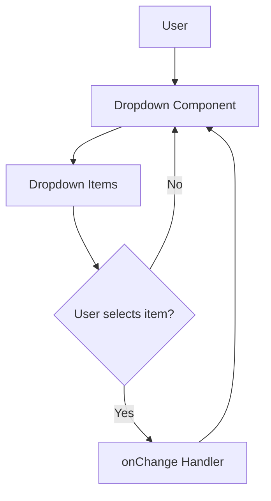

# Dropdown Components

The Dropdown components provide reusable, customizable selection menus within the frontend application. They support type-safe dropdown items, optional icons, loading states, and additional features such as labeled dropdown menus and action handling. These components are designed to be flexible and easily integrated into various parts of the UI.

---

## Table of Contents

- [Overview](#overview)
- [Basic Usage](#basic-usage)
- [Dropdown Items](#dropdown-items)
- [Dropdown Props](#dropdown-props)
- [DropdownWithLabel Component](#dropdownwithlabel-component)
- [Advanced Features](#advanced-features)
- [Mermaid Diagram: Dropdown Interaction Flow](#mermaid-diagram-dropdown-interaction-flow)
- [Integration Details](#integration-details)
- [Source](#source)

---

## Overview

Dropdowns are UI components that allow users to select options from a list of choices. They can be used for navigating between options, adjusting settings, or any scenario that requires selecting one item from multiple options.

These components:

- Accept a generic type parameter for extensibility.
- Support labels and custom icons.
- Provide flexible open/close state control.
- Offer keyboard and mouse interaction handling.

---

## Basic Usage

Here is a minimal example of using the `Dropdown` component with a list of items:

```tsx
import { Dropdown, createDropdownItem } from "./dropdown";
import React from "react";

// Define dropdown items
const items = [
  createDropdownItem("option1"),
  createDropdownItem("option2"),
  createDropdownItem("option3")
];

function ExampleDropdown() {
  return (
    <Dropdown
      items={items} // List of items to select from
      placeholder="Select an option"
      onChange={(item) => console.log("Selected:", item.label)}
    />
  );
}

export default ExampleDropdown;
```

In this example:

- `createDropdownItem` creates a dropdown item object with an id and label.
- `Dropdown` displays the items and invokes `onChange` when a selection occurs.

---

## Dropdown Items

Dropdown items are objects with the following shape:

```ts
interface IDropdownItem<T = any> {
  id: string;
  label: string;
  icon?: React.ReactElement;
  extra?: T;
}
```

They include:

- `id`: Unique string identifier.
- `label`: Text for display.
- `icon`: Optional icon component for visual aid.
- `extra`: Optional extra data of generic type `T`.

Use `createDropdownItem` to easily generate such items:

```ts
// Create item with label and optional icon
const item = createDropdownItem("Option 1", <MyIcon />);
```

---

## Dropdown Props

The `Dropdown` component accepts props to customize behavior and appearance:

```ts
interface IDropdownProps {
  items: IDropdownItem[];              // List of selectable items
  placeholder?: string;               // Placeholder text
  className?: string;                 // Additional CSS class
  label?: string;                    // Label text shown alongside
  loading?: boolean;                 // Shows loading state when true
  disabled?: boolean;                // Disable interaction
  onChange?: (item: IDropdownItem) => void; // Change handler
  value?: IDropdownItem;             // Controlled selected item
  testId?: string;                   // For testing
  onActionClick?: () => void;        // Optional action button handler
}
```

Key callbacks and control:

- `onChange`: Called when user selects an item.
- `value`: If set, the dropdown is controlled externally.
- `loading`: Displays a loader to indicate async data.

---

## DropdownWithLabel Component

This component extends `Dropdown` by providing a label prop that displays a label associated with the dropdown.

### Example

```tsx
import { DropdownWithLabel, createDropdownItem } from "./dropdown";
import React from "react";

const options = [
  createDropdownItem("red"),
  createDropdownItem("blue"),
  createDropdownItem("green")
];

function ColorPicker() {
  return (
    <DropdownWithLabel
      label="Choose Color"
      items={options}
      onChange={(item) => console.log("Color selected:", item.label)}
    />
  );
}

export default ColorPicker;
```

This provides a concise UI with a label attached.

---

## Advanced Features

- **Action Button:** Some dropdowns can include an action button to trigger custom operations besides selecting an option.

- **Icon Support:** Icons can visually enhance dropdown items and action buttons.

- **Loading State:** The components can show a spinner or similar indication when data is loading.

- **Keyboard Navigation:** Supports arrow keys and enter key for accessibility and better UX.

- **Custom Styling:** Accepts class names for container, items, and active states for rich theming.

---

## Mermaid Diagram: Dropdown Interaction Flow



This flow illustrates how a user's interaction triggers state updates via the dropdown's event handlers.

---

## Integration Details

### How Dropdown Integrates

- **UI Layer:** The Dropdown components are used throughout the frontend for presenting selectable lists, including in sidebars, forms, and modals.

- **React & TypeScript:** Fully typed with generic support to ensure compile-time safety.

- **State Management:** Works alongside Redux state management — e.g., selection changes dispatch actions or propagate via callbacks.

- **Styling:** Uses className props combined with utility libraries such as `classnames` and `tailwind-merge` for flexible and consistent styling.

- **Testing:** Supports `testId` props allowing automated UI tests to locate and interact with dropdowns.

- **Composability:** The `DropdownWithLabel` component is built on top of `Dropdown`, allowing easy addition of labels without rewriting core logic.


### Dependencies

- React (functional components and hooks)
- classnames
- Optional icon components (React elements)

### Responsibilities

- Present a list of options
- Handle user input through clicks and keyboard
- Maintain and expose open/close state
- Trigger external callbacks on selection changes

---

## Source

- Component source: [frontend/src/components/dropdown.tsx](/frontend/src/components/dropdown.tsx)
