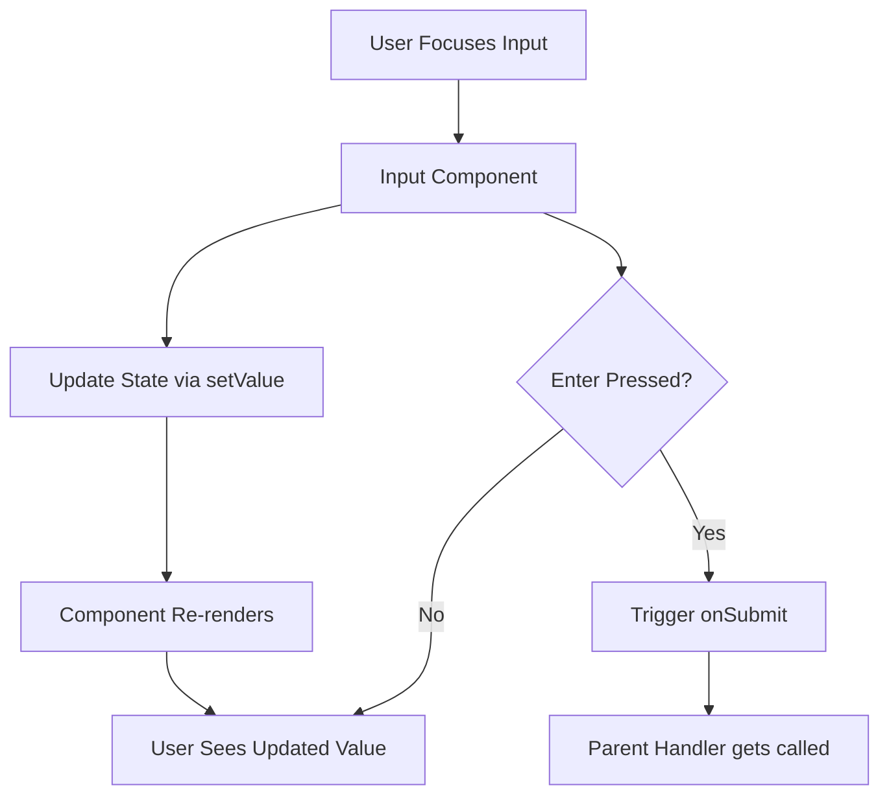

# Inputs

This section covers reusable Input components designed for form handling and user interactions within the frontend application. These components provide styled text inputs, labels, toggle switches, checkboxes, and enhance UX with functionality like password visibility toggling.

---

## Table of Contents

- [Overview](#overview)
- [Basic Input Components](#basic-input-components)
  - [Text](#text)
  - [Label](#label)
  - [Input](#input)
  - [InputWithLabel](#inputwithlabel)
- [Advanced Input Components](#advanced-input-components)
  - [ToggleInput](#toggleinput)
  - [CheckBoxInput](#checkboxinput)
- [Example Usage](#example-usage)
- [Integration Details](#integration-details)

---

## Overview

Input components are essential building blocks for capturing user data in forms and interfaces. The provided components are crafted to be:

- **Reusable:** Easily drop-in for various form fields.
- **Accessible:** Proper labeling and keyboard support.
- **Customizable:** Accept props for behavior, styling, and events.
- **User-friendly:** Features like toggling password visibility.

These components are implemented using React functional components with TypeScript, offering full typing support.

---

## Basic Input Components

### Text

A simple text display component used for static text elements such as labels or read-only field descriptions.

```tsx
import React from 'react';

export const Text: React.FC<{ label: string }> = ({ label }) => {
  return <p className="text-base text-gray-800 dark:text-gray-200">{label}</p>;
};
```

### Label

Renders a label element associated with an input field providing semantic meaning.

```tsx
import React from 'react';

export const Label: React.FC<{ label: string }> = ({ label }) => {
  return (
    <label className="block text-sm font-medium text-gray-700 dark:text-gray-300">
      {label}
    </label>
  );
};
```

### Input

The core input element allowing users to enter text data, supporting various input types like 'text', 'password', and handlers for change events.

```tsx
import React, { ChangeEvent, KeyboardEvent } from 'react';

interface InputProps {
  value: string;
  setValue: (value: string) => void;
  type?: string;
  placeholder?: string;
  onSubmit?: () => void;
}

export const Input: React.FC<InputProps> = ({ value, setValue, type = "text", placeholder, onSubmit }) => {
  const handleChange = (e: ChangeEvent<HTMLInputElement>) => {
    setValue(e.target.value);
  };

  const handleKeyUp = (e: KeyboardEvent<HTMLInputElement>) => {
    if (e.key === 'Enter' && onSubmit) {
      onSubmit();
    }
  };

  return (
    <input
      className="border border-gray-300 rounded px-3 py-2 w-full"
      value={value}
      onChange={handleChange}
      type={type}
      placeholder={placeholder}
      onKeyUp={handleKeyUp}
    />
  );
};
```

### InputWithLabel

Combines a label and input connected visually and semantically.

```tsx
import React from 'react';
import { Label } from './Label';
import { Input } from './Input';

interface InputWithLabelProps {
  value: string;
  setValue: (value: string) => void;
  label: string;
  type?: string;
  placeholder?: string;
  onSubmit?: () => void;
}

export const InputWithlabel: React.FC<InputWithLabelProps> = ({ value, setValue, label, type, placeholder, onSubmit }) => {
  return (
    <div className="mb-4">
      <Label label={label} />
      <Input value={value} setValue={setValue} type={type} placeholder={placeholder} onSubmit={onSubmit} />
    </div>
  );
};
```

---

## Advanced Input Components

### ToggleInput

A binary toggle switch input used for boolean values.

```tsx
import React from 'react';

interface IToggleInputProps {
  value: boolean;
  setValue: (v: boolean) => void;
}

export const ToggleInput: React.FC<IToggleInputProps> = ({ value, setValue }) => {
  return (
    <label className="inline-flex items-center">
      <input
        type="checkbox"
        checked={value}
        onChange={(e) => setValue(e.target.checked)}
        className="form-checkbox h-5 w-5"
      />
      <span className="ml-2">{value ? 'On' : 'Off'}</span>
    </label>
  );
};
```

### CheckBoxInput

A simple checkbox input component.

```tsx
import React from 'react';

interface ICheckBoxInputProps {
  value: boolean;
  setValue: (v: boolean) => void;
}

export const CheckBoxInput: React.FC<ICheckBoxInputProps> = ({ value, setValue }) => {
  return (
    <input
      type="checkbox"
      checked={value}
      onChange={(e) => setValue(e.target.checked)}
      className="form-checkbox"
    />
  );
};
```

---

## Example Usage

Here is a concise example showing an input form with a labeled text input and a toggle:

```tsx
import React, { useState } from 'react';
import { InputWithlabel, ToggleInput } from './inputs';

export const ExampleForm = () => {
  const [username, setUsername] = useState('');
  const [isAdmin, setIsAdmin] = useState(false);

  return (
    <form>
      <InputWithlabel
        label="Username"
        value={username}
        setValue={setUsername}
        placeholder="Enter your username"
      />
      <div>
        <span>Admin Access</span>
        <ToggleInput value={isAdmin} setValue={setIsAdmin} />
      </div>
    </form>
  );
};
```

---

## Input Component Flow



---

## Integration Details

Input components are foundational UI elements within the React frontend application:

- **Usage:** Available across login forms, settings pages, data query interfaces, and user profile management.
- **Props:** Designed to support controlled inputs with state passed down and updated via callbacks.
- **Customization:** Components support various types (e.g., text, password) and behaviors (submit on enter key).
- **Dependencies:** Leverage React and TypeScript for type safety and composability.

These input components improve user experience by standardizing form elements and reducing duplicate code while enabling consistent theming and accessibility.

For detailed source code, see [frontend/src/components/input.tsx](/frontend/src/components/input.tsx).

---

This modular and type-safe approach ensures robust user input handling and forms a solid base for building interactive UI forms in the application.
