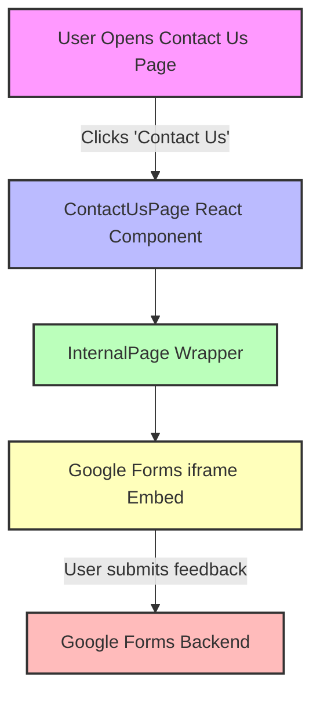

# Contact Us Page

The Contact Us page provides a straightforward interface within the WhoDB frontend application for users to submit feedback, feature requests, or bug reports. It does so by embedding a Google Forms feedback form directly into the page, allowing easy and seamless communication with the development team without needing to leave the application.

---

## Table of Contents

- [Overview](#overview)
- [Component Details](#component-details)
- [Usage Example](#usage-example)
- [Integration](#integration)
- [Architecture and Flow](#architecture-and-flow)

---

## Overview

The Contact Us page serves as a centralized location for user feedback collection. The page is implemented as a React functional component that embeds a Google Forms iframe. This ensures the feedback mechanism is lightweight and requires minimal maintenance, while leveraging an existing, reliable platform for data collection.

Key features:

- Embedded Google Form for feedback.
- Minimal UI around the form to maintain consistent app look and feel.
- Accessible as part of the internal app navigation flow.

This approach enables rapid iteration and easy monitoring of user inputs with the powerful Google Forms backend.

---

## Component Details

The page component is implemented in TypeScript as a React Functional Component (`ContactUsPage`). It leverages an internal page layout component to maintain consistent UI structure and styling across the application.

### Main Elements

- **InternalPage**: Wraps the embedded form to provide navigation, padding, and other common page elements.
- **iframe**: Embeds the Google Form identified by a specific URL.

### Code Snippet

```tsx
import React, { FC } from 'react';
import { InternalPage } from '../components/page';

// Contact Us page component
export const ContactUsPage: FC = () => {
  return (
    <InternalPage routes={[]}>  {/* no sub-routes, just a simple page */}
      <div className="w-full h-full flex justify-center items-center">
        <iframe
          title="feedback-form"
          src="https://docs.google.com/forms/d/e/1FAIpQLSe0BmLXC0NuXXrzvxPENkd_FilhyLPAPf3ARtP7lGAEyNS1Fw/viewform?embedded=true"
          width="760"
          height="1064"
          style={{ border: 'none' }}
          loading="lazy"
          allowFullScreen
        />
      </div>
    </InternalPage>
  );
};
```

- The form's URL is fixed and points to the embedded Google Form for user input.
- The `loading="lazy"` attribute optimizes form loading.
- Styling centers the form within the parent container.

---

## Usage Example

The ContactUsPage is typically used as one of the navigation routes within the frontend React router, accessible from the sidebar or header.

```tsx
import { ContactUsPage } from './pages/contact-us/contact-us';

// Route configuration example
const routes = [
  { path: '/contact-us', component: <ContactUsPage /> },
  // other routes ...
];

// Used inside a React Router setup
<Routes>
  <Route path="/contact-us" element={<ContactUsPage />} />
</Routes>
```

Users navigate to this page to submit feedback, which email or Google Form backend then collects.

---

## Integration

The Contact Us page fits easily into the WhoDB application's overall frontend architecture:

- **Frontend Components**: Relies on the `InternalPage` wrapper for layout consistency.
- **Routing**: Integrated as a route within React Router allowing direct access.
- **No Backend Dependency**: Does not communicate with the backend server API; relies on Google Forms.
- **Component Dependencies**:
  - `React` (functional component, JSX syntax)
  - `InternalPage` for consistent UI

This design ensures minimal maintenance and leverages existing tools for feedback processing.

---

## Architecture and Flow



1. The user navigates to the Contact Us route.
2. The React component `ContactUsPage` loads.
3. It wraps the Google Forms iframe inside the app's `InternalPage` layout.
4. The user interacts with the form.
5. Feedback is submitted directly to Google Forms backend.

---

## Source

- [Contact Us Page Source](/frontend/src/pages/contact-us/contact-us.tsx)
- [Internal Page Wrapper](/frontend/src/components/page.tsx)

---

This document provides a full overview of the Contact Us page's role, usage, and integration within the WhoDB application.

