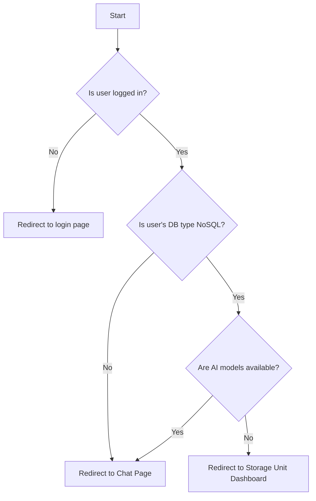

# Default Chat Route

## Table of Contents
- [Introduction](#introduction)
- [Purpose and Behavior](#purpose-and-behavior)
- [Implementation Overview](#implementation-overview)
- [Code Example](#code-example)
- [Integration Details](#integration-details)
- [Mermaid Diagram: Flow of Default Chat Route](#mermaid-diagram-flow-of-default-chat-route)
- [Source Code Reference](#source-code-reference)

---

## Introduction

The **Default Chat Route** component is a React functional component designed to serve as a conditional entry point for authenticated users to the chat interface of the WhoDB frontend application. Based on the user's current database type and the availability of AI models, it redirects the user to an appropriate route.

This component helps guide users with different database types and AI capability states seamlessly within the app, ensuring they are directed either to the main chat page or to a storage unit dashboard when AI integration is not supported.

---

## Purpose and Behavior

- **Determine User Authentication State**: Fetches the current authenticated user from the Redux store.
- **Fetch Available AI Models**: Queries available AI models given the user's database type.
- **Determine Database Type**: Checks whether the user's database type is non-relational (NoSQL).
- **Conditional Navigation**:
  - If the user is authenticated, their database type is NoSQL, and no AI models are available, the component redirects to the default storage unit dashboard.
  - Otherwise, it presents the chat interface.

This routing logic is essential for delivering a relevant user experience based on backend capabilities and user context.

---

## Implementation Overview

The component uses:

- `useAppSelector`: To select current authenticated user info from state.
- `useGetAiModelsQuery`: To lazily fetch AI model data from the backend.
- `useMemo`: To efficiently derive a boolean indicating NoSQL database type.
- React Router's `Navigate`: To perform conditional navigation.

The AI model query is dependent on the user's database type, preventing unnecessary queries.

---

## Code Example

```tsx
import React, { useMemo } from 'react';
import { useAppSelector } from '../store/hooks';
import { useGetAiModelsQuery } from '../generated/graphql';
import { Navigate } from 'react-router-dom';
import { isNoSQL } from '../utils/functions';

/**
 * Component that conditionally redirects to chat or dashboard based on user and AI model availability
 */
const NavigateToDefault = (): JSX.Element => {
  // Access current user info from Redux
  const current = useAppSelector(state => state.auth.current);

  // Query available AI models only if user and database type are present
  const { data, error } = useGetAiModelsQuery({
    variables: { modelType: current?.Type ?? '' },
    skip: !current?.Type
  });

  // Determine if current DB type is NoSQL
  const modelAvailable = data?.AIModel && !error;
  const isDatabaseNoSQL = useMemo(() => {
    if (!current || !current.Type) return false;
    return isNoSQL(current.Type);
  }, [current]);

  // Redirect to storage unit dashboard if NoSQL with no AI models, else show chat
  if (current && isDatabaseNoSQL && !modelAvailable) {
    return <Navigate to="/database/storage-unit/dashboard" replace />;
  }

  return <Navigate to="/chat" replace />;
};

export default NavigateToDefault;
```

---

## Integration Details

### Dependencies
- **Redux Store**: Utilizes the `auth` slice for authentication and current user profile.
- **GraphQL API (Apollo Client)**: `useGetAiModelsQuery` fetches available AI models for user's DB type.
- **React Router**: Uses `<Navigate />` for declarative route redirection.
- **Utility Functions**: `isNoSQL` determines database type category.

### How It Fits Within the System
- Serves as a protected route entry that adapts navigation based on backend capabilities and user authentication.
- Ensures that users with NoSQL databases not supporting AI models are not sent to a chat interface lacking required features.
- Acts as an intermediate redirect handler used by route configuration to simplify user experience.

### Interaction Flow

1. Component mounts and retrieves user info.
2. Queries active AI models fitting user database.
3. Evaluates conditions.
4. Redirects to `/chat` or `/database/storage-unit/dashboard` accordingly.

This logic centralizes route decision, reducing repetitive checks in other parts of the app.

---

## Mermaid Diagram: Flow of Default Chat Route



---

## Source Code Reference

- `DefaultChatRoute.tsx` component implementation: [frontend/src/pages/chat/default-chat-route.tsx](frontend/src/pages/chat/default-chat-route.tsx)
- Utility function `isNoSQL`: [frontend/src/utils/functions.ts](frontend/src/utils/functions.ts)
- GraphQL query hook `useGetAiModelsQuery`: [frontend/src/generated/graphql.tsx](frontend/src/generated/graphql.tsx)
- Redux selector `useAppSelector`: [frontend/src/store/hooks.ts](frontend/src/store/hooks.ts)

---

By implementing a smart redirection layer, the Default Chat Route component helps ensure a smooth and context-aware user navigation experience in the WhoDB user interface.