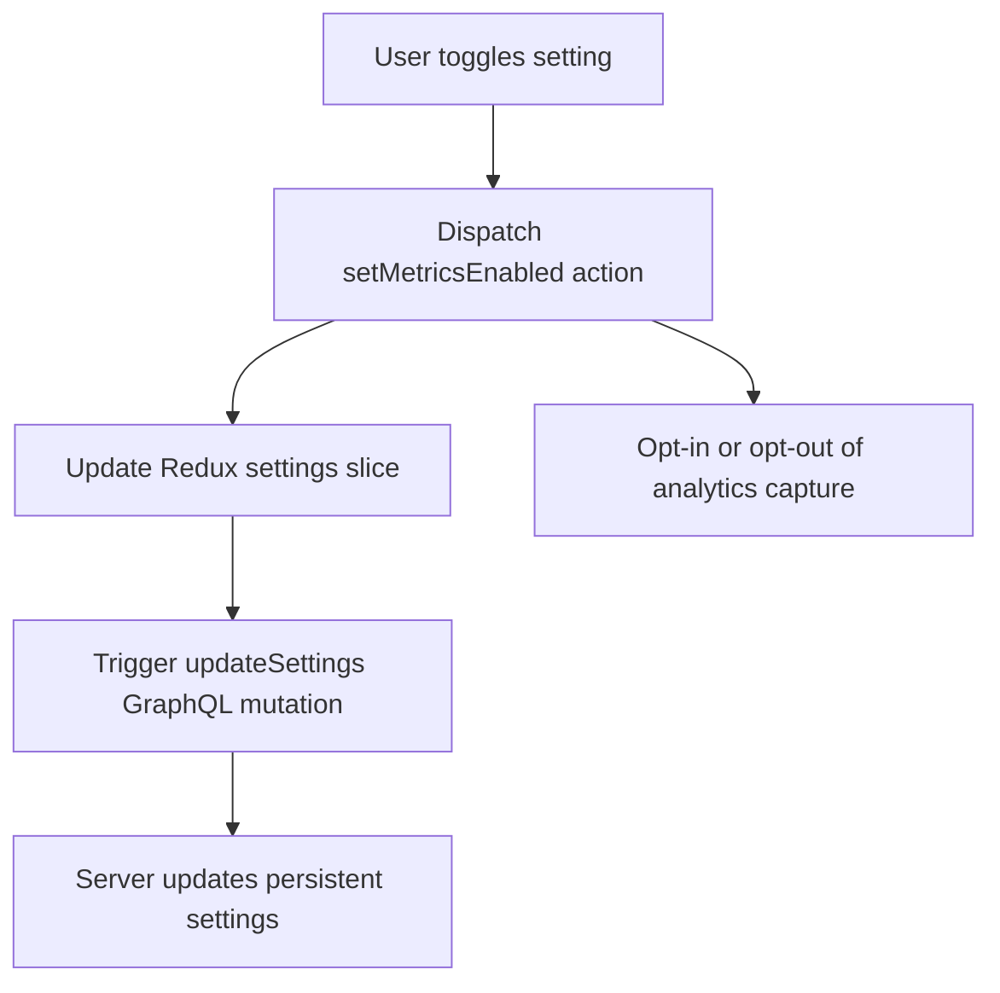

# Table of Contents

- [Overview](#overview)
- [User Metrics Settings](#user-metrics-settings)
- [Component Implementation](#component-implementation)
- [Integration Details](#integration-details)
- [Architecture Context](#architecture-context)
- [Source Code](#source-code)

---

## Overview

The **Settings Page** in WhoDB provides users with a straightforward interface to manage application-level configurations, prominently focusing on telemetry and performance metrics settings. Through this page, users can enable or disable the collection of usage metrics, helping balance between improving the product and preserving user privacy.

This page acts as a centralized place for settings that influence how the application operates, with immediate effect on the backend and analytic services.

---

## User Metrics Settings

### Metrics Enabled Toggle

The primary setting on this page is a toggle switch for **Metrics Enabled**.

- **Enabled:** The application collects telemetry data to help understand usage patterns and improve functionality.
- **Disabled:** Telemetry is turned off, and no metric data is sent or collected.

This setting is persisted in the application's backend settings store and synced with frontend state as well.

### Typical Usage

- New users can opt in or out of telemetry data collection at any time.
- Administrators can enforce or audit user settings via the back-end mechanisms.

---

## Component Implementation

Here's a focused code example illustrating the core implementation of the Settings Page component using React and Apollo:

```tsx
import React, { useCallback } from 'react';
import { useAppDispatch, useAppSelector } from '../store/hooks';
import { useUpdateSettingsMutation } from '../generated/graphql';
import { SettingsActions } from '../store/settings';
import ToggleInput from '../components/input';

export const SettingsPage: React.FC = () => {
  // Local Redux dispatch
  const dispatch = useAppDispatch();

  // Read current setting from Redux state
  const metricsEnabled = useAppSelector((state) => state.settings.metricsEnabled);

  // GraphQL mutation to update backend settings
  const [updateSettings] = useUpdateSettingsMutation();

  // Handler to toggle metrics
  const handleMetricsToggle = useCallback((enabled: boolean) => {
    dispatch(SettingsActions.setMetricsEnabled(enabled));
    updateSettings({ variables: { newSettings: { MetricsEnabled: String(enabled) } } });
  }, [dispatch, updateSettings]);

  return (
    <div className="settings-container">
      <h2>Telemetry & Performance Metrics</h2>
      <p>Enable or disable sending anonymous usage data to help improve the product.</p>
      <ToggleInput
        value={metricsEnabled}
        setValue={handleMetricsToggle}
        label="Enable Metrics Collection"
      />
    </div>
  );
};
```

**Comments:**
- The `ToggleInput` is a reusable input component for on/off switches.
- `useUpdateSettingsMutation` is an Apollo hook generated from GraphQL schema.
- Settings update dispatches to both local Redux store and backend.

---

## Integration Details

### Redux Store
- The setting is stored in a dedicated slice called `settings` with the boolean `metricsEnabled`.
- Actions include `setMetricsEnabled`, used by the component to update state.
- The Redux store persists and propagates this flag throughout the UI.

### Apollo Client
- The `useUpdateSettingsMutation` communicates with the server to sync user settings.
- This backs the persistent storage of user preferences on the backend.

### PostHog Analytics (or equivalent)
- This page triggers the opt-in and opt-out of analytics capturing through user interaction.
- Ensures respect for user privacy preferences.

### UI
- Simple toggle UI ensures non-technical users can control telemetry easily.
- The interface is aligned with overall application styling and accessibility standards.

### Update Flow



---

## Architecture Context

The Settings Page is a crucial UI component linking user preferences with backend application behavior:

- **Frontend:** React component interacts with global state (Redux) and GraphQL API.
- **Backend:** GraphQL mutation updates settings repository; potentially impacts logging and telemetry services.
- **Telemetry Services:** PostHog configured in the frontend integrates with this setting to enable/disable event capture.

This arrangement ensures user choices are respected across all layers of the application.

---

## Source Code

- [Settings Page Component](/frontend/src/pages/settings/settings.tsx)
- [Settings Redux Slice](/frontend/src/store/settings.ts)
- [UpdateSettings GraphQL Mutation](/frontend/src/generated/graphql.tsx)

---