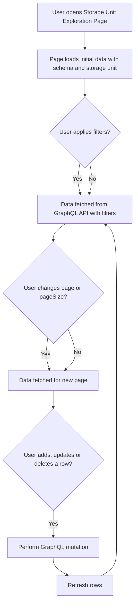

# Overview

The **Storage Unit Exploration Page** provides a feature-rich user interface for exploring, querying, filtering, and manipulating data rows inside a specific storage unit (e.g., a table or collection) within a selected database schema. This page allows users to navigate database content with CRUD (Create, Read, Update, Delete) capabilities enhanced by filter conditions and pagination for efficient data management.

It integrates closely with the GraphQL backend API to fetch and update data while offering a responsive frontend experience.

---

## Table of Contents

- [Key Features](#key-features)
- [Core Concepts](#core-concepts)
- [Using the Storage Unit Exploration Page](#using-the-storage-unit-exploration-page)
- [Filtering Data](#filtering-data)
- [Pagination](#pagination)
- [Modifying Rows](#modifying-rows)
- [Implementation Example](#implementation-example)
- [Integration Details](#integration-details)

---

## Key Features

- **Data Viewing:** Display rows of data for a chosen storage unit with support for varying database types.
- **Pagination:** Control the page size and navigate through pages of data easily.
- **Filtering:** Apply complex filter conditions (where clauses) to narrow down rows shown.
- **Add Rows:** Interface to add new rows with dynamic input fields.
- **Update Rows:** Support inline editing or update of existing row values.
- **Delete Rows:** Delete selected rows in bulk or individually.
- **UI Enhancements:** Visual cues for loading states, form controls for usability.

---

## Core Concepts

### Storage Unit
A **Storage Unit** corresponds to a logical table, collection, or entity within a schema or database. It is associated with a set of rows (records) and has a defined schema of columns or fields.

### Where Condition
A **Where Condition** defines logical filters used to limit data retrieval. This can be a combination of atomic conditions (e.g., `column = value`) or composite conditions using `AND`/`OR` operators.

### Pagination
Data results are **paged** to improve performance. Users can select page size and navigate between pages using provided UI controls.

---

## Using the Storage Unit Exploration Page

### Loading and Navigation
The page automatically loads rows based on the currently selected schema and storage unit. It dispatches GraphQL queries to fetch the relevant rows incorporating filters and pagination settings.

### UI Controls
- **Page Size Selector:** Choose how many rows to load per page.
- **Page Navigation:** Buttons or input for switching between pages.
- **Filter Inputs:** UI for building where conditions to filter displayed rows.
- **Add Row Button:** Opens a form for inserting new data fields.

### Row Actions
- **Edit:** Users can update values of a row inline or via a modal.
- **Delete:** Selected rows can be deleted after confirmation.

---

## Filtering Data

Users can define filters with various operators and values. Filters are sent as structured GraphQL `WhereCondition` inputs and processed by the backend to return only matching rows.

Filter inputs support column selection, operator choices (like `=`, `!=`, `LIKE`, etc.), and value inputs.

---

## Pagination

To handle large datasets, the page supports loading data in pages. The interface shows current page, total pages, and controls to jump forward or backward.

This improves responsiveness and avoids loading massive amounts of data at once.

---

## Modifying Rows

### Adding
Users fill an input form where fields correspond to the storage unit schema. On submission, a GraphQL mutation adds the row and refreshes the displayed data.

### Updating
Editing a field triggers an update mutation that modifies the targeted row and column.

### Deleting
Rows can be deleted individually or in bulk by selecting multiple rows and confirming deletion.

---

## Implementation Example

```ts
import React, { useState, useCallback, useMemo, useEffect, useRef } from 'react';
import { useGetStorageUnitRowsLazyQuery, useAddRowMutation } from '../generated/graphql';
import { WhereCondition, RecordInput } from '../generated/graphql';
import { notify } from '../store/function';

const StorageUnitExplorer: React.FC<{ schema: string; unitName: string }> = ({ schema, unitName }) => {
  const [pageSize, setPageSize] = useState('20');
  const [currentPage, setCurrentPage] = useState(1);
  const [whereCondition, setWhereCondition] = useState<WhereCondition | undefined>(undefined);
  
  const [getRows, { data, loading, error }] = useGetStorageUnitRowsLazyQuery();
  const [addRow, { loading: adding }] = useAddRowMutation();

  // Fetch rows when page or filters change
  useEffect(() => {
    getRows({
      variables: {
        schema,
        storageUnit: unitName,
        pageSize: parseInt(pageSize, 10),
        pageOffset: (currentPage - 1) * parseInt(pageSize, 10),
        where: whereCondition
      },
    });
  }, [schema, unitName, pageSize, currentPage, whereCondition, getRows]);

  // Handle adding a simple row (example)
  const handleAddRow = useCallback(async (values: RecordInput[]) => {
    try {
      await addRow({ variables: { schema, storageUnit: unitName, values } });
      notify('Row added successfully', 'success');
      // Refresh rows
      getRows();
    } catch (e) {
      notify('Error adding row', 'error');
    }
  }, [addRow, schema, unitName, getRows]);

  return (
    <div>
      {/* Render table with rows, filtering, paging and add row UI here */}
      {loading && <p>Loading rows...</p>}
      {error && <p>Error: {error.message}</p>}
      {/* Table component showing data.rows with props columns data.columns */}

      {/* Pagination Controls */}

    </div>
  );
};

export default StorageUnitExplorer;
```

---

## Mermaid Diagram



---

## Integration Details

**Storage Unit Exploration Page** is an essential frontend component integrated with several key subsystems:

- **GraphQL Backend:** Utilizes queries like `GetStorageUnitRows` and mutations such as `AddRow`, `UpdateRow`, or `DeleteRow` to communicate with the backend. These are defined in the [GraphQL Schema and Resolvers](/core/graph/schema.graphqls).

- **Redux State:** Uses selectors and dispatch via [Typed React Redux Hooks](/frontend/src/store/hooks.ts) and [Notification Helper](/frontend/src/store/function.ts) for user feedback.

- **Routing:** Connected with UI navigation, integrating with the routing setup in [Frontend Routing Configuration](/frontend/src/config/routes.tsx).

- **UI Components:** Leverages components like [Tables](/frontend/src/components/table.tsx) for tabular data display, inputs for filters, and buttons to trigger actions.

- **Authentication:** Ensures only authorized users can access and modify storage units via integration with [Authentication & Profiles](/core/src/auth/auth.go).

This page acts as a bridge between the user's interactive exploration of database content and the backend database engine abstractions exposed via the GraphQL API, enabling efficient and safe database content management.

---

## Related files

- Source code: [explore-storage-unit.tsx](/frontend/src/pages/storage-unit/explore-storage-unit.tsx)
- GraphQL schema: [schema.graphqls](/core/graph/schema.graphqls)
- GraphQL resolvers: [schema.resolvers.go](/core/graph/schema.resolvers.go)
- Table component: [table.tsx](/frontend/src/components/table.tsx)
- Where condition component: [explore-storage-unit-where-condition.tsx](/frontend/src/pages/storage-unit/explore-storage-unit-where-condition.tsx)

---