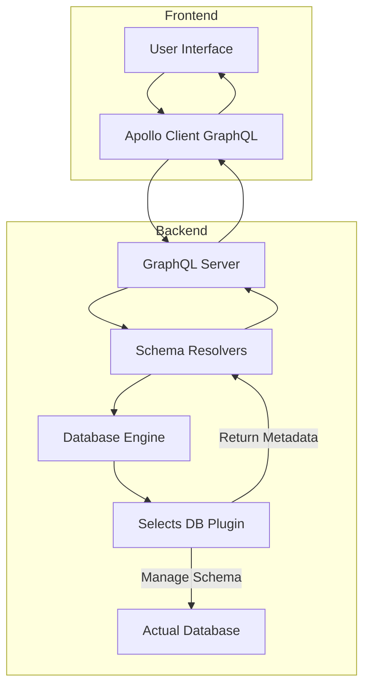

# Storage Unit Management

Storage Unit Management in WhoDB enables users to view, create, update, and organize database storage units (such as tables or collections) and their fields. This feature provides a user-friendly interface for managing the schema elements of a connected database, supporting multiple database types through a unified frontend backed by dynamic GraphQL APIs.

---

## Table of Contents

- [Overview](#overview)
- [Features](#features)
- [Component Structure](#component-structure)
- [Usage Example](#usage-example)
- [Integration](#integration)
- [Architecture and Data Flow](#architecture-and-data-flow)
- [See Also](#see-also)

---

## Overview

Storage units represent logical grouping of data such as tables in SQL or collections in NoSQL databases. The Storage Unit Management feature allows users to:

- Browse existing storage units within a selected database schema.
- Create new storage units by specifying their names and defining fields.
- View and manage details of each storage unit.
- Navigate to specific storage units to explore or modify their data.

This management functionality abstracts differences between various database types and offers consistent operations inside the WhoDB frontend.

## Features

- **Listing Storage Units**  
  Quickly view all available storage units in the current schema with metadata.

- **Create New Storage Unit**  
  Add a new storage unit by specifying its name and field attributes.

- **Field Management**  
  Add, update, or remove fields (columns, attributes) within a storage unit.

- **Navigation Integration**  
  Seamless navigation between storage units, data exploration pages, and schema views.

- **Validation and Feedback**  
  Form validation and user notifications on success or failure of operations.


## Component Structure

The principal components involved:

- **StorageUnitPage**: The main container page displaying the list of storage units for a database schema, and manufacturing the UI for creating new units.

- **StorageUnitCard**: Renders individual storage units with controls for expansion, editing, and navigation.

- **StorageUnitGraphCard**: Specialized card to visualize relationships involving a storage unit using graph components.

- **Field Input Components**: A set of input elements supporting user interaction for adding or modifying field metadata.


## Usage Example

```ts
import React, { useState } from 'react';
import { useGetStorageUnitsQuery, useAddStorageUnitMutation } from '../generated/graphql';
import { StorageUnitCard } from '../components/storage-unit-card';

function StorageUnitPage() {
  const schema = 'public'; // current schema name

  // Query existing storage units for the schema
  const { data, loading, error, refetch } = useGetStorageUnitsQuery({
    variables: { schema },
  });

  // Mutation to add storage unit
  const [addStorageUnit, { loading: adding }] = useAddStorageUnitMutation();

  const [newName, setNewName] = useState('');

  const handleCreate = async () => {
    if (!newName.trim()) return;
    try {
      await addStorageUnit({ variables: { schema, storageUnit: newName, fields: [] } });
      await refetch();
      setNewName('');
    } catch (e) {
      alert('Failed to add storage unit');
    }
  };

  if (loading) return <div>Loading...</div>;
  if (error) return <div>Error loading storage units</div>;

  return (
    <div>
      <h1>Storage Units in {schema}</h1>
      <div>
        {data?.StorageUnit?.map(unit => (
          <StorageUnitCard key={unit.Name} unit={unit} />
        ))}
      </div>
      <input
        type="text"
        value={newName}
        onChange={e => setNewName(e.target.value)}
        placeholder="New Storage Unit Name"
      />
      <button onClick={handleCreate} disabled={adding}>
        Add Storage Unit
      </button>
    </div>
  );
}

export default StorageUnitPage;
```

---

## Integration

Storage Unit Management ties closely with several key parts of WhoDB's architecture:

- **GraphQL API**: Uses mutations and queries like `AddStorageUnit` and `GetStorageUnits` defined in the GraphQL schema (`core/graph/schema.graphqls`) to perform backend database schema operations.
  - The GraphQL resolver for these operations is in [core/graph/schema.resolvers.go](/core/graph/schema.resolvers.go).

- **State Management**: Relies on frontend GraphQL hooks generated by Apollo Client (see [frontend/src/generated/graphql.tsx](/frontend/src/generated/graphql.tsx)) to fetch and mutate data.

- **UI Components**: Built with React and use common components from `frontend/src/components`, including card components (`card.tsx`), input components (`input.tsx`), and dropdowns (`dropdown.tsx`).

- **Routing & Navigation**: Works with routes defined under `InternalRoutes` in [frontend/src/config/routes.tsx](/frontend/src/config/routes.tsx), enabling users to navigate between storage units and associated data pages.

- **Back-end Plugin System**: The actual interaction with the database types is managed by the backend database engine and plugins (e.g., GORM plugin, Postgres plugin), ensuring schema creation and alteration are executed on the connected database.

---

## Architecture and Data Flow



- The user initiates storage unit operations through the frontend UI.
- Apollo Client sends GraphQL queries/mutations to the backend server.
- The GraphQL server dispatches operations to resolver functions.
- Resolvers interact with the core engine, which chooses the proper plugin based on database type.
- The plugin executes schema changes or fetches metadata from the real database.
- Responses flow back to the user interface for display and interaction.

---

## See Also

- [Storage Unit Exploration](Storage Unit Exploration) - Explore and manipulate data within storage units.
- [GraphQL Schema and Resolvers](GraphQL Schema and Resolvers) - Backend schema definitions relevant to storage units.
- [Engine Core](Engine Core) - Core engine managing database plugins.
- [Postgres Plugin](Postgres Plugin) - Example database plugin implementation.
- [GORM Base Plugin](GORM Base Plugin) - Base database plugin implementation using GORM.

---

[Source code for Storage Unit Page and components](/frontend/src/pages/storage-unit/storage-unit.tsx)

[GraphQL schema definitions for StorageUnit](/core/graph/schema.graphqls)

[GraphQL resolvers for StorageUnit](/core/graph/schema.resolvers.go)